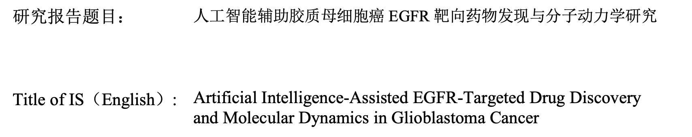
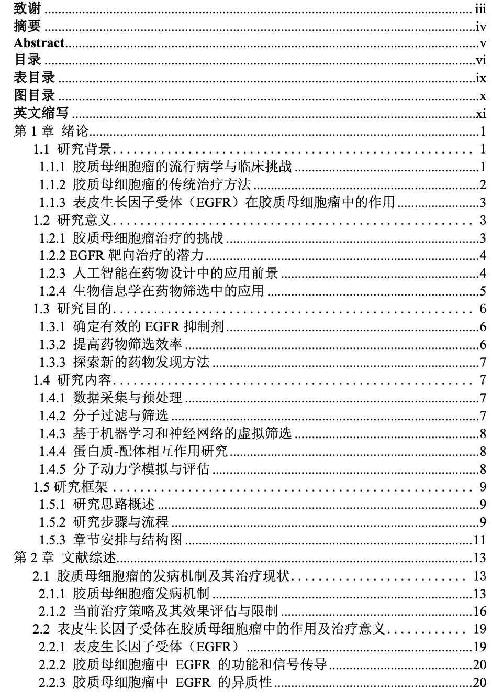
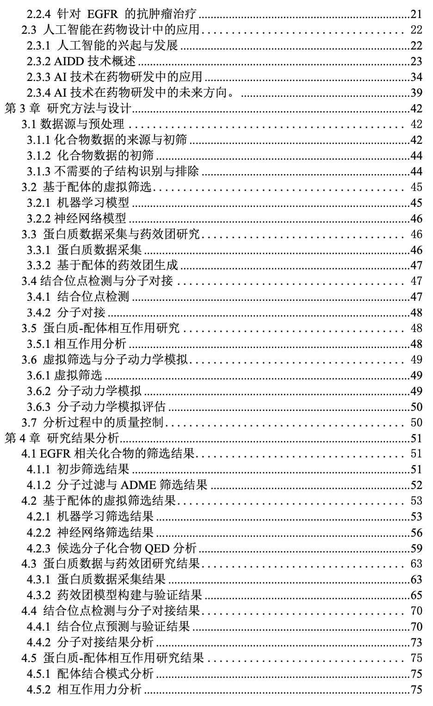
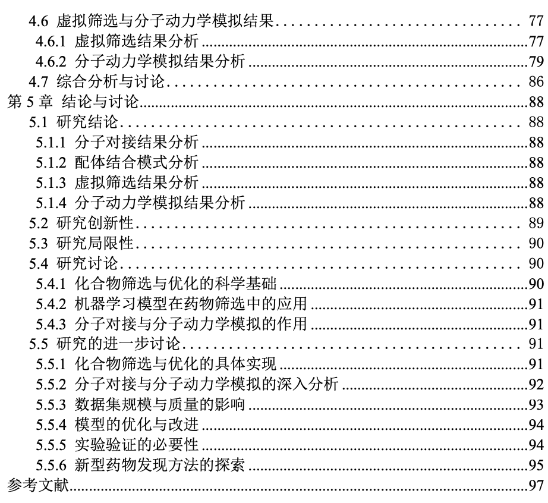
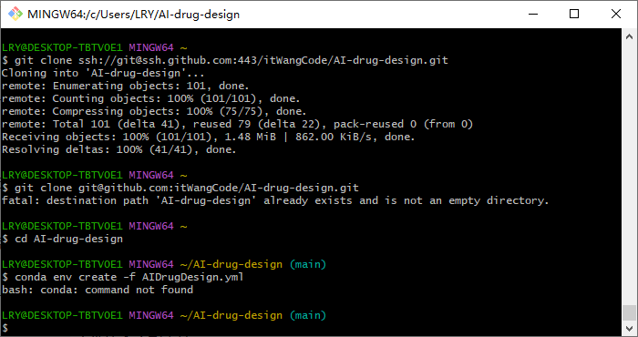
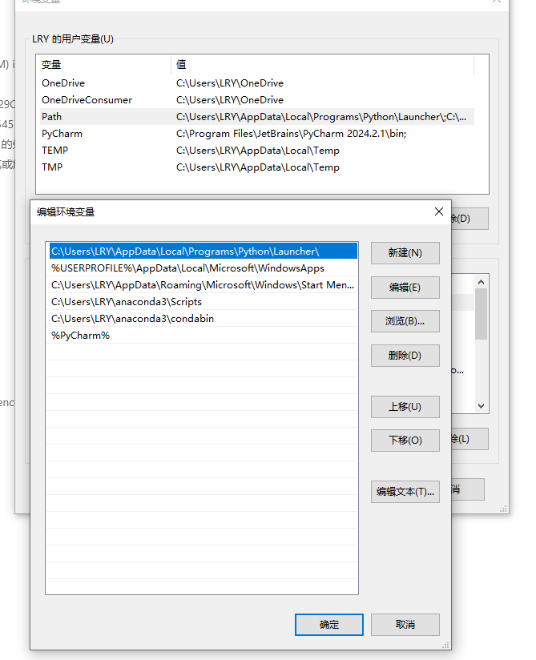

# Artificial Intelligence Drug Design (AIDD)

## Artificial Intelligence-assisted Drug Discovery and Design

## 人工智能辅助药物发现与设计

## 全球唯一实战开源教程，零基础入门AIDD，手把手教学入门到博士大佬级别

**人工智能辅助药物发现与设计**：为了更好地帮助大家理解这一复杂的前沿技术，我将通过中文为大家进行讲解，特别是为那些可能在语言上有所障碍的同学提供支持。尽管这种内容通常更适合以英语呈现，但为了确保大家能够更好地掌握核心概念并迅速上手，我选择用中文为大家提供更加直观的学习路径。

**人工智能辅助药物发现与设计**是一种利用人工智能（AI）技术来加速和优化药物开发过程的方法。传统药物研发周期长、成本高、成功率低，而 AI 能够通过大数据处理、模型预测和自动化分析，大幅提升药物设计的效率和准确性。

### **AI 在药物设计中的优势**

- **加速研发周期**：AI 能够快速筛选大量化合物，减少实验筛选的工作量。
- **提高准确性**：AI 能够通过大规模数据训练模型，提升药物设计中的预测准确性。
- **成本降低**：由于减少了实验的重复性和失败率，AI 能够有效降低药物研发成本。
- **个性化药物设计**：AI 能帮助设计个性化药物，针对特定患者或疾病特征，优化治疗效果。

人工智能在药物发现与设计中的应用，使得药物开发过程更加智能化、自动化。通过化合物筛选、靶标预测、药物生成、ADMET 分析等关键步骤，AI 能有效加速药物研发的进程，同时提高设计的准确性和效率。

## 前言：人工智能在药物发现与设计中的应用 [[**点击展开**](docs/preamble.md)]


## 欢迎来到人工智能药物发现与设计平台


## Abstract

Abstract: Drug discovery and development affects various aspects of human health and dramatically impacts the pharmaceutical market. However, investments in a new drug often go unrewarded due to the long and complex process of drug research and development (R&D). With the advancement of experimental technology and computer hardware, artificial intelligence (AI) has recently emerged as a leading tool in analyzing abundant and high-dimensional data. Explosive growth in the size of biomedical data provides advantages in applying AI in all stages of drug R&D. Driven by big data in biomedicine, AI has led to a revolution in drug R&D, due to its ability to discover new drugs more efficiently and at lower cost. This review begins with a brief overview of common AI models in the field of drug discovery; then, it summarizes and discusses in depth their specific applications in various stages of drug R&D, such as target discovery, drug discovery and design, preclinical research, automated drug synthesis, and influences in the pharmaceutical market. Finally, the major limitations of AI in drug R&D are fully discussed and possible solutions are proposed.

Keywords: Artificial intelligence; Machine learning; Deep learning; Target identification; Target discovery; Drug design; Drug discovery

- 👉🏻👉🏻👉🏻👉🏻👉🏻目前目录分为了，第一、二节和第三节分别：提供没有基础的同学，有基础的同学

## 目录

## 第一节 基础部分
<details>
<summary>目录展开</summary>

0. 人工智能在医学中的应用
   - Python基础
   - Numpy、Pandas
   - Matplotlib
   - 机器学习和Scikit-Learn
   - 深度学习
   - CADD
   - 图神经网络

1. Python和机器学习基础
   - 分子的文本表示：SMILES
   - 分子的向量表示：描述符和指纹
   - RDKit简介
   - 经典机器学习模型：线性回归、随机森林、支持向量机

2. 公开可用的小分子数据集的探索
   - 生物活性分子 ChEMBL 数据库
   - ZINC 数据库
   - PubChem 数据库
   - 探索性数据分析 (EDA)
   - 定量构效关系 (QSAR) 和虚拟筛选 (VS)

3. 图神经网络
   - 神经网络架构和训练
   - 分子图、原子特征化
   - 消息传递神经网络
   - 图卷积神经网络
   - 可解释性：Grad-CAM

4. 分子对接
   - 分子数据格式：SMI、SDF、MOL2、PDB
   - 力场
   - 蛋白质折叠
   - 使用 AutoDock Vina、Smina、QuickVina 进行分子对接
   - 交互指纹
   - 药效团

5. 深度生成模型
   - 自动编码器
   - 循环神经网络
   - SMILES生成器：ReLeaSE 和 REINVENT
   - 基于图的生成模型：JT-VAE
   - 分子特性优化：强化学习和贝叶斯优化

6. 蛋白质深度学习
   - 简化的蛋白质图表示
   - 体素网格表示
   - 用于编码蛋白质表面的网格表示
   - 3D卷积神经网络

7. 不确定性预测
   - 任意和认知的不确定性
   - 共形预测
</details>

## 第二节 化学信息学
<details>
<summary>目录展开</summary>

1. 基础知识
   - 化学信息学 RDKit 简介
   - Pandas 在化学信息学中的应用
   - SMILES 教程
   - SMARTS 教程
   - 反应列举基础知识
   - 立体异构体和互变异构体列举

2. 使用 Datamol 和 Molfeat 精简化学信息学工作流
   - 数据处理、描述符和聚类

3. 聚类
   - K-Means 聚类
   - Taylor-Butina 聚类

4. 复杂的化学信息学分析
   - Chembl 系统分析
   - 基于 Chembl 数据库的药物数据分析
   - 基于 BindingDB 中的专利数据进行分析

5. SAR 分析
   - 脚手架识别
   - R-group 分析
   - 位置模拟扫描分析
   - Free-Wilson 分析
   - 匹配的分子对
   - 匹配的分子集

6. 机器学习模型
   - 构建并测试一个 QSAR 模型
   - 分类模型构建与比较
   - 回归模型构建与比较

7. 主动学习
   - 主动分类
   - 主动回归
   - 主动形状搜索

8. 神经网络潜能
   - 使用 Auto3D 的同分异构体能量预测
</details>

## 第三节 实战部分
<details>
<summary>目录展开</summary>

### 1. **化合物数据采集与初步处理**

   - 01_从 ChEMBL 化合物数据采集
   - 02_从 PubChem 获取数据
   - 03_从 KLIFS 获取数据
     - 03_1 完整项目：《基于机器学习的生物活性预测》
   - 04_查询在线 API 网络服务

### 2. **分子过滤与预处理**

   - 05_分子过滤：ADMET 和先导化合物相似标准
     - 05_1 完整项目：《基于机器学习与深度学习的分子ADMET预测》
     - 05_2 完整项目：《基于GNN的分子毒性预测》
   - 06_分子过滤：不需要的子结构
     - 06_1 完整项目：《基于ADMET和RO5的分子筛选与化合物相似性的配体筛选》

### 3. **分子表示与相似性分析**

   - 07_分子表示
   - 08_基于配体的筛选：化合物相似性
   - 09_复合聚类
   - 10_最大公共子结构

### 4. **药效团与脱靶预测**

   - 11_基于配体的药效团
   - 12_结合位点相似性和脱靶预测

### 5. **蛋白质数据获取与结合位点检测**

   - 13_蛋白质数据获取：蛋白质数据库（PDB）
   - 14_结合位点检测

### 6. **蛋白质-配体对接**

   - 15_蛋白质-配体对接
     - 15_1 预测生物活性分子的逆合成可及性
   - 16_蛋白质-配体相互作用
   - 17_NGLview 高级使用

### 7. **分子动力学模拟**

   - 18_分子动力学模拟
   - 19_分析分子动力学模拟

### 8. **先导化合物优化与自动化流程**

   - 20_先导化合物优化的自动化流程

### 9. **机器学习与分子性质预测**

   - 21_基于配体的筛选：机器学习
   - 22_基于配体的筛选：神经网络
   - 23_基于 RNN 的分子性质预测
   - 24_基于 GNN 的分子性质预测
   - 25_分子特性预测转换器
   - 26_不确定性估计

### 10. **RNA Aptamer 设计与分析**
<details>
<summary>目录展开</summary>

#### **1. 数据采集与准备**

- **27_1 RNA Aptamer 数据来源**
  - 数据来源：RNAapt3D (https://rnaapt3d.medals.jp/)
- **27_2 数据清洗与预处理**

#### **2. RNA 结构预测**

- **28_1 一级结构预测**
- **28_2 结构可视化与分析**

- **29_1 二级结构预测**
- **29_2 能量最小化与折叠稳定性分析**
  - ΔG（自由能）和折叠稳定性图

#### **30_RNA Aptamer 结合位点分析**

- **30_1 RNA Aptamer 与靶标的结合位点预测**
- **30_2 结合能计算与优化**

#### **3. 药物设计与优化**

- **30_3 基于 RNA Aptamer 的药物设计**
- **30_4 药物化学与虚拟筛选**

#### **5. 分子动力学模拟与实验验证**

- **30_5 分子动力学模拟**
- **30_6 实验验证**
</details>

### 11. **激酶相似性与分析**

   - 31_激酶相似性：序列
   - 32_激酶相似性：激酶口袋（KiSSim 指纹）
   - 33_激酶相似性：相互作用指纹
   - 34_激酶相似性：配体概况
   - 35_激酶相似性：不同观点比较
   - 36_基于激酶片段库设计激酶抑制剂

### 12. **蛋白质-配体相互作用与预测**

   - 37_蛋白质-配体相互作用预测
     - 完整项目：《项目实战：基于Transformer的有机化学反应产量预测 （Prediction of chemical reaction yields using deep learning）》
     - 完整项目：《项目实战：Mapping the space of chemical reactions using attention-based neural networks》
     - 完整项目：《项目实战：基于图数据的小分子化合物生成模型（A Graph to Graphs Framework for Retrosynthesis Prediction）》
     - 完整项目：《项目实战：基于NLP的抗体生成模型（Generative language modeling for antibody design）》

### 13. **高级建模与虚拟筛选**

   - 38_基于 KLIFS 数据跑 3D 动力学
   - 39_基于共识对接的一体化结构虚拟筛选（蛋白质制备、对接、结合位点选择、重新评分和排序）

### 14. **可视化与编码工具**

   - 40_One-Hot 编码
   - 41_使用代码绘制分子图
</details>


## **第四节 研究基因到免疫浸润**
<details>
<summary>目录展开</summary>

#### **1. Introduction**
- 研究目标：探索基因与免疫浸润之间的关系
- 背景介绍：免疫浸润的重要性及其在基因表达中的影响

#### **2. Software 环境配置**
- 安装与配置所需的软件工具（如 R、Python、Bioconductor ）

#### **3. 数据下载与预处理**
- 从 GEO、TCGA 等数据库下载基因表达数据
- 数据标准化和清洗

#### **4. 数据注释** Annotation (ANN)
- 使用注释文件（如 GTF 或 GFF 文件）对基因表达数据进行注释
- 工具：`biomaRt`、`org.Hs.eg.db`

#### **5. SVA (Surrogate Variable Analysis)**
- 使用 SVA 校正批次效应
- 代码实现：`sva`包中的 `ComBat` 或 `svaseq` 方法

#### **6. 差异基因分析 **Differential Gene Expression (Diff)
- 使用 `limma`、`DESeq2` 等工具进行差异基因分析
- 生成差异表达基因（DEGs）列表

#### **7. 火山图绘制** Volcano Plot
- 使用差异分析的结果绘制火山图
- 代码实现：`ggplot2`、`EnhancedVolcano`包

#### **8. 富集分析** Metascape
- 在 Metascape 网站上进行通路和功能富集分析

#### **9. Gene Ontology (GO)**
- 使用 GO 进行基因功能注释和富集分析
- 工具：`clusterProfiler`、`topGO`

#### **10. KEGG 富集分析**
- 使用 KEGG 数据库进行信号通路富集分析
- 工具：`clusterProfiler`、`KEGGREST`

#### **11. 蛋白质互作网络** **Protein-Protein Interaction (PPI)**
- 构建蛋白质-蛋白质互作网络
- 工具：`STRING` 数据库、`Cytoscape`

#### **12. 随机森林模型Random Forest**
- 构建随机森林模型，筛选重要基因

#### **13. 热图绘制Heatmap**
- 绘制差异基因的表达热图

#### **14. 基因评分计算**Gene Score
- 根据差异基因计算基因评分
- 代码实现：基于基因表达值的综合评分方法

#### **15. 神经网络模型Neural Network**
- 使用神经网络模型对基因表达进行预测
- 工具：`neuralnet`包

#### **16. ROC 曲线分析Receiver Operating Characteristic (ROC)**
- 绘制 ROC 曲线，评估模型的准确性
- 工具：`pROC` 包

#### **17. 基因评分测试Test Gene Score**
- 测试基因评分模型的准确性和可行性

#### **18. 神经网络预测测试Test Neural Network Prediction**
- 测试神经网络模型的预测能力

#### **19. ROC 测试Test ROC**
- 使用测试数据集验证 ROC 曲线

#### **20. CIBERSORT 分析**
- 使用 CIBERSORT 分析基因表达数据，估算免疫细胞的比例

#### **21. 柱状图绘制**Barplot
- 绘制免疫细胞比例的柱状图
- 工具：`ggplot2`

#### **22. 小提琴图绘制Violin Plot**
- 绘制基因表达与免疫细胞浸润之间的关系图

</details>


## 项目结构

```
|-- Al-drug-design-reference.Data   <- 参考文献文件夹
|-- README.md                       <- 详细简介
|-- img                             <- md的图片
|-- docs                            <- 文档
|-- Al-drug-design-reference.enl    <- 参考文献文件
|-- list                            <- 项目结构目录
|-- Al-drug-design.yml                             <- 环境配置
|   |-- 00_ai in_medicine                          <- Python基础知识（❤️如果你有Python基础，或者你有Python与药物设计基础，你可以跳过这一章节，直接从01开始看）
|   |-- 01_Compound_data_acquisition               <- 化合物采集
```


## 配置代码环境   [[**点击展开**](docs/install.md)]


## 文章所用到的 ***Python*** 语法
<details>
<summary>语法展开</summary>

### Python 学习目录和教案 —— 适用于 AI-drug-design 项目

在学习 Python 用于 AI 药物设计（AIDD）项目时，您需要掌握以下知识点。学习计划将涵盖基础知识、数据处理、机器学习、深度学习框架、药物设计相关库的使用等内容。以下是详细的学习目录和教案：

---

### 目录

1. **Python 基础**

   ```
   1.1 Python 环境配置（Anaconda、虚拟环境、Jupyter Notebook）
   1.2 Python 基础语法（变量、数据类型、运算符）
   1.3 控制结构（条件语句、循环）
   1.4 函数与模块（自定义函数、导入库）
   1.5 文件操作（读取和写入文件）
   1.6 异常处理
   ```

   

2. **数据处理与分析**

   ```
   2.1 Numpy 数组操作
   2.2 Pandas 数据框操作
   2.3 数据清洗与处理
   2.4 数据可视化（Matplotlib、Seaborn）
   2.5 基础统计与数据分析方法
   ```

   

3. **科学计算与机器学习基础**

   ```
   3.1 Scikit-learn 入门
   3.2 常用算法（线性回归、分类、聚类、决策树等）
   3.3 模型评估与优化
   3.4 模型调参与交叉验证
   ```

   

4. **深度学习框架**

   ```
   4.1 TensorFlow 基础
   4.2 Keras 快速上手
   4.3 PyTorch 基础
   4.4 GPU 加速与优化
   4.5 神经网络的构建与训练
   ```

   

5. **AI 药物设计基础**

   ```
   5.1 药物设计相关的 Python 库介绍
   5.2 RDKit（化学信息学工具）入门与使用
   5.3 Mol2Vec 分子特征表示方法
   5.4 化合物的预处理与分子特征提取
   5.5 分子对接与虚拟筛选
   5.6 药物活性预测模型
   ```

   

6. **高级主题**

   ```
   6.1 深度学习在药物设计中的应用
   6.2 分子生成模型（GAN、VAE）
   6.3 分子动力学模拟简介
   6.4 蛋白质结构预测与分子对接
   6.5 AI 在药物筛选和优化中的应用
   ```


---
   
</details>

### 教案
<details>
<summary>教案展开</summary>

#### 1. Python 基础

**目标**：掌握 Python 基本语法、数据结构及控制流，能够编写简单的 Python 程序。

**教学内容**：

- Python 环境配置与解释器运行
- 基本数据类型（字符串、整数、浮点数、布尔）
- 数据结构：列表、字典、集合、元组
- 控制结构：if、else、for、while 循环
- 函数与参数传递，理解递归
- 模块的导入与创建（如 `math`、`random` 模块）

**作业**：

- 编写一个处理简单文本的 Python 程序（如计算文本单词频率）
- 编写一个函数，接受多个参数并返回最大值

#### 2. 数据处理与分析

**目标**：学习 Numpy 和 Pandas 库，能够进行高效的数据处理和分析。

**教学内容**：

- Numpy 基础：数组创建、形状修改、索引与切片、数组运算
- Pandas 基础：Series 和 DataFrame 的操作，缺失值处理，数据筛选与排序
- 数据的导入与导出（CSV、Excel 等格式）
- 数据可视化：柱状图、折线图、散点图
- 数据统计分析：均值、中位数、标准差等

**作业**：

- 使用 Pandas 读取 CSV 文件，计算每列的均值和标准差
- 使用 Matplotlib 绘制简单的柱状图和折线图

#### 3. 科学计算与机器学习基础

**目标**：掌握机器学习基础理论，能够使用 Scikit-learn 进行模型训练和评估。

**教学内容**：

- 监督学习和无监督学习简介
- 数据集的划分：训练集、验证集与测试集
- 线性回归、逻辑回归、KNN、决策树等基本算法
- 模型的评估：准确率、混淆矩阵、ROC 曲线
- 超参数优化与交叉验证

**作业**：

- 使用 Scikit-learn 进行一个简单的分类问题（如鸢尾花数据集分类）
- 绘制模型的 ROC 曲线并计算 AUC

#### 4. 深度学习框架

**目标**：熟悉常用的深度学习框架（TensorFlow、Keras、PyTorch），能够搭建简单的神经网络。

**教学内容**：

- TensorFlow 和 Keras 的基本用法：张量操作、模型构建
- PyTorch 的基本操作：Tensors、Autograd、优化器
- 构建简单的全连接神经网络
- 使用 GPU 进行模型训练
- 优化方法：SGD、Adam 等优化器
- 避免过拟合的正则化方法（如 Dropout）

**作业**：

- 使用 Keras 实现一个手写数字识别模型（MNIST 数据集）
- 使用 PyTorch 实现一个简单的卷积神经网络

#### 5. AI 药物设计基础

**目标**：学习 AI 药物设计相关的库，能够进行分子数据的处理与建模。

**教学内容**：

- RDKit 入门：分子结构的读取、绘制与操作
- 化合物分子描述符的计算
- 化学库的虚拟筛选
- Mol2Vec 特征表示方法
- 基于机器学习的药物活性预测模型
- 小分子的对接模拟（AutoDock、PyMOL 简介）

**作业**：

- 使用 RDKit 对一组化合物进行特征提取
- 使用机器学习模型预测药物活性

#### 6. 高级主题

**目标**：掌握深度学习在分子生成与药物设计中的应用。

**教学内容**：

- 分子生成模型：生成对抗网络（GAN）、变分自编码器（VAE）
- 基于深度学习的分子优化方法
- 蛋白质结构预测：AlphaFold 介绍
- 分子动力学模拟基础与应用
- 药物筛选流程与 AI 在其中的应用

**作业**：

- 使用 GAN 模型生成新的分子结构
- 编写脚本对某一蛋白质靶点进行分子对接模拟

文章引入：
Mingkun Lu, Jiayi Yin, Qi Zhu, Gaole Lin, Minjie Mou, Fuyao Liu, Ziqi Pan, Nanxin You, Xichen Lian, Fengcheng Li, Hongning Zhang, Lingyan Zheng, Wei Zhang, Hanyu Zhang, Zihao Shen, Zhen Gu, Honglin Li, Feng Zhu,
Artificial Intelligence in Pharmaceutical Sciences,
Engineering,
Volume 27,
2023,
Pages 37-69,
ISSN 2095-8099,
https://doi.org/10.1016/j.eng.2023.01.014.
(https://www.sciencedirect.com/science/article/pii/S2095809923001649)
Abstract: Drug discovery and development affects various aspects of human health and dramatically impacts the pharmaceutical market. However, investments in a new drug often go unrewarded due to the long and complex process of drug research and development (R&D). With the advancement of experimental technology and computer hardware, artificial intelligence (AI) has recently emerged as a leading tool in analyzing abundant and high-dimensional data. Explosive growth in the size of biomedical data provides advantages in applying AI in all stages of drug R&D. Driven by big data in biomedicine, AI has led to a revolution in drug R&D, due to its ability to discover new drugs more efficiently and at lower cost. This review begins with a brief overview of common AI models in the field of drug discovery; then, it summarizes and discusses in depth their specific applications in various stages of drug R&D, such as target discovery, drug discovery and design, preclinical research, automated drug synthesis, and influences in the pharmaceutical market. Finally, the major limitations of AI in drug R&D are fully discussed and possible solutions are proposed.
Keywords: Artificial intelligence; Machine learning; Deep learning; Target identification; Target discovery; Drug design; Drug discovery


## 来源的出处

- 跟我我的论文里面的内容，进行书写









</details>


## QS问题区
<details>
<summary>问题展开</summary>

### 1. 比如说你会遇见这样子的情况？



- 然后我们如何解决，那么就去win高级环境变量中去配置？

  

</details>

## 进群讨论

<div style="display: flex; justify-content: center; align-items: center;">
  
  
</div>


### Link: t.me/AIDD_itwangyang

## ☕️☕️☕️能否支持我喝一杯咖啡☕️☕️☕️☕️☕️，谢谢！！让我更有动力，写作💪🏻！！！

<div style="display: flex; justify-content: space-between;">
  
  
</div>


##  致谢 

- 首先我感谢我的中山大学的导师雷教授带我入门这一行，我踏入校园一无所知，所以也不知道自己的方向，一脸茫然的，所以还是特别感谢我的导师的。并且还要感谢淮阴工学院——喻教授，在他的帮助下才能写出来。同时也感谢张胜玉同学的大力支持完成学业。
- 第二个首先感谢，南京工业大学的计算化学大佬——“郭为涛”同学，一直帮助我，给我讲解制药的流程。
- 第三，我还是得感谢我的好朋友——南京医科大学的“周仪萍”同学，是她聪明漂亮善良的姑娘，大力帮助我。
- 其次，感谢我的群里面的大佬各路指导。
- 最后感谢社会人士和同道中人来帮我批评指正，让我的这一份文档，这一份代码写得更完整，更加完善，让我们祖国做的更好更强大，感谢祖国，感谢党。
- 感谢这些帮助我的人完成我的学业！

## Reference
<details>
<summary>参考文献展开</summary>

[0] Visan, A. I., & Negut, I. (2024). Integrating Artificial Intelligence for Drug Discovery in the Context of Revolutionizing Drug Delivery. *Life*, *14*(2), 233. https://www.mdpi.com/2075-1729/14/2/233 

[ 1 ] Martin L, Hutchens M, Hawkins C, Radnov A. How much do clinical trials cost? Nat Rev Drug Discov 2017;16(6):381‒2. [链接1](http://dx.doi.org/10.1038/nrd.2017.70)

[ 2 ] Moore TJ, Zhang H, Anderson G, Alexander GC. Estimated costs of pivotal trials for novel therapeutic agents approved by the US Food and Drug Administration, 2015‒2016. JAMA Intern Med 2018;178(11):1451‒7. [链接1](http://dx.doi.org/10.1001/jamainternmed.2018.3931)

[ 3 ] Paul SM, Mytelka DS, Dunwiddie CT, Persinger CC, Munos BH, Lindborg SR, et al. How to improve R&D productivity: the pharmaceutical industry’s grand challenge. Nat Rev Drug Discov 2010;9(3):203‒14. [链接1](http://dx.doi.org/10.1038/nrd3078)

[ 4 ] Hopkins AL. Network pharmacology: the next paradigm in drug discovery. Nat Chem Biol 2008;4(11):682‒90. [链接1](http://dx.doi.org/10.1038/nchembio.118)

[ 5 ] Wang Z, Gerstein M, Snyder M. RNA-Seq: a revolutionary tool for transcriptomics. Nat Rev Genet 2009;10(1):57‒63. [链接1](http://dx.doi.org/10.1038/nrg2484)

[ 6 ] Giacomotto J, Ségalat L. High-throughput screening and small animal models, where are we? Br J Pharmacol 2010;160(2):204‒16. [链接1](http://dx.doi.org/10.1111/j.1476-5381.2010.00725.x)

[ 7 ] Mayr LM, Bojanic D. Novel trends in high-throughput screening. Curr Opin Pharmacol 2009;9(5):580‒8. [链接1](http://dx.doi.org/10.1016/j.coph.2009.08.004)

[ 8 ] Shoichet BK. Virtual screening of chemical libraries. Nature 2004;432(7019):862‒5. [链接1](http://dx.doi.org/10.1038/nature03197)

[ 9 ] Kitchen DB, Decornez H, Furr JR, Bajorath J. Docking and scoring in virtual screening for drug discovery: methods and applications. Nat Rev Drug Discov 2004;3(11):935‒49. [链接1](http://dx.doi.org/10.1038/nrd1549)

[10] LeCun Y, Bengio Y, Hinton G. Deep learning. Nature 2015;521(7553):436‒44. [链接1](http://dx.doi.org/10.1038/nature14539)

[11] Farabet C, Couprie C, Najman L, LeCun Y. Learning hierarchical features for scene labeling. IEEE Trans Pattern Anal Mach Intell 2013;35(8):1915‒29. [链接1](http://dx.doi.org/10.1109/tpami.2012.231)

[12] Dahl GE, Yu D, Deng L, Acero A. Context-dependent pre-trained deep neural networks for large-vocabulary speech recognition. IEEE Trans Audio Speech 2012;20(1):30‒42. [链接1](http://dx.doi.org/10.1109/tasl.2011.2134090)

[13] Ding J, Sharon N, Bar-Joseph Z. Temporal modelling using single-cell transcriptomics. Nat Rev Genet 2022;23(6):355‒68. [链接1](http://dx.doi.org/10.1038/s41576-021-00444-7)

[14] Liu S, Trapnell C. Single-cell transcriptome sequencing: recent advances and remaining challenges. F1000 Res 2016;5(1):182. [链接1](http://dx.doi.org/10.12688/f1000research.7223.1)

[15] Luecken MD, Theis FJ. Current best practices in single-cell RNA-seq analysis: a tutorial. Mol Syst Biol 2019;15(6):e8746. [链接1](http://dx.doi.org/10.15252/msb.20188746)

[16] Aebersold R, Mann M. Mass spectrometry-based proteomics. Nature 2003;422(6928):198‒207. [链接1](http://dx.doi.org/10.1038/nature01511)

[17] Kim S, Chen J, Cheng T, Gindulyte A, He J, He S, et al. PubChem in 2021: new data content and improved web interfaces. Nucleic Acids Res 2021;49(D1): D1388‒95. [链接1](http://dx.doi.org/10.1093/nar/gkaa971)

[18] Bateman A, Martin MJ, Orchard S, Magrane M, Agivetova R, Ahmad S, et al.; Consortium UniProt. UniProt: the universal protein knowledgebase in 2021. Nucleic Acids Res 2021;49(D1):D480‒9.

[19] Manzoni C, Kia DA, Vandrovcova J, Hardy J, Wood NW, Lewis PA, et al. Genome, transcriptome and proteome: the rise of omics data and their integration in biomedical sciences. Brief Bioinform 2018;19(2):286‒302. [链接1](http://dx.doi.org/10.1093/bib/bbw114)

[20] Shi Y, Prieto PL, Zepel T, Grunert S, Hein JE. Automated experimentation powers data science in chemistry. Acc Chem Res 2021;54(3):546‒55. [链接1](http://dx.doi.org/10.1021/acs.accounts.0c00736)

[21] Nam AS, Chaligne R, Landau DA. Integrating genetic and non-genetic determinants of cancer evolution by single-cell multi-omics. Nat Rev Genet 2021;22(1):3‒18. [链接1](http://dx.doi.org/10.1038/s41576-020-0265-5)

[22] Waring MJ, Arrowsmith J, Leach AR, Leeson PD, Mandrell S, Owen RM, et al. An analysis of the attrition of drug candidates from four major pharmaceutical companies. Nat Rev Drug Discov 2015;14(7):475‒86. [链接1](http://dx.doi.org/10.1038/nrd4609)

[23] Tunyasuvunakool K, Adler J, Wu Z, Green T, Zielinski M, Žídek A, et al. Highly accurate protein structure prediction for the human proteome. Nature 2021;596(7873):590‒6. [链接1](http://dx.doi.org/10.1038/s41586-021-03828-1)

[24] Ying C, Cai T, Luo S, Zheng S, Ke G, He D, et al. Do transformers really perform badly for graph representation? Adv Neural Inf Process Syst 2021;34(1):28877‒88.

[25] Seyed Tabib NS, Madgwick M, Sudhakar P, Verstockt B, Korcsmaros T, Vermeire S. Big data in IBD: big progress for clinical practice. Gut 2020;69(8):1520‒32. [链接1](http://dx.doi.org/10.1136/gutjnl-2019-320065)

[26] Granda JM, Donina L, Dragone V, Long DL, Cronin L. Controlling an organic synthesis robot with machine learning to search for new reactivity. Nature 2018;559(7714):377‒81. Corrected in: Nature 2019;570:E67‒9. [链接1](http://dx.doi.org/10.1038/s41586-018-0307-8)

[27] Zhong F, Xing J, Li X, Liu X, Fu Z, Xiong Z, et al. Artificial intelligence in drug design. Sci China Life Sci 2018;61(10):1191‒204. [链接1](http://dx.doi.org/10.1007/s11427-018-9342-2)

[28] Zhavoronkov A, Ivanenkov YA, Aliper A, Veselov MS, Aladinskiy VA, Aladinskaya AV, et al. Deep learning enables rapid identification of potent DDR1 kinase inhibitors. Nat Biotechnol 2019;37(9):1038‒40. [链接1](http://dx.doi.org/10.1038/s41587-019-0224-x)

[29] Winter R, Montanari F, Noé F, Clevert DA. Learning continuous and datadriven molecular descriptors by translating equivalent chemical representations. Chem Sci 2019;10(6):1692‒701. [链接1](http://dx.doi.org/10.1039/c8sc04175j)

[30] Zheng S, Rao J, Song Y, Zhang J, Xiao X, Fang EF, et al. PharmKG: a dedicated knowledge graph benchmark for bomedical data mining. Brief Bioinform 2021;22(4):bbaa344. [链接1](http://dx.doi.org/10.1093/bib/bbaa344)

[31] Jeon J, Nim S, Teyra J, Datti A, Wrana JL, Sidhu SS, et al. A systematic approach to identify novel cancer drug targets using machine learning, inhibitor design and high-throughput screening. Genome Med 2014;6(7):57. [链接1](http://dx.doi.org/10.1186/preaccept-8096551512514564)

[32] Riniker S, Wang Y, Jenkins JL, Landrum GA. Using information from historical high-throughput screens to predict active compounds. J Chem Inf Model 2014;54(7):1880‒91. [链接1](http://dx.doi.org/10.1021/ci500190p)

[33] Basile AO, Yahi A, Tatonetti NP. Artificial intelligence for drug toxicity and safety. Trends Pharmacol Sci 2019;40(9):624‒35. [链接1](http://dx.doi.org/10.1016/j.tips.2019.07.005)

[34] Cruz Rivera S, Liu X, Chan AW, Denniston AK, Calvert MJ; The SPIRIT-AI and CONSORT-AI Working Group. Guidelines for clinical trial protocols for interventions involving artificial intelligence: the SPIRIT-AI extension. Lancet Digit Health 2020;2(10):e549‒60.

[35] Steiner S, Wolf J, Glatzel S, Andreou A, Granda JM, Keenan G, et al. Organic synthesis in a modular robotic system driven by a chemical programming language. Science 2019;363(6423):eaav2211. [链接1](http://dx.doi.org/10.1126/science.aav2211)

[36] Hamet P, Tremblay J. Artificial intelligence in medicine. Metabolism 2017;69(Suppl):S36‒40. [链接1](http://dx.doi.org/10.1016/j.metabol.2017.01.011)

[37] Zhou Y, Zhang Y, Lian X, Li F, Wang C, Zhu F, et al. Therapeutic target database update 2022: facilitating drug discovery with enriched comparative data of targeted agents. Nucleic Acids Res 2022;50(D1):D1398‒407. [链接1](http://dx.doi.org/10.1093/nar/gkab953)

[38] Amahong K, Zhang W, Zhou Y, Zhang S, Yin J, Li F, et al. CovInter: interaction data between coronavirus RNAs and host proteins. Nucleic Acids Res 2022; 51(D1):D546‒56. [链接1](http://dx.doi.org/10.1093/nar/gkac834)

[39] Liu S, Chen L, Zhang Y, Zhou Y, He Y, Chen Z, et al. M6AREG: m6A-centered regulation of disease development and drug response. Nucleic Acids Res 2022;51(D1):D1333‒44. [链接1](http://dx.doi.org/10.1093/nar/gkac801)

[40] Sun X, Zhang Y, Li H, Zhou Y, Shi S, Chen Z, et al. DRESIS: the first comprehensive landscape of drug resistance information. Nucleic Acids Res 2022;51(D1):D1263‒75. [链接1](http://dx.doi.org/10.1093/nar/gkac812)

[41] Wang X, Li F, Qiu W, Xu B, Li Y, Lian X, et al. SYNBIP: synthetic binding proteins for research, diagnosis and therapy. Nucleic Acids Res 2022;50(D1): D560‒70. [链接1](http://dx.doi.org/10.1093/nar/gkab926)

[42] Zhang S, Sun X, Mou M, Amahong K, Sun H, Zhang W, et al. REGLIV: molecular regulation data of diverse living systems facilitating current multiomics research. Comput Biol Med 2022;148(1):105825. [链接1](http://dx.doi.org/10.1016/j.compbiomed.2022.105825)

[43] Burley SK, Bhikadiya C, Bi C, Bittrich S, Chen L, Crichlow GV, et al. RCSB Protein Data Bank: powerful new tools for exploring 3D structures of biological macromolecules for basic and applied research and education in fundamental biology, biomedicine, biotechnology, bioengineering and energy sciences. Nucleic Acids Res 2021;49(D1):D437‒51. [链接1](http://dx.doi.org/10.1093/nar/gkaa1038)

[44] Perez-Riverol Y, Bai J, Bandla C, García-Seisdedos D, Hewapathirana S, Kamatchinathan S, et al. The PRIDE database resources in 2022: a hub for mass spectrometry-based proteomics evidences. Nucleic Acids Res 2022; 50(D1):D543‒52. [链接1](http://dx.doi.org/10.1093/nar/gkab1038)

[45] Blum M, Chang HY, Chuguransky S, Grego T, Kandasaamy S, Mitchell A, et al. The InterPro protein families and domains database: 20 years on. Nucleic Acids Res 2021;49(D1):D344‒54. [链接1](http://dx.doi.org/10.1093/nar/gkaa977)

[46] Yin J, Sun W, Li F, Hong J, Li X, Zhou Y, et al. VARIDT 1.0: variability of drug transporter database. Nucleic Acids Res 2020;48(D1):D1042‒50. [链接1](http://dx.doi.org/10.1093/nar/gkz779)

[47] Fu T, Li F, Zhang Y, Yin J, Qiu W, Li X, et al. VARIDT 2.0: structural variability of drug transporter. Nucleic Acids Res 2022;50(D1):D1417‒31. [链接1](http://dx.doi.org/10.1093/nar/gkab1013)

[48] Cunningham F, Allen JE, Allen J, Alvarez-Jarreta J, Amode MR, Armean IM, et al. Ensembl 2022. Nucleic Acids Res 2022;50(D1):D988‒95. [链接1](http://dx.doi.org/10.1093/nar/gkab1049)

[49] Kent WJ, Sugnet CW, Furey TS, Roskin KM, Pringle TH, Zahler AM, et al. The human genome browser at UCSC. Genome Res 2002;12(6):996‒1006. [链接1](http://dx.doi.org/10.1101/gr.229102)

[50] Barrett T, Wilhite SE, Ledoux P, Evangelista C, Kim IF, Tomashevsky M, et al. NCBI GEO: archive for functional genomics data sets—update. Nucleic Acids Res 2013;41(D1):D991‒5. [链接1](http://dx.doi.org/10.1093/nar/gks1193)

[51] Sayers EW, Cavanaugh M, Clark K, Pruitt KD, Schoch CL, Sherry ST, et al. GenBank. Nucleic Acids Res 2022;50(D1):D161‒4. [链接1](http://dx.doi.org/10.1093/nar/gkab1135)

[52] Li W, O’Neill KR, Haft DH, DiCuccio M, Chetvernin V, Badretdin A, et al. RefSeq: expanding the prokaryotic genome annotation pipeline reach with protein family model curation. Nucleic Acids Res 2021;49(D1):D1020‒8. [链接1](http://dx.doi.org/10.1093/nar/gkaa1105)

[53] Papatheodorou I, Moreno P, Manning J, Fuentes AM, George N, Fexova S, et al. Expression Atlas update: from tissues to single cells. Nucleic Acids Res 2020;48(D1):D77‒83.

[54] Mendez D, Gaulton A, Bento AP, Chambers J, De Veij M, Félix E, et al. ChEMBL: towards direct deposition of bioassay data. Nucleic Acids Res 2019;47(D1): D930‒40. [链接1](http://dx.doi.org/10.1093/nar/gky1075)

[55] Wishart DS, Feunang YD, Guo AC, Lo EJ, Marcu A, Grant JR, et al. DrugBank 5.0: a major update to the DrugBank database for 2018. Nucleic Acids Res 2018;46 (D1):D1074‒82. [链接1](http://dx.doi.org/10.1093/nar/gkx1037)

[56] Li F, Yin J, Lu M, Mou M, Li Z, Zeng Z, et al. DrugMAP: molecular atlas and pharma-information of all drugs. Nucleic Acids Res 2022;51(D1):D1288‒99. [链接1](http://dx.doi.org/10.1093/nar/gkac813)

[57] Tang J, Tanoli ZU, Ravikumar B, Alam Z, Rebane A, Vähä-Koskela M, et al. Drug target commons: a community effort to build a consensus knowledge base for drug‒target interactions. Cell Chem Biol 2018;25(2):224‒9. [链接1](http://dx.doi.org/10.1016/j.chembiol.2017.11.009)

[58] Sheils TK, Mathias SL, Kelleher KJ, Siramshetty VB, Nguyen DT, Bologa CG, et al. TCRD and Pharos 2021: mining the human proteome for disease biology. Nucleic Acids Res 2021;49(D1):D1334‒46. [链接1](http://dx.doi.org/10.1093/nar/gkaa993)

[59] Hutter C, Zenklusen JC. The Cancer Genome Atlas: creating lasting value beyond its data. Cell 2018;173(2):283‒5. [链接1](http://dx.doi.org/10.1016/j.cell.2018.03.042)

[60] Piñero J, Saüch J, Sanz F, Furlong LI. The DisGeNET Cytoscape App: exploring and visualizing disease genomics data. Comput Struct Biotechnol J 2021;19(1):2960‒7. [链接1](http://dx.doi.org/10.1016/j.csbj.2021.05.015)

[61] Landrum MJ, Chitipiralla S, Brown GR, Chen C, Gu B, Hart J, et al. ClinVar: improvements to accessing data. Nucleic Acids Res 2020;48(D1):D835‒44. [链接1](http://dx.doi.org/10.1093/nar/gkz972)

[62] Amberger JS, Bocchini CA, Scott AF, OMIMHamosh A..org: leveraging knowledge across phenotype-gene relationships. Nucleic Acids Res 2019;47(D1):D1038‒43. [链接1](http://dx.doi.org/10.1093/nar/gky1151)

[63] Hashimoto DA, Witkowski E, Gao L, Meireles O, Rosman G. Artificial intelligence in anesthesiology: current techniques, clinical applications, and limitations. Anesthesiology 2020;132(2):379‒94. [链接1](http://dx.doi.org/10.1097/aln.0000000000002960)

[64] Cheng W, Ng CA. Using machine learning to classify bioactivity for 3486 perand polyfluoroalkyl substances (PFASs) from the OECD list. Environ Sci Technol 2019;53(23):13970‒80. [链接1](http://dx.doi.org/10.1021/acs.est.9b04833)

[65] Hong J, Luo Y, Mou M, Fu J, Zhang Y, Xue W, et al. Convolutional neural network-based annotation of bacterial type IV secretion system effectors with enhanced accuracy and reduced false discovery. Brief Bioinform 2020;21(5):1825‒36. [链接1](http://dx.doi.org/10.1093/bib/bbz120)

[66] Rifaioglu AS, Atas H, Martin MJ, Cetin-Atalay R, Atalay V, Doğan T. Recent applications of deep learning and machine intelligence on in silico drug discovery: methods, tools and databases. Brief Bioinform 2019;20(5):1878‒912. [链接1](http://dx.doi.org/10.1093/bib/bby061)

[67] Kulmanov M, Hoehndorf R. DeepGOPlus: improved protein function prediction from sequence. Bioinformatics 2020;36(2):422‒9. [链接1](http://dx.doi.org/10.1093/bioinformatics/btz595)

[68] Kulmanov M, Khan MA, Hoehndorf R. DeepGO: predicting protein functions from sequence and interactions using a deep ontology-aware classifier. Bioinformatics 2018;34(4):660‒8. [链接1](http://dx.doi.org/10.1093/bioinformatics/btx624)

[69] Gligorijevic´ V, Renfrew PD, Kosciolek T, Leman JK, Berenberg D, Vatanen T, et al. Structure-based protein function prediction using graph convolutional networks. Nat Commun 2021;12(1):3168. [链接1](http://dx.doi.org/10.1038/s41467-021-23303-9)

[70] Xia W, Zheng L, Fang J, Li F, Zhou Y, Zeng Z, et al. PFmulDL: a novel strategy enabling multi-class and multi-label protein function annotation by integrating diverse deep learning methods. Comput Biol Med 2022;145(1):105465. [链接1](http://dx.doi.org/10.1016/j.compbiomed.2022.105465)

[71] Carracedo-Reboredo P, Liñares-Blanco J, Rodríguez-Fernández N, Cedrón F, Novoa FJ, Carballal A, et al. A review on machine learning approaches and trends in drug discovery. Comput Struct Biotechnol J 2021;19(1):4538‒58. [链接1](http://dx.doi.org/10.1016/j.csbj.2021.08.011)

[72] Ubels J, Schaefers T, Punt C, Guchelaar HJ, de Ridder J. RAINFOREST: a random forest approach to predict treatment benefit in data from (failed) clinical drug trials. Bioinformatics 2020;36(Suppl 2):i601‒9. [链接1](http://dx.doi.org/10.1093/bioinformatics/btaa799)

[73] Yang C, Zhang Y. Delta machine learning to improve scoring-rankingscreening performances of protein‒ligand scoring functions. J Chem Inf Model 2022;62(11):2696‒712. [链接1](http://dx.doi.org/10.1021/acs.jcim.2c00485)

[74] Heikamp K, Bajorath J. Support vector machines for drug discovery. Expert Opin Drug Discov 2014;9(1):93‒104. [链接1](http://dx.doi.org/10.1517/17460441.2014.866943)

[75] Zhang S, Li X, Zong M, Zhu X, Wang R. Efficient kNN classification with different numbers of nearest neighbors. IEEE Trans Neural Netw Learn Syst 2018;29(5):1774‒85. [链接1](http://dx.doi.org/10.1109/tnnls.2017.2673241)

[76] Liu B, He H, Luo H, Zhang T, Jiang J. Artificial intelligence and big data facilitated targeted drug discovery. Stroke Vasc Neurol 2019;4(4):206‒13. [链接1](http://dx.doi.org/10.1136/svn-2019-000290)

[77] Cirillo D, Valencia A. Big data analytics for personalized medicine. Curr Opin Biotechnol 2019;58(1):161‒7. [链接1](http://dx.doi.org/10.1016/j.copbio.2019.03.004)

[78] Ma J, Sheridan RP, Liaw A, Dahl GE, Svetnik V. Deep neural nets as a method for quantitative structure‒activity relationships. J Chem Inf Model 2015;55(2):263‒74. [链接1](http://dx.doi.org/10.1021/ci500747n)

[79] Shin HC, Roth HR, Gao M, Lu L, Xu Z, Nogues I, et al. Deep convolutional neural networks for computer-aided detection: CNN architectures, dataset characteristics and transfer learning. IEEE Trans Med Imaging 2016;35(5):1285‒98. [链接1](http://dx.doi.org/10.1109/tmi.2016.2528162)

[80] Hou BJ, Zhou ZH. Learning with interpretable structure from gated RNN. IEEE Trans Neural Netw Learn Syst 2020;31(7):2267‒79.

[81] Zhang Z, Chen L, Zhong F, Wang D, Jiang J, Zhang S, et al. Graph neural network approaches for drug‒target interactions. Curr Opin Struct Biol 2022;73(1):102327. [链接1](http://dx.doi.org/10.1016/j.sbi.2021.102327)

[82] Zhang H, Wang Y, Pan Z, Sun X, Mou M, Zhang B, et al. ncRNAInter: a novel strategy based on graph neural network to discover interactions between lncRNA and miRNA. Brief Bioinform 2022;23(6):bbac411. [链接1](http://dx.doi.org/10.1093/bib/bbac411)

[83] Sun C, Cao Y, Wei JM, Liu J. Autoencoder-based drug‒target interaction prediction by preserving the consistency of chemical properties and functions of drugs. Bioinformatics 2021;37(20):3618‒25. [链接1](http://dx.doi.org/10.1093/bioinformatics/btab384)

[84] Yi X, Walia E, Babyn P. Generative adversarial network in medical imaging: a review. Med Image Anal 2019;58(1):101552. [链接1](http://dx.doi.org/10.1016/j.media.2019.101552)

[85] Zhou X, Shen F, Liu L, Liu W, Nie L, Yang Y, et al. Graph convolutional network hashing. IEEE Trans Cybern 2020;50(4):1460‒72. [链接1](http://dx.doi.org/10.1109/tcyb.2018.2883970)

[86] Handelman GS, Kok HK, Chandra RV, Razavi AH, Huang S, Brooks M, et al. Peering into the black box of artificial intelligence: evaluation metrics of machine learning methods. AJR Am J Roentgenol 2019;212(1):38‒43. [链接1](http://dx.doi.org/10.2214/ajr.18.20224)

[87] Richards BA, Frankland PW. The persistence and transience of memory. Neuron 2017;94(6):1071‒84. [链接1](http://dx.doi.org/10.1016/j.neuron.2017.04.037)

[88] Krizhevsky A, Sutskever I, Hinton GE. ImageNet classification with deep convolutional neural networks. Commun ACM 2017;60(6):84‒90. [链接1](http://dx.doi.org/10.1145/3065386)

[89] Srivastava N, Hinton G, Krizhevsky A, Sutskever I, Salakhutdinov R. Dropout: a simple way to prevent neural networks from overfitting. J Mach Learn Res 2014;15(1):1929‒58.

[90] Sun J, Chen X, Zhang Z, Lai S, Zhao B, Liu H, et al. Forecasting the long-term trend of COVID-19 epidemic using a dynamic model. Sci Rep 2020;10(1):21122. [链接1](http://dx.doi.org/10.1038/s41598-020-78084-w)

[91] Jiao Y, Du P. Performance measures in evaluating machine learning based bioinformatics predictors for classifications. Quant Biol 2016;4(4):320‒30. [链接1](http://dx.doi.org/10.1007/s40484-016-0081-2)

[92] Xue L, Bajorath J. Molecular descriptors in chemoinformatics, computational combinatorial chemistry, and virtual screening. Comb Chem High Throughput Screen 2000;3(5):363‒72. [链接1](http://dx.doi.org/10.2174/1386207003331454)

[93] Wenzel J, Matter H, Schmidt F. Predictive multitask deep neural network models for ADME-Tox properties: learning from large data sets. J Chem Inf Model 2019;59(3):1253‒68. [链接1](http://dx.doi.org/10.1021/acs.jcim.8b00785)

[94] Goh GB, Siegel C, Vishnu A, Hodas N. Using rule-based labels for weak supervised learning: a ChemNet for transferable chemical property prediction. In: Proceedings of the 24th ACM SIGKDD International Conference on Knowledge Discovery & Data Mining; 2018 Aug 19‒23; London, UK. New York City: Association for Computing Machinery; 2018. p. 302‒10. [链接1](http://dx.doi.org/10.1145/3219819.3219838)

[95] Popova M, Isayev O, Tropsha A. Deep reinforcement learning for de novo drug design. Sci Adv 2018;4(7):eaap7885. [链接1](http://dx.doi.org/10.1126/sciadv.aap7885)

[96] Karpov P, Godin G, Tetko IV. Transformer-CNN: Swiss knife for QSAR modeling and interpretation. J Cheminform 2020;12(1):17. [链接1](http://dx.doi.org/10.1186/s13321-020-00423-w)

[97] Goh GB, Hodas NO, Siegel C, Vishnu A. SMILES2Vec: an interpretable generalpurpose deep neural network for predicting chemical properties. 2017. arXiv:171202034. [链接1](http://dx.doi.org/10.1109/wacv.2018.00151)

[98] Xiong Z, Wang D, Liu X, Zhong F, Wan X, Li X, et al. Pushing the boundaries of molecular representation for drug discovery with the graph attention mechanism. J Med Chem 2020;63(16):8749‒60. [链接1](http://dx.doi.org/10.1021/acs.jmedchem.9b00959)

[99] Yang K, Swanson K, Jin W, Coley C, Eiden P, Gao H, et al. Analyzing learned molecular representations for property prediction. J Chem Inf Model 2019;59(8):3370‒88. [链接1](http://dx.doi.org/10.1021/acs.jcim.9b00237)

[100] Li K, Xu C, Huang J, Liu W, Zhang L, Wan W, et al. Prediction and identification of the effectors of heterotrimeric G proteins in rice (Oryza sativa L.). Brief Bioinform 2017;18(2):270‒8.

[101] Wu M, Yang Y, Wang H, Xu Y. A deep learning method to more accurately recall known lysine acetylation sites. BMC Bioinf 2019;20(1):49. [链接1](http://dx.doi.org/10.1186/s12859-019-2632-9)

[102] Li YH, Xu JY, Tao L, Li XF, Li S, Zeng X, et al. SVM-Prot 2016: a web-server for machine learning prediction of protein functional families from sequence irrespective of similarity. PLoS One 2016;11(8):e0155290. [链接1](http://dx.doi.org/10.1371/journal.pone.0155290)

[103] Zou L, Nan C, Hu F. Accurate prediction of bacterial type IV secreted effectors using amino acid composition and PSSM profiles. Bioinformatics 2013;29(24):3135‒42. [链接1](http://dx.doi.org/10.1093/bioinformatics/btt554)

[104] Petrilli P. Classification of protein sequences by their dipeptide composition. Comput Appl Biosci 1993;9(2):205‒9. [链接1](http://dx.doi.org/10.1093/bioinformatics/9.2.205)

[105] Seo S, Oh M, Park Y, Kim S. DeepFam: deep learning based alignment-free method for protein family modeling and prediction. Bioinformatics 2018;34(13):i254‒62. [链接1](http://dx.doi.org/10.1093/bioinformatics/bty275)

[106] Wang J, Yang B, Revote J, Leier A, Marquez-Lago TT, Webb G, et al. POSSUM: a bioinformatics toolkit for generating numerical sequence feature descriptors based on PSSM profiles. Bioinformatics 2017;33(17):2756‒8. [链接1](http://dx.doi.org/10.1093/bioinformatics/btx302)

[107] Hong J, Luo Y, Zhang Y, Ying J, Xue W, Xie T, et al. Protein functional annotation of simultaneously improved stability, accuracy and false discovery rate achieved by a sequence-based deep learning. Brief Bioinform 2020;21(4):1437‒47. [链接1](http://dx.doi.org/10.1093/bib/bbz081)

[108] Yu CY, Li XX, Yang H, Li YH, Xue WW, Chen YZ, et al. Assessing the performances of protein function prediction algorithms from the perspectives of identification accuracy and false discovery rate. Int J Mol Sci 2018;19(1):183. [链接1](http://dx.doi.org/10.3390/ijms19010183)

[109] Chou KC. Using amphiphilic pseudo amino acid composition to predict enzyme subfamily classes. Bioinformatics 2005;21(1):10‒9. [链接1](http://dx.doi.org/10.1093/bioinformatics/bth466)

[110] Chou KC. Prediction of protein cellular attributes using pseudo-amino acid composition. Proteins 2001;43(3):246‒55. [链接1](http://dx.doi.org/10.1002/prot.1035)

[111] Mosier PD, Counterman AE, Jurs PC, Clemmer DE. Prediction of peptide ion collision cross sections from topological molecular structure and amino acid parameters. Anal Chem 2002;74(6):1360‒70. [链接1](http://dx.doi.org/10.1021/ac0112059)

[112] Ren B. Atomic-level-based AI topological descriptors for structure‒property correlations. J Chem Inf Comput Sci 2003;43(1):161‒9. [链接1](http://dx.doi.org/10.1021/ci020382n)

[113] Magnan CN, Baldi P. SSpro/ACCpro 5: almost perfect prediction of protein secondary structure and relative solvent accessibility using profiles, machine learning and structural similarity. Bioinformatics 2014;30(18):2592‒7. [链接1](http://dx.doi.org/10.1093/bioinformatics/btu352)

[114] Strokach A, Becerra D, Corbi-Verge C, Perez-Riba A, Kim PM. Fast and flexible protein design using deep graph neural networks. Cell Syst 2020;11(4):402‒11. [链接1](http://dx.doi.org/10.1016/j.cels.2020.08.016)

[115] Ingraham J, Garg V, Barzilay R, Jaakkola T. Generative models for graph-based protein design. Adv Neural Inf Process Syst 2019;32(1):15820‒31.

[116] Greener JG, Moffat L, Jones DT. Design of metalloproteins and novel protein folds using variational autoencoders. Sci Rep 2018;8(1):16189. [链接1](http://dx.doi.org/10.1038/s41598-018-34533-1)

[117] Karimi M, Zhu S, Cao Y, Shen Y. De novo protein design for novel folds using guided conditional Wasserstein generative adversarial networks. J Chem Inf Model 2020;60(12):5667‒81. [链接1](http://dx.doi.org/10.1021/acs.jcim.0c00593)

[118] Ye Q, Hsieh CY, Yang Z, Kang Y, Chen J, Cao D, et al. A unified drug‒target interaction prediction framework based on knowledge graph and recommendation system. Nat Commun 2021;12(1):6775. [链接1](http://dx.doi.org/10.1038/s41467-021-27137-3)

[119] Rives A, Meier J, Sercu T, Goyal S, Lin Z, Liu J, et al. Biological structure and function emerge from scaling unsupervised learning to 250 million protein sequences. Proc Natl Acad Sci USA 2021;118(15):e2016239118. [链接1](http://dx.doi.org/10.1073/pnas.2016239118)

[120] Li GB, Yang LL, Wang WJ, Li LL, Yang SY. ID-Score: a new empirical scoring function based on a comprehensive set of descriptors related to protein‒ ligand interactions. J Chem Inf Model 2013;53(3):592‒600. [链接1](http://dx.doi.org/10.1021/ci300493w)

[121] Montanari F, Kuhnke L, Ter Laak A, Clevert DA. Modeling physico-chemical ADMET endpoints with multitask graph convolutional networks. Molecules 2019;25(1):44. [链接1](http://dx.doi.org/10.3390/molecules25010044)

[122] Dara S, Dhamercherla S, Jadav SS, Babu CM, Ahsan MJ. Machine learning in drug discovery: a review. Artif Intell Rev 2022;55(3):1947‒99. [链接1](http://dx.doi.org/10.1007/s10462-021-10058-4)

[123] Olivecrona M, Blaschke T, Engkvist O, Chen H. Molecular de-novo design through deep reinforcement learning. J Cheminform 2017;9(1):48. [链接1](http://dx.doi.org/10.1186/s13321-017-0235-x)

[124] Dean SN, Alvarez JAE, Zabetakis D, Walper SA, Malanoski AP. PepVAE: variational autoencoder framework for antimicrobial peptide generation and activity prediction. Front Microbiol 2021;12(1):725727. [链接1](http://dx.doi.org/10.3389/fmicb.2021.725727)

[125] Xiong G, Wu Z, Yi J, Fu L, Yang Z, Hsieh C, et al. ADMETlab 2.0: an integrated online platform for accurate and comprehensive predictions of ADMET properties. Nucleic Acids Res 2021;49(W1):W5‒14. [链接1](http://dx.doi.org/10.1093/nar/gkab255)

[126] Gaudelet T, Day B, Jamasb AR, Soman J, Regep C, Liu G, et al. Utilizing graph machine learning within drug discovery and development. Brief Bioinform 2021;22(6):bbab159. [链接1](http://dx.doi.org/10.1093/bib/bbab159)

[127] Swinney DC, Anthony J. How were new medicines discovered? Nat Rev Drug Discov 2011;10(7):507‒19. [链接1](http://dx.doi.org/10.1038/nrd3480)

[128] Vincent F, Nueda A, Lee J, Schenone M, Prunotto M, Mercola M. Publisher correction: phenotypic drug discovery: recent successes, lessons learned and new directions. Nat Rev Drug Discov 2022;21(7):541. [链接1](http://dx.doi.org/10.1038/s41573-022-00503-6)

[129] Li YH, Li XX, Hong JJ, Wang YX, Fu JB, Yang H, et al. Clinical trials, progressionspeed differentiating features and swiftness rule of the innovative targets of first-in-class drugs. Brief Bioinform 2020;21(2):649‒62. [链接1](http://dx.doi.org/10.1093/bib/bby130)

[130] Misra BB, Langefeld CD, Olivier M, Cox LA. Integrated omics: tools, advances, and future approaches. J Mol Endocrinol 2019;62(1):21‒45. [链接1](http://dx.doi.org/10.1530/jme-18-0055)

[131] Fu J, Zhang Y, Wang Y, Zhang H, Liu J, Tang J, et al. Optimization of metabolomic data processing using NOREVA. Nat Protoc 2022;17(1):129‒51. [链接1](http://dx.doi.org/10.1038/s41596-021-00636-9)

[132] Tang J, Fu J, Wang Y, Li B, Li Y, Yang Q, et al. ANPELA: analysis and performance assessment of the label-free quantification workflow for metaproteomic studies. Brief Bioinform 2020;21(2):621‒36. [链接1](http://dx.doi.org/10.1093/bib/bby127)

[133] Li F, Zhou Y, Zhang Y, Yin J, Qiu Y, Gao J, et al. POSREG: proteomic signature discovered by simultaneously optimizing its reproducibility and generalizability. Brief Bioinform 2022;23(2):bbac040. [链接1](http://dx.doi.org/10.1093/bib/bbac040)

[134] Li F, Yin J, Lu M, Yang Q, Zeng Z, Zhang B, et al. ConSIG: consistent discovery of molecular signature from OMIC data. Brief Bioinform 2022;23(4):bbac253. [链接1](http://dx.doi.org/10.1093/bib/bbac253)

[135] Yang Q, Li B, Wang P, Xie J, Feng Y, Liu Z, et al. LargeMetabo: an out-of-the-box tool for processing and analyzing large-scale metabolomic data. Brief Bioinform 2022;23(6):bbac455. [链接1](http://dx.doi.org/10.1093/bib/bbac455)

[136] Mou M, Pan Z, Lu M, Sun H, Wang Y, Luo Y, et al. Application of machine learning in spatial proteomics. J Chem Inf Model 2022;62(23):5875‒95. [链接1](http://dx.doi.org/10.1021/acs.jcim.2c01161)

[137] Fu J, Yang Q, Luo Y, Zhang S, Tang J, Zhang Y, et al. Label-free proteome quantification and evaluation. Brief Bioinform 2022;24(1):bbac477. [链接1](http://dx.doi.org/10.1093/bib/bbac477)

[138] Yang Q, Wang Y, Zhang Y, Li F, Xia W, Zhou Y, et al. NOREVA: enhanced normalization and evaluation of time-course and multi-class metabolomic data. Nucleic Acids Res 2020;48(W1):W436‒48. [链接1](http://dx.doi.org/10.1093/nar/gkaa258)

[139] Zhang S, Amahong K, Zhang C, Li F, Gao J, Qiu Y, et al. RNA‒RNA interactions between SARS-CoV-2 and host benefit viral development and evolution during COVID-19 infection. Brief Bioinform 2022;23(1):bbab397. [链接1](http://dx.doi.org/10.1093/bib/bbab397)

[140] Yang Q, Li B, Tang J, Cui X, Wang Y, Li X, et al. Consistent gene signature of schizophrenia identified by a novel feature selection strategy from comprehensive sets of transcriptomic data. Brief Bioinform 2020;21(3):1058‒68. [链接1](http://dx.doi.org/10.1093/bib/bbz049)

[141] Zhang S, Amahong K, Sun X, Lian X, Liu J, Sun H, et al. The miRNA: a small but powerful RNA for COVID-19. Brief Bioinform 2021;22(2):1137‒49. [链接1](http://dx.doi.org/10.1093/bib/bbab062)

[142] Reel PS, Reel S, Pearson E, Trucco E, Jefferson E. Using machine learning approaches for multi-omics data analysis: a review. Biotechnol Adv 2021;49(1):107739. [链接1](http://dx.doi.org/10.1016/j.biotechadv.2021.107739)

[143] The Cancer Genome Atlas Research Network. Comprehensive genomic characterization defines human glioblastoma genes and core pathways. Nature 2008;455(7216):1061‒8. Corrected in: Nature 2013;494(7438):506. [链接1](http://dx.doi.org/10.1038/nature07385)

[144] Subramanian A, Narayan R, Corsello SM, Peck DD, Natoli TE, Lu X, et al. A next generation connectivity map: L1000 platform and the first 1,000,000 profiles. Cell 2017;171(6):1437‒52.

[145] Uhlén M, Fagerberg L, Hallström BM, Lindskog C, Oksvold P, Mardinoglu A, et al. Tissue-based map of the human proteome. Science 2015;347(6220):1260419. [链接1](http://dx.doi.org/10.1126/science.1260419)

[146] Kim MS, Pinto SM, Getnet D, Nirujogi RS, Manda SS, Chaerkady R, et al. A draft map of the human proteome. Nature 2014;509(7502):575‒81. [链接1](http://dx.doi.org/10.1038/nature13302)

[147] Wishart DS, Guo A, Oler E, Wang F, Anjum A, Peters H, et al. HMDB 5.0: the human metabolome database for 2022. Nucleic Acids Res 2022;50(D1): D622‒31. [链接1](http://dx.doi.org/10.1093/nar/gkab1062)

[148] Smith CA, O’Maille G, Want EJ, Qin C, Trauger SA, Brandon TR, et al. METLIN: a metabolite mass spectral database. Ther Drug Monit 2005;27(6):747‒51. [链接1](http://dx.doi.org/10.1097/01.ftd.0000179845.53213.39)

[149] Kanehisa M, Furumichi M, Tanabe M, Sato Y, Morishima K. KEGG: new perspectives on genomes, pathways, diseases and drugs. Nucleic Acids Res 2017;45(D1):D353‒61. [链接1](http://dx.doi.org/10.1093/nar/gkw1092)

[150] Caspi R, Billington R, Keseler IM, Kothari A, Krummenacker M, Midford PE, et al. The MetaCyc database of metabolic pathways and enzymes—a 2019 update. Nucleic Acids Res 2020;48(D1):D445‒53. [链接1](http://dx.doi.org/10.1093/nar/gkz862)

[151] Gillespie M, Jassal B, Stephan R, Milacic M, Rothfels K, Senff-Ribeiro A, et al. The Reactome pathway knowledgebase 2022. Nucleic Acids Res 2022;50(D1):D687‒92. [链接1](http://dx.doi.org/10.1093/nar/gkab1028)

[152] Zhang Y, Tseng JT, Lien IC, Li F, Wu W, Li H. mRNAsi index: machine learning in mining lung adenocarcinoma stem cell biomarkers. Genes 2020;11(3):257. [链接1](http://dx.doi.org/10.3390/genes11030257)

[153] Duda M, Zhang H, Li HD, Wall DP, Burmeister M, Guan Y. Brain-specific functional relationship networks inform autism spectrum disorder gene prediction. Transl Psychiatry 2018;8(1):56. [链接1](http://dx.doi.org/10.1038/s41398-018-0098-6)

[154] Liu TP, Hsieh YY, Chou CJ, Yang PM. Systematic polypharmacology and drug repurposing via an integrated L1000-based Connectivity Map database mining. R Soc Open Sci 2018;5(11):181321. [链接1](http://dx.doi.org/10.1098/rsos.181321)

[155] Gao Y, Kim S, Lee YI, Lee J. Cellular stress-modulating drugs can potentially be identified by in silico screening with Connectivity Map (CMap). Int J Mol Sci 2019;20(22):5601. [链接1](http://dx.doi.org/10.3390/ijms20225601)

[156] Liu X, Ouyang S, Yu B, Liu Y, Huang K, Gong J, et al. PharmMapper server: a web server for potential drug target identification using pharmacophore mapping approach. Nucleic Acids Res 2010;38(Suppl 2):W609‒14. [链接1](http://dx.doi.org/10.1093/nar/gkq300)

[157] Wang X, Shen Y, Wang S, Li S, Zhang W, Liu X, et al. PharmMapper 2017 update: a web server for potential drug target identification with a comprehensive target pharmacophore database. Nucleic Acids Res 2017;45(W1):W356‒60. [链接1](http://dx.doi.org/10.1093/nar/gkx374)

[158] Wang X, Pan C, Gong J, Liu X, Li H. Enhancing the enrichment of pharmacophore-based target prediction for the polypharmacological profiles of drugs. J Chem Inf Model 2016;56(6):1175‒83. [链接1](http://dx.doi.org/10.1021/acs.jcim.5b00690)

[159] Gong J, Cai C, Liu X, Ku X, Jiang H, Gao D, et al. ChemMapper: a versatile web server for exploring pharmacology and chemical structure association based on molecular 3D similarity method. Bioinformatics 2013;29(14):1827‒9. [链接1](http://dx.doi.org/10.1093/bioinformatics/btt270)

[160] Wang X, Chen H, Yang F, Gong J, Li S, Pei J, et al. iDrug: a web-accessible and interactive drug discovery and design platform. J Cheminform 2014;6(1):28. [链接1](http://dx.doi.org/10.1186/1758-2946-6-28)

[161] Noh H, Gunawan R. Inferring gene targets of drugs and chemical compounds from gene expression profiles. Bioinformatics 2016;32(14):2120‒7. [链接1](http://dx.doi.org/10.1093/bioinformatics/btw148)

[162] Zhu J, Wang J, Wang X, Gao M, Guo B, Gao M, et al. Prediction of drug efficacy from transcriptional profiles with deep learning. Nat Biotechnol 2021;39(11):1444‒52. [链接1](http://dx.doi.org/10.1038/s41587-021-00946-z)

[163] Woo JH, Shimoni Y, Yang WS, Subramaniam P, Iyer A, Nicoletti P, et al. Elucidating compound mechanism of action by network perturbation analysis. Cell 2015;162(2):441‒51. [链接1](http://dx.doi.org/10.1016/j.cell.2015.05.056)

[164] Li B, Tang J, Yang Q, Li S, Cui X, Li Y, et al. NOREVA: normalization and evaluation of MS-based metabolomics data. Nucleic Acids Res 2017;45(W1): W162‒70. [链接1](http://dx.doi.org/10.1093/nar/gkx449)

[165] The Cancer Genome Atlas Research Network. Integrated genomic analyses of ovarian carcinoma. Nature 2011;474(7353):609‒15. Erratum in: Nature 2012;490(7419):292. [链接1](http://dx.doi.org/10.1038/nature10166)

[166] Masica DL, Karchin R. Correlation of somatic mutation and expression identifies genes important in human glioblastoma progression and survival. Cancer Res 2011;71(13):4550‒61. [链接1](http://dx.doi.org/10.1158/0008-5472.can-11-0180)

[167] Fang J, Zhang P, Wang Q, Chiang CW, Zhou Y, Hou Y, et al. Artificial intelligence framework identifies candidate targets for drug repurposing in Alzheimer’s disease. Alzheimers Res Ther 2022;14(1):7. [链接1](http://dx.doi.org/10.1186/s13195-021-00951-z)

[168] Pabon NA, Xia Y, Estabrooks SK, Ye Z, Herbrand AK, Süß E, et al. Predicting protein targets for drug-like compounds using transcriptomics. PLoS Comput Biol 2018;14(12):e1006651. [链接1](http://dx.doi.org/10.1371/journal.pcbi.1006651)

[169] Zhong F, Wu X, Yang R, Li X, Wang D, Fu Z, et al. Drug target inference by mining transcriptional data using a novel graph convolutional network framework. Protein Cell 2022;13(4):281‒301. [链接1](http://dx.doi.org/10.1007/s13238-021-00885-0)

[170] Jaganathan K, Kyriazopoulou Panagiotopoulou S, McRae JF, Darbandi SF, Knowles D, Li YI, et al. Predicting splicing from primary sequence with deep learning. Cell 2019;176(3):535‒48. [链接1](http://dx.doi.org/10.1016/j.cell.2018.12.015)

[171] Lopez R, Regier J, Cole MB, Jordan MI, Yosef N. Deep generative modeling for single-cell transcriptomics. Nat Methods 2018;15(12):1053‒8. [链接1](http://dx.doi.org/10.1038/s41592-018-0229-2)

[172] Liu F, Li H, Ren C, Bo X, Shu W. PEDLA: predicting enhancers with a deep learning-based algorithmic framework. Sci Rep 2016;6(1):28517. [链接1](http://dx.doi.org/10.1038/srep28517)

[173] Downes DJ, Cross AR, Hua P, Roberts N, Schwessinger R, Cutler AJ, et al.; COMBAT Consortium. Identification of LZTFL1 as a candidate effector gene at a COVID-19 risk locus. Nat Genet 2021;53(11):1606‒15. [链接1](http://dx.doi.org/10.1038/s41588-021-00955-3)

[174] Barretina J, Caponigro G, Stransky N, Venkatesan K, Margolin AA, Kim S, et al. The cancer cell line encyclopedia enables predictive modelling of anticancer drug sensitivity. Nature 2012;483(7391):603‒7.

[175] Dry JR, Pavey S, Pratilas CA, Harbron C, Runswick S, Hodgson D, et al. Transcriptional pathway signatures predict MEK addiction and response to selumetinib (AZD6244). Cancer Res 2010;70(6):2264‒73. [链接1](http://dx.doi.org/10.1158/0008-5472.can-09-1577)

[176] Sharifi-Noghabi H, Zolotareva O, Collins CC, Ester M. MOLI: multi-omics late integration with deep neural networks for drug response prediction. Bioinformatics 2019;35(14):i501‒9. [链接1](http://dx.doi.org/10.1093/bioinformatics/btz318)

[177] Iorio F, Knijnenburg TA, Vis DJ, Bignell GR, Menden MP, Schubert M, et al. A landscape of pharmacogenomic interactions in cancer. Cell 2016;166(3):740‒54. [链接1](http://dx.doi.org/10.1016/j.cell.2016.06.017)

[178] Peng W, Chen T, Dai W. Predicting drug response based on multi-omics fusion and graph convolution. IEEE J Biomed Health Inform 2022;26 (3):1384‒93. [链接1](http://dx.doi.org/10.1109/jbhi.2021.3102186)

[179] Wang Y, Yang Y, Chen S, Wang J. DeepDRK: a deep learning framework for drug repurposing through kernel-based multi-omics integration. Brief Bioinform 2021;22(5):bbab048. [链接1](http://dx.doi.org/10.1093/bib/bbab048)

[180] Novac N. Challenges and opportunities of drug repositioning. Trends Pharmacol Sci 2013;34(5):267‒72. [链接1](http://dx.doi.org/10.1016/j.tips.2013.03.004)

[181] Keiser MJ, Setola V, Irwin JJ, Laggner C, Abbas AI, Hufeisen SJ, et al. Predicting new molecular targets for known drugs. Nature 2009;462(7270):175‒81. [链接1](http://dx.doi.org/10.1038/nature08506)

[182] Davis AP, Grondin CJ, Johnson RJ, Sciaky D, Wiegers J, Wiegers TC, et al. Comparative Toxicogenomics Database (CTD): update 2021. Nucleic Acids Res 2021;49(D1):D1138‒43. [链接1](http://dx.doi.org/10.1093/nar/gkaa891)

[183] Harding SD, Armstrong JF, Faccenda E, Southan C, Alexander SPH, Davenport AP, et al. The IUPHAR/BPS guide to PHARMACOLOGY in 2022: curating pharmacology for COVID-19, malaria and antibacterials. Nucleic Acids Res 2022;50(D1):D1282‒94. [链接1](http://dx.doi.org/10.1093/nar/gkab1010)

[184] Avram S, Bologa CG, Holmes J, Bocci G, Wilson TB, Nguyen DT, et al. DrugCentral 2021 supports drug discovery and repositioning. Nucleic Acids Res 2021;49(D1):D1160‒9. [链接1](http://dx.doi.org/10.1093/nar/gkaa997)

[185] Urán Landaburu L, Berenstein AJ, Videla S, Maru P, Shanmugam D, Chernomoretz A, et al. TDR Targets 6: driving drug discovery for human pathogens through intensive chemogenomic data integration. Nucleic Acids Res 2020;48(D1):D992‒1005.

[186] Chen TF, Chang YC, Hsiao Y, Lee KH, Hsiao YC, Lin YH, et al. DockCoV2: a drug database against SARS-CoV-2. Nucleic Acids Res 2021;49(D1):D1152‒9. [链接1](http://dx.doi.org/10.1093/nar/gkaa861)

[187] Kanehisa M, Furumichi M, Sato Y, Ishiguro-Watanabe M, Tanabe M. KEGG: integrating viruses and cellular organisms. Nucleic Acids Res 2021;49(D1): D545‒51. [链接1](http://dx.doi.org/10.1093/nar/gkaa970)

[188] Wang C, Hu G, Wang K, Brylinski M, Xie L, Kurgan L. PDID: database of molecular-level putative protein‒drug interactions in the structural human proteome. Bioinformatics 2016;32(4):579‒86. [链接1](http://dx.doi.org/10.1093/bioinformatics/btv597)

[189] Kuhn M, Letunic I, Jensen LJ, Bork P. The SIDER database of drugs and side effects. Nucleic Acids Res 2016;44(D1):D1075‒9. [链接1](http://dx.doi.org/10.1093/nar/gkv1075)

[190] Ochoa D, Hercules A, Carmona M, Suveges D, Gonzalez-Uriarte A, Malangone C, et al. Open Targets Platform: supporting systematic drug‍‒‍target identification and prioritisation. Nucleic Acids Res 2021;49(D1):D1302‒10. [链接1](http://dx.doi.org/10.1093/nar/gkaa1027)

[191] Gao Z, Li H, Zhang H, Liu X, Kang L, Luo X, et al. PDTD: a web-accessible protein database for drug target identification. BMC Bioinf 2008;9(1):104. [链接1](http://dx.doi.org/10.1186/1471-2105-9-104)

[192] RDKit: open-source cheminformatics software [Internet]. Basel: T5 Informatics GmbH; [cited 2023 Feb 9]. Available from: https://www.rdkit. org/. [链接1](http://dx.doi.org/10.1002/minf.201800082)

[193] O’Boyle NM, Banck M, James CA, Morley C, Vandermeersch T, Hutchison GR. Open Babel: an open chemical toolbox. J Cheminform 2011;3(1):33. [链接1](http://dx.doi.org/10.1186/1758-2946-3-33)

[194] Daylight Toolkit: C-language interface for SMILESTM, SMARTS®, and SMIRKS® [Internet]. Laguna Niguel: Daylight Chemical Information Systems, Inc.; [cited 2023 Feb 9]. Available from: https://www.daylight.com/products/toolkit.html. [链接1](http://dx.doi.org/10.1201/9781420051018.ch5)

[195] Steinbeck C, Han Y, Kuhn S, Horlacher O, Luttmann E, Willighagen E. The Chemistry Development Kit (CDK): an open-source Java library for chemoand bioinformatics. J Chem Inf Comput Sci 2003;43(2):493‒500. [链接1](http://dx.doi.org/10.1021/ci025584y)

[196] ToolkitsOpenEye 2022.2.2 [Internet]. Santa Fe: OpenEye Scientific Software, Inc.; [cited 2023 Feb 9]. Available from: https://docs.eyesopen.com/toolkits/ python/index.html. [链接1](https://docs.eyesopen.com/toolkits/python/index.html)

[197] Cao Y, Charisi A, Cheng LC, Jiang T, Girke T. ChemmineR: a compound mining framework for R. Bioinformatics 2008;24(15):1733‒4. [链接1](http://dx.doi.org/10.1093/bioinformatics/btn307)

[198] Indigo Toolkit [Internet]. Newtown: EPAM System, Inc.; [cited 2023 Feb 9]. Available from: https://lifescience.opensource.epam.com/indigo/. [链接1](http://dx.doi.org/10.1002/cprt.30781)

[199] Liu X, Jiang H, Li H. SHAFTS: a hybrid approach for 3D molecular similarity calculation. 1. Method and assessment of virtual screening. J Chem Inf Model 2011;51(9):2372‒85. [链接1](http://dx.doi.org/10.1021/ci200060s)

[200] Lu W, Liu X, Cao X, Xue M, Liu K, Zhao Z, et al. SHAFTS: a hybrid approach for 3D molecular similarity calculation. 2. Prospective case study in the discovery of diverse p90 ribosomal S6 protein kinase 2 inhibitors to suppress cell migration. J Med Chem 2011;54(10):3564‒74. [链接1](http://dx.doi.org/10.1021/jm200139j)

[201] He G, Song Y, Wei W, Wang X, Lu X, Li H. eSHAFTS: integrated and graphical drug design software based on 3D molecular similarity. J Comput Chem 2019;40(6):826‒38. [链接1](http://dx.doi.org/10.1002/jcc.25769)

[202] Zhang P, Tao L, Zeng X, Qin C, Chen S, Zhu F, et al. A protein network descriptor server and its use in studying protein, disease, metabolic and drug targeted networks. Brief Bioinform 2017;18(6):1057‒70.

[203] Boratyn GM, Camacho C, Cooper PS, Coulouris G, Fong A, Ma N, et al. BLAST: a more efficient report with usability improvements. Nucleic Acids Res 2013;41(W1):W29‒33. [链接1](http://dx.doi.org/10.1093/nar/gkt282)

[204] Thompson JD, Higgins DG, Gibson TJ. CLUSTAL W: improving the sensitivity of progressive multiple sequence alignment through sequence weighting, position-specific gap penalties and weight matrix choice. Nucleic Acids Res 1994;22(22):4673‒80. [链接1](http://dx.doi.org/10.1093/nar/22.22.4673)

[205] Holm L, Laakso LM. Dali server update. Nucleic Acids Res 2016;44(W1): W351‒5. [链接1](http://dx.doi.org/10.1093/nar/gkw357)

[206] Shatsky M, Nussinov R, Wolfson HJ. A method for simultaneous alignment of multiple protein structures. Proteins 2004;56(1):143‒56. [链接1](http://dx.doi.org/10.1002/prot.10628)

[207] Zhang Y, Skolnick J. TM-align: a protein structure alignment algorithm based on the TM-score. Nucleic Acids Res 2005;33(7):2302‒9. [链接1](http://dx.doi.org/10.1093/nar/gki524)

[208] Li S, Cai C, Gong J, Liu X, Li H. A fast protein binding site comparison algorithm for proteome-wide protein function prediction and drug repurposing. Proteins 2021;89(11):1541‒56. [链接1](http://dx.doi.org/10.1002/prot.26176)

[209] Prlić A, Bliven S, Rose PW, Bluhm WF, Bizon C, Godzik A, et al. Pre-calculated protein structure alignments at the RCSB PDB website. Bioinformatics 2010;26(23):2983‒5. [链接1](http://dx.doi.org/10.1093/bioinformatics/btq572)

[210] Shulman-Peleg A, Nussinov R, Wolfson HJ. Recognition of functional sites in protein structures. J Mol Biol 2004;339(3):607‒33. [链接1](http://dx.doi.org/10.1016/j.jmb.2004.04.012)

[211] Gao M, Skolnick J. APoc: large-scale identification of similar protein pockets. Bioinformatics 2013;29(5):597‒604. [链接1](http://dx.doi.org/10.1093/bioinformatics/btt024)

[212] Brylinski M. eMatchSite: sequence order-independent structure alignments of ligand binding pockets in protein models. PLoS Comput Biol 2014;10(9): e1003829. [链接1](http://dx.doi.org/10.1371/journal.pcbi.1003829)

[213] Björkholm P, Daniluk P, Kryshtafovych A, Fidelis K, Andersson R, Hvidsten TR. Using multi-data hidden Markov models trained on local neighborhoods of protein structure to predict residue‒residue contacts. Bioinformatics 2009;25(10):1264‒70. [链接1](http://dx.doi.org/10.1093/bioinformatics/btp149)

[214] McGuffin LJ, Bryson K, Jones DT. The PSIPRED protein structure prediction server. Bioinformatics 2000;16(4):404‒5. [链接1](http://dx.doi.org/10.1093/bioinformatics/16.4.404)

[215] Nayal M, Honig B. On the nature of cavities on protein surfaces: application to the identification of drug-binding sites. Proteins 2006;63(4):892‒906. [链接1](http://dx.doi.org/10.1002/prot.20897)

[216] Cao DS, Liu S, Xu QS, Lu HM, Huang JH, Hu QN, et al. Large-scale prediction of drug‒target interactions using protein sequences and drug topological structures. Anal Chim Acta 2012;752(1):1‒10. [链接1](http://dx.doi.org/10.1016/j.aca.2012.09.021)

[217] Öztürk H, Özgür A, Ozkirimli E. DeepDTA: deep drug‒target binding affinity prediction. Bioinformatics 2018;34(17):i821‒9. [链接1](http://dx.doi.org/10.1093/bioinformatics/bty593)

[218] Rayhan F, Ahmed S, Shatabda S, Farid DM, Mousavian Z, Dehzangi A, et al. iDTI-ESBoost: identification of drug target interaction using evolutionary and structural features with boosting. Sci Rep 2017;7(1):17731. [链接1](http://dx.doi.org/10.1038/s41598-017-18025-2)

[219] Huang K, Fu T, Glass LM, Zitnik M, Xiao C, Sun J. DeepPurpose: a deep learning library for drug‒target interaction prediction. Bioinformatics 2021;36(22‒23):5545‒7.

[220] Bleakley K, Yamanishi Y. Supervised prediction of drug‒target interactions using bipartite local models. Bioinformatics 2009;25(18):2397‒403. [链接1](http://dx.doi.org/10.1093/bioinformatics/btp433)

[221] Yamanishi Y, Araki M, Gutteridge A, Honda W, Kanehisa M. Prediction of drug‒target interaction networks from the integration of chemical and genomic spaces. Bioinformatics 2008;24(13):i232‒40. [链接1](http://dx.doi.org/10.1093/bioinformatics/btn162)

[222] Yıldırım MA, Goh KI, Cusick ME, Barabási AL, Vidal M. Drug‒target network. Nat Biotechnol 2007;25(10):1119‒26. [链接1](http://dx.doi.org/10.1038/nbt1338)

[223] Luo Y, Zhao X, Zhou J, Yang J, Zhang Y, Kuang W, et al. A network integration approach for drug‒target interaction prediction and computational drug repositioning from heterogeneous information. Nat Commun 2017;8(1):573. [链接1](http://dx.doi.org/10.1038/s41467-017-00680-8)

[224] Zeng X, Zhu S, Lu W, Liu Z, Huang J, Zhou Y, et al. Target identification among known drugs by deep learning from heterogeneous networks. Chem Sci 2020;11(7):1775‒97. [链接1](http://dx.doi.org/10.1039/c9sc04336e)

[225] Mohamed SK, Nounu A, Novácˇek V. Biological applications of knowledge graph embedding models. Brief Bioinform 2021;22(2):1679‒93. [链接1](http://dx.doi.org/10.1093/bib/bbaa012)

[226] Perlman L, Gottlieb A, Atias N, Ruppin E, Sharan R. Combining drug and gene similarity measures for drug‒target elucidation. J Comput Biol 2011;18(2):133‒45. [链接1](http://dx.doi.org/10.1089/cmb.2010.0213)

[227] Cobanoglu MC, Liu C, Hu F, Oltvai ZN, Bahar I. Predicting drug‒target interactions using probabilistic matrix factorization. J Chem Inf Model 2013;53(12):3399‒409. [链接1](http://dx.doi.org/10.1021/ci400219z)

[228] Sydow D, Burggraaff L, Szengel A, van Vlijmen HWT, IJzerman AP, van Westen GJP, et al. Advances and challenges in computational target prediction. J Chem Inf Model 2019;59(5):1728‒42. [链接1](http://dx.doi.org/10.1021/acs.jcim.8b00832)

[229] Bagherian M, Sabeti E, Wang K, Sartor MA, Nikolovska-Coleska Z, Najarian K. Machine learning approaches and databases for prediction of drug‒target interaction: a survey paper. Brief Bioinform 2021;22(1):247‒69. [链接1](http://dx.doi.org/10.1093/bib/bbz157)

[230] Zhang X, Li L, Ng MK, Zhang S. Drug‒target interaction prediction by integrating multiview network data. Comput Biol Chem 2017;69(1):185‒93. [链接1](http://dx.doi.org/10.1016/j.compbiolchem.2017.03.011)

[231] Zhang W, Chen Y, Li D. Drug‒target interaction prediction through label propagation with linear neighborhood information. Molecules 2017;22(12):2056. [链接1](http://dx.doi.org/10.3390/molecules22122056)

[232] van Laarhoven T, Marchiori E. Predicting drug‒target interactions for new drug compounds using a weighted nearest neighbor profile. PLoS One 2013;8(6):e66952. [链接1](http://dx.doi.org/10.1371/journal.pone.0066952)

[233] He T, Heidemeyer M, Ban F, Cherkasov A, Ester M. SimBoost: a read-across approach for predicting drug‒target binding affinities using gradient boosting machines. J Cheminform 2017;9(1):24. [链接1](http://dx.doi.org/10.1186/s13321-017-0209-z)

[234] Sharma A, Rani R. BE-DTI’: ensemble framework for drug target interaction prediction using dimensionality reduction and active learning. Comput Methods Programs Biomed 2018;165(1):151‒62. [链接1](http://dx.doi.org/10.1016/j.cmpb.2018.08.011)

[235] Liu Y, Wu M, Miao C, Zhao P, Li XL. Neighborhood regularized logistic matrix factorization for drug‒target interaction prediction. PLoS Comput Biol 2016;12(2):e1004760. [链接1](http://dx.doi.org/10.1371/journal.pcbi.1004760)

[236] Bolgár B, Antal P. VB-MK-LMF: fusion of drugs, targets and interactions using variational Bayesian multiple kernel logistic matrix factorization. BMC Bioinf 2017;18(1):440. [链接1](http://dx.doi.org/10.1186/s12859-017-1845-z)

[237] Li L, Cai M. Drug target prediction by multi-view low rank embedding. IEEE/ ACM Trans Comput Biol Bioinform 2019;16(5):1712‒21. [链接1](http://dx.doi.org/10.1109/tcbb.2017.2706267)

[238] Cheng F, Liu C, Jiang J, Lu W, Li W, Liu G, et al. Prediction of drug‒target interactions and drug repositioning via network-based inference. PLoS Comput Biol 2012;8(5):e1002503. [链接1](http://dx.doi.org/10.1371/journal.pcbi.1002503)

[239] Chen X, Liu MX, Yan GY. Drug‒target interaction prediction by random walk on the heterogeneous network. Mol Biosyst 2012;8(7):1970‒8. [链接1](http://dx.doi.org/10.1039/c2mb00002d)

[240] Chen H, Zhang Z. A semi-supervised method for drug‒target interaction prediction with consistency in networks. PLoS One 2013;8(5):e62975. [链接1](http://dx.doi.org/10.1371/journal.pone.0062975)

[241] Alaimo S, Pulvirenti A, Giugno R, Ferro A. Drug‒target interaction prediction through domain-tuned network-based inference. Bioinformatics 2013;29(16):2004‒8. [链接1](http://dx.doi.org/10.1093/bioinformatics/btt307)

[242] Mongia A, Majumdar A. Drug‒target interaction prediction using multi graph regularized nuclear norm minimization. PLoS One 2020;15(1):e0226484. [链接1](http://dx.doi.org/10.1371/journal.pone.0226484)

[243] Wang Y, Zeng J. Predicting drug‒target interactions using restricted Boltzmann machines. Bioinformatics 2013;29(13):i126‒34. [链接1](http://dx.doi.org/10.1093/bioinformatics/btt234)

[244] Shi H, Liu S, Chen J, Li X, Ma Q, Yu B. Predicting drug‒target interactions using Lasso with random forest based on evolutionary information and chemical structure. Genomics 2019;111(6):1839‒52. [链接1](http://dx.doi.org/10.1016/j.ygeno.2018.12.007)

[245] Wen M, Zhang Z, Niu S, Sha H, Yang R, Yun Y, et al. Deep-learning-based drug‒target interaction prediction. J Proteome Res 2017;16(4):1401‒9. [链接1](http://dx.doi.org/10.1021/acs.jproteome.6b00618)

[246] Lee I, Keum J, Nam H. DeepConv-DTI: prediction of drug‒target interactions via deep learning with convolution on protein sequences. PLoS Comput Biol 2019;15(6):e1007129. [链接1](http://dx.doi.org/10.1371/journal.pcbi.1007129)

[247] Xie L, He S, Song X, Bo X, Zhang Z. Deep learning-based transcriptome data classification for drug‒target interaction prediction. BMC Genomics 2018;19(Suppl 7):667. [链接1](http://dx.doi.org/10.1186/s12864-018-5031-0)

[248] Verma J, Khedkar VM, Coutinho EC. 3D-QSAR in drug design—a review. Curr Top Med Chem 2010;10(1):95‒115. [链接1](http://dx.doi.org/10.2174/156802610790232260)

[249] Jing Y, Bian Y, Hu Z, Wang L, Xie XQ. Deep learning for drug design: an artificial intelligence paradigm for drug discovery in the big data era. AAPS J 2018;20(3):58. Corrected in: AAPS J 2018;20(4):79. [链接1](http://dx.doi.org/10.1208/s12248-018-0243-4)

[250] Hessler G, Baringhaus KH. Artificial intelligence in drug design. Molecules 2018;23(10):2520. [链接1](http://dx.doi.org/10.3390/molecules23102520)

[251] Burello E, Worth AP. QSAR modeling of nanomaterials. Wiley Interdiscip Rev Nanomed Nanobiotechnol 2011;3(3):298‒306. [链接1](http://dx.doi.org/10.1002/wnan.137)

[252] Xue W, Fu T, Deng S, Yang F, Yang J, Zhu F. Molecular mechanism for the allosteric inhibition of the human serotonin transporter by antidepressant escitalopram. ACS Chem Neurosci 2022;13(3):340‒51. [链接1](http://dx.doi.org/10.1021/acschemneuro.1c00694)

[253] Ballante F, Kooistra AJ, Kampen S, de Graaf C, Carlsson J. Structure-based virtual screening for ligands of G protein-coupled receptors: what can molecular docking do for you? Pharmacol Rev 2021;73(4):1698‒736. [链接1](http://dx.doi.org/10.1124/pharmrev.120.000246)

[254] Shin WH, Zhu X, Bures MG, Kihara D. Three-dimensional compound comparison methods and their application in drug discovery. Molecules 2015;20(7):12841‒62. [链接1](http://dx.doi.org/10.3390/molecules200712841)

[255] Ghislat G, Rahman T, Ballester PJ. Recent progress on the prospective application of machine learning to structure-based virtual screening. Curr Opin Chem Biol 2021;65(1):28‒34. [链接1](http://dx.doi.org/10.1016/j.cbpa.2021.04.009)

[256] Liu M, Wang S. MCDOCK: a Monte Carlo simulation approach to the molecular docking problem. J Comput Aided Mol Des 1999;13(5):435‒51. [链接1](http://dx.doi.org/10.1023/a:1008005918983)

[257] Sneha P, George Priya Doss C. Molecular dynamics: new frontier in personalized medicine. Adv Protein Chem Struct Biol 2016;102(1): 181‒224.

[258] Xue W, Yang F, Wang P, Zheng G, Chen Y, Yao X, et al. What contributes to serotonin‒norepinephrine reuptake inhibitors’ dual-targeting mechanism? The key role of transmembrane domain 6 in human serotonin and norepinephrine transporters revealed by molecular dynamics simulation. ACS Chem Neurosci 2018;9(5):1128‒40. [链接1](http://dx.doi.org/10.1021/acschemneuro.7b00490)

[259] Xie QQ, Zhong L, Pan YL, Wang XY, Zhou JP, Di-wu L, et al. Combined SVMbased and docking-based virtual screening for retrieving novel inhibitors of c-Met. Eur J Med Chem 2011;46(9):3675‒80. [链接1](http://dx.doi.org/10.1016/j.ejmech.2011.05.031)

[260] Pereira JC, Caffarena ER, Dos Santos CN. Boosting docking-based virtual screening with deep learning. J Chem Inf Model 2016;56(12):2495‒506. [链接1](http://dx.doi.org/10.1021/acs.jcim.6b00355)

[261] Huang N, Shoichet BK, Irwin JJ. Benchmarking sets for molecular docking. J Med Chem 2006;49(23):6789‒801. [链接1](http://dx.doi.org/10.1021/jm0608356)

[262] Lang PT, Brozell SR, Mukherjee S, Pettersen EF, Meng EC, Thomas V, et al. DOCK 6: combining techniques to model RNA—small molecule complexes. RNA 2009;15(6):1219‒30. [链接1](http://dx.doi.org/10.1261/rna.1563609)

[263] Trott O, Olson AJ. AutoDock Vina: improving the speed and accuracy of docking with a new scoring function, efficient optimization, and multithreading. J Comput Chem 2010;31(2):455‒61. [链接1](http://dx.doi.org/10.1002/jcc.21334)

[264] AbdulHameed MD, Ippolito DL, Wallqvist A. Predicting rat and human pregnane X receptor activators using Bayesian classification models. Chem Res Toxicol 2016;29(10):1729‒40. [链接1](http://dx.doi.org/10.1021/acs.chemrestox.6b00227)

[265] Martin EJ, Polyakov VR, Tian L, Perez RC. Profile-QSAR 2.0: kinase virtual screening accuracy comparable to four-concentration IC50s for realistically novel compounds. J Chem Inf Model 2017;57(8):2077‒88.

[266] Chen JJF, Visco Jr DP. Developing an in silico pipeline for faster drug candidate discovery: virtual high throughput screening with the signature molecular descriptor using support vector machine models. Chem Eng Sci 2017;159(1):31‒42. [链接1](http://dx.doi.org/10.1016/j.ces.2016.02.037)

[267] Myint KZ, Wang L, Tong Q, Xie XQ. Molecular fingerprint-based artificial neural networks QSAR for ligand biological activity predictions. Mol Pharm 2012;9(10):2912‒23. [链接1](http://dx.doi.org/10.1021/mp300237z)

[268] Jaén-Oltra J, Salabert-Salvador MT, García-March FJ, Pérez-Giménez F, Tomás-Vert F. Artificial neural network applied to prediction of fluorquinolone antibacterial activity by topological methods. J Med Chem 2000;43(6):1143‒8. [链接1](http://dx.doi.org/10.1021/jm980448z)

[269] Lenselink EB, Ten Dijke N, Bongers B, Papadatos G, van Vlijmen HWT, Kowalczyk W, et al. Beyond the hype: deep neural networks outperform established methods using a ChEMBL bioactivity benchmark set. J Cheminform 2017;9(1):45. [链接1](http://dx.doi.org/10.1186/s13321-017-0232-0)

[270] Keiser MJ, Roth BL, Armbruster BN, Ernsberger P, Irwin JJ, Shoichet BK. Relating protein pharmacology by ligand chemistry. Nat Biotechnol 2007;25(2):197‒206. [链接1](http://dx.doi.org/10.1038/nbt1284)

[271] Xiao T, Qi X, Chen Y, Jiang Y. Development of ligand-based big data deep neural network models for virtual screening of large compound libraries. Mol Inform 2018;37(11):1800031. [链接1](http://dx.doi.org/10.1002/minf.201800031)

[272] Fang J, Wang L, Li Y, Lian W, Pang X, Wang H, et al. AlzhCPI: a knowledge base for predicting chemical‒protein interactions towards Alzheimer’s disease. PLoS One 2017;12(5):e0178347. [链接1](http://dx.doi.org/10.1371/journal.pone.0178347)

[273] Bender A, Mussa HY, Glen RC. Screening for dihydrofolate reductase inhibitors using MOLPRINT 2D, a fast fragment-based method employing the naïve Bayesian classifier: limitations of the descriptor and the importance of balanced chemistry in training and test sets. J Biomol Screen 2005;10(7):658‒66. [链接1](http://dx.doi.org/10.1177/1087057105281048)

[274] Abdo A, Chen B, Mueller C, Salim N, Willett P. Ligand-based virtual screening using Bayesian networks. J Chem Inf Model 2010;50(6):1012‒20. [链接1](http://dx.doi.org/10.1021/ci100090p)

[275] Li Y, Wang L, Liu Z, Li C, Xu J, Gu Q, et al. Predicting selective liver X receptor b agonists using multiple machine learning methods. Mol Biosyst 2015;11(5):1241‒50. [链接1](http://dx.doi.org/10.1039/c4mb00718b)

[276] Fang J, Yang R, Gao L, Zhou D, Yang S, Liu AL, et al. Predictions of BuChE inhibitors using support vector machine and naive Bayesian classification techniques in drug discovery. J Chem Inf Model 2013;53(11):3009‒20. [链接1](http://dx.doi.org/10.1021/ci400331p)

[277] Schneider P, Tanrikulu Y, Schneider G. Self-organizing maps in drug discovery: compound library design, scaffold-hopping, repurposing. Curr Med Chem 2009;16(3):258‒66. [链接1](http://dx.doi.org/10.2174/092986709787002655)

[278] Hristozov D, Oprea TI, Gasteiger J. Ligand-based virtual screening by novelty detection with self-organizing maps. J Chem Inf Model 2007;47(6):2044‒62. [链接1](http://dx.doi.org/10.1021/ci700040r)

[279] Reker D, Rodrigues T, Schneider P, Schneider G. Identifying the macromolecular targets of de novo-designed chemical entities through selforganizing map consensus. Proc Natl Acad Sci USA 2014;111(11):4067‒72. [链接1](http://dx.doi.org/10.1073/pnas.1320001111)

[280] Stojanović L, Popović M, Tijanić N, Rakočević G, Kalinić M. Improved scaffold hopping in ligand-based virtual screening using neural representation learning. J Chem Inf Model 2020;60(10):4629‒39. [链接1](http://dx.doi.org/10.1021/acs.jcim.0c00622)

[281] Kadurin A, Aliper A, Kazennov A, Mamoshina P, Vanhaelen Q, Khrabrov K, et al. The cornucopia of meaningful leads: applying deep adversarial autoencoders for new molecule development in oncology. Oncotarget 2017;8(7):10883‒90. [链接1](http://dx.doi.org/10.18632/oncotarget.14073)

[282] Xu Y, Chen P, Lin X, Yao H, Lin K. Discovery of CDK4 inhibitors by convolutional neural networks. Future Med Chem 2019;11(3):165‒77. [链接1](http://dx.doi.org/10.4155/fmc-2018-0478)

[283] Altae-Tran H, Ramsundar B, Pappu AS, Pande V. Low data drug discovery with one-shot learning. ACS Cent Sci 2017;3(4):283‒93. [链接1](http://dx.doi.org/10.1021/acscentsci.6b00367)

[284] Zhou Z, Kearnes S, Li L, Zare RN, Riley P. Optimization of molecules via deep reinforcement learning. Sci Rep 2019;9(1):10752. Corrected in: Sci Rep 2020;10(1):10478. [链接1](http://dx.doi.org/10.1038/s41598-020-66840-x)

[285] Hartenfeller M, Schneider G. De novo drug design. Methods Mol Biol 2011;672(1):299‒323.

[286] Segall M. Advances in multiparameter optimization methods for de novo drug design. Expert Opin Drug Discov 2014;9(7):803‒17. [链接1](http://dx.doi.org/10.1517/17460441.2014.913565)

[287] Schneider G, Fechner U. Computer-based de novo design of drug-like molecules. Nat Rev Drug Discov 2005;4(8):649‒63. [链接1](http://dx.doi.org/10.1038/nrd1799)

[288] Sohn JI, Nam JW. The present and future of de novo whole-genome assembly. Brief Bioinform 2018;19(1):23‒40.

[289] Schneider G, Clark DE. Automated de novo drug design: are we nearly there yet? Angew Chem Int Ed Engl 2019;58(32):10792‒803. [链接1](http://dx.doi.org/10.1002/anie.201814681)

[290] Xiong J, Xiong Z, Chen K, Jiang H, Zheng M. Graph neural networks for automated de novo drug design. Drug Discov Today 2021;26(6):1382‒93. [链接1](http://dx.doi.org/10.1016/j.drudis.2021.02.011)

[291] Pereira T, Abbasi M, Ribeiro B, Arrais JP. Diversity oriented deep reinforcement learning for targeted molecule generation. J Cheminform 2021;13(1):21. [链接1](http://dx.doi.org/10.1186/s13321-021-00498-z)

[292] Ståhl N, Falkman G, Karlsson A, Mathiason G, Boström J. Deep reinforcement learning for multiparameter optimization in de novo drug design. J Chem Inf Model 2019;59(7):3166‒76.

[293] Maziarka Ł, Pocha A, Kaczmarczyk J, Rataj K, Danel T, Warchoł M. Mol- CycleGAN: a generative model for molecular optimization. J Cheminform 2020;12(1):2. [链接1](http://dx.doi.org/10.1186/s13321-019-0404-1)

[294] Sanchez-Lengeling B, Outeiral C, Guimaraes GL, Aspuru-Guzik A. Optimizing distributions over molecular space. An objective-reinforced generative adversarial network for inverse-design chemistry (ORGANIC). ChemRxiv. Cambridge: Cambridge Open Engage; 2017.

[295] Putin E, Asadulaev A, Ivanenkov Y, Aladinskiy V, Sanchez-Lengeling B, Aspuru-Guzik A, et al. Reinforced adversarial neural computer for de novo molecular design. J Chem Inf Model 2018;58(6):1194‒204. [链接1](http://dx.doi.org/10.1021/acs.jcim.7b00690)

[296] Harel S, Radinsky K. Prototype-based compound discovery using deep generative models. Mol Pharm 2018;15(10):4406‒16. [链接1](http://dx.doi.org/10.1021/acs.molpharmaceut.8b00474)

[297] Wilman W, Wrobel S, Bielska W, Deszynski P, Dudzic P, Jaszczyszyn I, et al. Machine-designed biotherapeutics: opportunities, feasibility and advantages of deep learning in computational antibody discovery. Brief Bioinform 2022;23(4):bbac267. [链接1](http://dx.doi.org/10.1093/bib/bbac267)

[298] Ruffolo JA, Sulam J, Gray JJ. Antibody structure prediction using interpretable deep learning. Patterns 2022;3(2):100406. [链接1](http://dx.doi.org/10.1016/j.patter.2021.100406)

[299] Sivasubramanian A, Sircar A, Chaudhury S, Gray JJ. Toward high-resolution homology modeling of antibody Fv regions and application to antibodyantigen docking. Proteins 2009;74(2):497‒514. [链接1](http://dx.doi.org/10.1002/prot.22309)

[300] Schneider C, Buchanan A, Taddese B, Deane CM. DLAB: deep learning methods for structure-based virtual screening of antibodies. Bioinformatics 2022;38(2):377‒83. [链接1](http://dx.doi.org/10.1093/bioinformatics/btab660)

[301] Eguchi RR, Choe CA, Huang PS. Ig-VAE: generative modeling of protein structure by direct 3D coordinate generation. PLoS Comput Biol 2022;18(6): e1010271. [链接1](http://dx.doi.org/10.1371/journal.pcbi.1010271)

[302] Raybould MIJ, Marks C, Krawczyk K, Taddese B, Nowak J, Lewis AP, et al. Five computational developability guidelines for therapeutic antibody profiling. Proc Natl Acad Sci USA 2019;116(10):4025‒30. [链接1](http://dx.doi.org/10.1073/pnas.1810576116)

[303] Kim JH, Hong HJ. Humanization by CDR grafting and specificity-determining residue grafting. Methods Mol Biol 2012;907(1):237‒45.

[304] Leem J, Mitchell LS, Farmery JHR, Barton J, Galson JD. Deciphering the language of antibodies using self-supervised learning. Patterns 2022;3(7):100513. [链接1](http://dx.doi.org/10.1016/j.patter.2022.100513)

[305] Olsen TH, Moal IH, Deane CM. AbLang: an antibody language model for completing antibody sequences. Bioinform Adv 2022;2(1):vbac046. [链接1](http://dx.doi.org/10.1093/bioadv/vbac046)

[306] Fu J, Zhang Y, Liu J, Lian X, Tang J, Zhu F. Pharmacometabonomics: data processing and statistical analysis. Brief Bioinform 2021;22(5): bbab138. [链接1](http://dx.doi.org/10.1093/bib/bbab138)

[307] Meanwell NA. Improving drug candidates by design: a focus on physicochemical properties as a means of improving compound disposition and safety. Chem Res Toxicol 2011;24(9):1420‒56. [链接1](http://dx.doi.org/10.1021/tx200211v)

[308] Lipinski CA. Lead- and drug-like compounds: the rule-of-five revolution. Drug Discov Today Technol 2004;1(4):337‒41. [链接1](http://dx.doi.org/10.1016/j.ddtec.2004.11.007)

[309] Zhang MQ, Wilkinson B. Drug discovery beyond the ‘rule-of-five’. Curr Opin Biotechnol 2007;18(6):478‒88. [链接1](http://dx.doi.org/10.1016/j.copbio.2007.10.005)

[310] Manallack DT, Prankerd RJ, Yuriev E, Oprea TI, Chalmers DK. The significance of acid/base properties in drug discovery. Chem Soc Rev 2013;42(2):485‒96. [链接1](http://dx.doi.org/10.1039/c2cs35348b)

[311] Zhang H, Xiang ML, Ma CY, Huang Q, Li W, Xie Y, et al. Three-class classification models of logS and logP derived by using GA-CG-SVM approach. Mol Divers 2009;13(2):261‒8. [链接1](http://dx.doi.org/10.1007/s11030-009-9108-1)

[312] Jorgensen WL, Duffy EM. Prediction of drug solubility from Monte Carlo simulations. Bioorg Med Chem Lett 2000;10(11):1155‒8. [链接1](http://dx.doi.org/10.1016/s0960-894x(00)00172-4)

[313] Kamlet MJ, Doherty RM, Abboud JL, Abraham MH, Taft RW. Linear solvation energy relationships: 36. molecular properties governing solubilities of organic nonelectrolytes in water. J Pharm Sci 1986;75(4):338‒49. [链接1](http://dx.doi.org/10.1002/jps.2600750405)

[314] Yang X, Wang Y, Byrne R, Schneider G, Yang S. Concepts of artificial intelligence for computer-assisted drug discovery. Chem Rev 2019;119(18):10520‒94. [链接1](http://dx.doi.org/10.1021/acs.chemrev.8b00728)

[315] Elder D, Holm R. Aqueous solubility: simple predictive methods (in silico, in vitro and bio-relevant approaches). Int J Pharm 2013;453(1):3‒11. [链接1](http://dx.doi.org/10.1016/j.ijpharm.2012.10.041)

[316] Hewitt M, Cronin MT, Enoch SJ, Madden JC, Roberts DW, Dearden JC. In silico prediction of aqueous solubility: the solubility challenge. J Chem Inf Model 2009;49(11):2572‒87. [链接1](http://dx.doi.org/10.1021/ci900286s)

[317] Francoeur PG, Koes DR. SolTranNet—a machine learning tool for fast aqueous solubility prediction. J Chem Inf Model 2021;61(6):2530‒6. [链接1](http://dx.doi.org/10.1021/acs.jcim.1c00331)

[318] Rogers D, Hahn M. Extended-connectivity fingerprints. J Chem Inf Model 2010;50(5):742‒54. [链接1](http://dx.doi.org/10.1021/ci100050t)

[319] Shen WX, Zeng X, Zhu F, Wang YL, Qin C, Tan Y, et al. Out-of-the-box deep learning prediction of pharmaceutical properties by broadly learned knowledge-based molecular representations. Nat Mach Intell 2021;3(4):334‒43. [链接1](http://dx.doi.org/10.1038/s42256-021-00301-6)

[320] Yin J, Li F, Zhou Y, Mou M, Lu Y, Chen K, et al. INTEDE: interactome of drugmetabolizing enzymes. Nucleic Acids Res 2021;49(D1):D1233‒43. [链接1](http://dx.doi.org/10.1093/nar/gkaa755)

[321] Cheng F, Li W, Liu G, Tang Y. In silico ADMET prediction: recent advances, current challenges and future trends. Curr Top Med Chem 2013;13(11):1273‒89. [链接1](http://dx.doi.org/10.2174/15680266113139990033)

[322] Wang Y, Xing J, Xu Y, Zhou N, Peng J, Xiong Z, et al. In silico ADME/T modelling for rational drug design. Q Rev Biophys 2015;48(4):488‒515. [链接1](http://dx.doi.org/10.1017/s0033583515000190)

[323] Ferreira LLG, Andricopulo AD. ADMET modeling approaches in drug discovery. Drug Discov Today 2019;24(5):1157‒65. [链接1](http://dx.doi.org/10.1016/j.drudis.2019.03.015)

[324] Tao L, Zhang P, Qin C, Chen SY, Zhang C, Chen Z, et al. Recent progresses in the exploration of machine learning methods as in-silico ADME prediction tools. Adv Drug Deliv Rev 2015;86(1):83‒100. [链接1](http://dx.doi.org/10.1016/j.addr.2015.03.014)

[325] Rácz A, Bajusz D, Miranda-Quintana RA, Héberger K. Machine learning models for classification tasks related to drug safety. Mol Divers 2021;25(3):1409‒24. [链接1](http://dx.doi.org/10.1007/s11030-021-10239-x)

[326] Vandenberg JI, Perry MD, Perrin MJ, Mann SA, Ke Y, Hill AP. hERG K+ channels: structure, function, and clinical significance. Physiol Rev 2012;92(3):1393‒478. [链接1](http://dx.doi.org/10.1152/physrev.00036.2011)

[327] Kaisar MA, Sajja RK, Prasad S, Abhyankar VV, Liles T, Cucullo L. New experimental models of the blood‒brain barrier for CNS drug discovery. Expert Opin Drug Discov 2017;12(1):89‒103. [链接1](http://dx.doi.org/10.1080/17460441.2017.1253676)

[328] Smyth MJ, Krasovskis E, Sutton VR, Johnstone RW. The drug efflux protein, P-glycoprotein, additionally protects drug-resistant tumor cells from multiple forms of caspase-dependent apoptosis. Proc Natl Acad Sci USA 1998;95(12):7024‒9. [链接1](http://dx.doi.org/10.1073/pnas.95.12.7024)

[329] Rácz A, Keser}u GM. Large-scale evaluation of cytochrome P450 2C9 mediated drug interaction potential with machine learning-based consensus modeling. J Comput Aided Mol Des 2020;34(8):831‒9. [链接1](http://dx.doi.org/10.1007/s10822-020-00308-y)

[330] Yang H, Sun L, Li W, Liu G, Tang Y. In silico prediction of chemical toxicity for drug design using machine learning methods and structural alerts. Front Chem 2018;6(1):30. [链接1](http://dx.doi.org/10.3389/fchem.2018.00030)

[331] Onakpoya IJ, Heneghan CJ, Aronson JK. Post-marketing withdrawal of 462 medicinal products because of adverse drug reactions: a systematic review of the world literature. BMC Med 2016;14(1):10. Corrected in: BMC Med 2019;17(1):56. [链接1](http://dx.doi.org/10.1186/s12916-016-0553-2)

[332] Alves VM, Golbraikh A, Capuzzi SJ, Liu K, Lam WI, Korn DR, et al. Multidescriptor read across (MuDRA): a simple and transparent approach for developing accurate quantitative structure‒activity relationship models. J Chem Inf Model 2018;58(6):1214‒23. [链接1](http://dx.doi.org/10.1021/acs.jcim.8b00124)

[333] Lei T, Chen F, Liu H, Sun H, Kang Y, Li D, et al. ADMET evaluation in drug discovery. Part 17: development of quantitative and qualitative prediction models for chemical-induced respiratory toxicity. Mol Pharm 2017;14(7):2407‒21. [链接1](http://dx.doi.org/10.1021/acs.molpharmaceut.7b00317)

[334] Zhu L, Zhao J, Zhang Y, Zhou W, Yin L, Wang Y, et al. ADME properties evaluation in drug discovery: in silico prediction of blood‒brain partitioning. Mol Divers 2018;22(4):979‒90. [链接1](http://dx.doi.org/10.1007/s11030-018-9866-8)

[335] Su BH, Tu YS, Lin C, Shao CY, Lin OA, Tseng YJ. Rule-based prediction models of cytochrome P450 inhibition. J Chem Inf Model 2015;55(7):1426‒34. [链接1](http://dx.doi.org/10.1021/acs.jcim.5b00130)

[336] Yang M, Chen J, Xu L, Shi X, Zhou X, Xi Z, et al. A novel adaptive ensemble classification framework for ADME prediction. RSC Adv 2018;8(21):11661‒83. [链接1](http://dx.doi.org/10.1039/c8ra01206g)

[337] Radchenko EV, Dyabina AS, Palyulin VA. Towards deep neural network models for the prediction of the blood‒brain barrier permeability for diverse organic compounds. Molecules 2020;25(24):5901. [链接1](http://dx.doi.org/10.3390/molecules25245901)

[338] Wang D, Liu W, Shen Z, Jiang L, Wang J, Li S, et al. Deep learning based drug metabolites prediction. Front Pharmacol 2020;10(1):1586. [链接1](http://dx.doi.org/10.3389/fphar.2019.01586)

[339] Yang H, Lou C, Sun L, Li J, Cai Y, Wang Z, et al. admetSAR 2.0: web-service for prediction and optimization of chemical ADMET properties. Bioinformatics 2019;35(6):1067‒9. [链接1](http://dx.doi.org/10.1093/bioinformatics/bty707)

[340] Daina A, Michielin O, Zoete V. SwissADME: a free web tool to evaluate pharmacokinetics, drug-likeness and medicinal chemistry friendliness of small molecules. Sci Rep 2017;7(1):42717. [链接1](http://dx.doi.org/10.1038/srep42717)

[341] Banerjee P, Eckert AO, Schrey AK, Preissner R. ProTox-II: a webserver for the prediction of toxicity of chemicals. Nucleic Acids Res 2018;46(W1): W257‒63. [链接1](http://dx.doi.org/10.1093/nar/gky318)

[342] Pires DE, Blundell TL, Ascher DB. pkCSM: predicting small-molecule pharmacokinetic and toxicity properties using graph-based signatures. J Med Chem 2015;58(9):4066‒72. [链接1](http://dx.doi.org/10.1021/acs.jmedchem.5b00104)

[343] Hay M, Thomas DW, Craighead JL, Economides C, Rosenthal J. Clinical development success rates for investigational drugs. Nat Biotechnol 2014;32(1):40‒51. [链接1](http://dx.doi.org/10.1038/nbt.2786)

[344] Harrer S, Shah P, Antony B, Hu J. Artificial intelligence for clinical trial design. Trends Pharmacol Sci 2019;40(8):577‒91. [链接1](http://dx.doi.org/10.1016/j.tips.2019.05.005)

[345] Perez-Gracia JL, Sanmamed MF, Bosch A, Patiño-Garcia A, Schalper KA, Segura V, et al. Strategies to design clinical studies to identify predictive biomarkers in cancer research. Cancer Treat Rev 2017;53(1):79‒97. [链接1](http://dx.doi.org/10.1016/j.ctrv.2016.12.005)

[346] Banda JM, Seneviratne M, Hernandez-Boussard T, Shah NH. Advances in electronic phenotyping: from rule-based definitions to machine learning models. Annu Rev Biomed Data Sci 2018;1(1):53‒68. [链接1](http://dx.doi.org/10.1146/annurev-biodatasci-080917-013315)

[347] Palmqvist S, Insel PS, Zetterberg H, Blennow K, Brix B, Stomrud E, et al.; Alzheimer’s Disease Neuroimaging Initiative, Swedish BioFINDER Study. Accurate risk estimation of β‍-amyloid positivity to identify prodromal Alzheimer’s disease: cross-validation study of practical algorithms. Alzheimers Dement 2019;15(2):194‒204. [链接1](http://dx.doi.org/10.1016/j.jalz.2018.08.014)

[348] Romero K, Ito K, Rogers JA, Polhamus D, Qiu R, Stephenson D, et al. The future is now: model-based clinical trial design for Alzheimer’s disease. Clin Pharmacol Ther 2015;97(3):210‒4. [链接1](http://dx.doi.org/10.1002/cpt.16)

[349] Bain EE, Shafner L, Walling DP, Othman AA, Chuang-Stein C, Hinkle J, et al. Use of a novel artificial intelligence platform on mobile devices to assess dosing compliance in a phase 2 clinical trial in subjects with schizophrenia. JMIR Mhealth Uhealth 2017;5(2):e18. [链接1](http://dx.doi.org/10.2196/mhealth.7030)

[350] Yauney G, Shah P. Reinforcement learning with action-derived rewards for chemotherapy and clinical trial dosing regimen selection. In: Proceedings of the 3rd Machine Learning for Healthcare Conference; 2018 Aug 17‒18; Stanford, CA, USA; 2018. p. 161‒226.

[351] Farrington CP. Relative incidence estimation from case series for vaccine safety evaluation. Biometrics 1995;51(1):228‒35. [链接1](http://dx.doi.org/10.2307/2533328)

[352] Ryan PB, Stang PE, Overhage JM, Suchard MA, Hartzema AG, DuMouchel W, et al. A comparison of the empirical performance of methods for a risk identification system. Drug Saf 2013;36(Suppl 1):143‒58. [链接1](http://dx.doi.org/10.1007/s40264-013-0108-9)

[353] Norén GN, Hopstadius J, Bate A, Star K, Edwards IR. Temporal pattern discovery in longitudinal electronic patient records. Data Min Knowl Discov 2010;20(3):361‒87. [链接1](http://dx.doi.org/10.1007/s10618-009-0152-3)

[354] Morel M, Bacry E, Gaïffas S, Guilloux A, Leroy F. ConvSCCS: convolutional selfcontrolled case series model for lagged adverse event detection. Biostatistics 2020;21(4):758‒74. [链接1](http://dx.doi.org/10.1093/biostatistics/kxz003)

[355] Ben Abacha A, Chowdhury MFM, Karanasiou A, Mrabet Y, Lavelli A, Zweigenbaum P. Text mining for pharmacovigilance: using machine learning for drug name recognition and drug‒drug interaction extraction and classification. J Biomed Inform 2015;58(1):122‒32. [链接1](http://dx.doi.org/10.1016/j.jbi.2015.09.015)

[356] Mower J, Subramanian D, Cohen T. Learning predictive models of drug sideeffect relationships from distributed representations of literature-derived semantic predications. J Am Med Inform Assoc 2018;25(10):1339‒50. [链接1](http://dx.doi.org/10.1093/jamia/ocy077)

[357] Lorberbaum T, Nasir M, Keiser MJ, Vilar S, Hripcsak G, Tatonetti NP. Systems pharmacology augments drug safety surveillance. Clin Pharmacol Ther 2015;97(2):151‒8. [链接1](http://dx.doi.org/10.1002/cpt.2)

[358] Enshaei A, Robson CN, Edmondson RJ. Artificial intelligence systems as prognostic and predictive tools in ovarian cancer. Ann Surg Oncol 2015;22(12):3970‒5. [链接1](http://dx.doi.org/10.1245/s10434-015-4475-6)

[359] Sun D, Wang M, Li A. A multimodal deep neural network for human breast cancer prognosis prediction by integrating multi-dimensional data. IEEE/ ACM Trans Comput Biol Bioinform 2018;16(3):841‒50. [链接1](http://dx.doi.org/10.1109/tcbb.2018.2806438)

[360] Chi CL, Street WN, Wolberg WH. Application of artificial neural networkbased survival analysis on two breast cancer datasets. AMIA Annu Symp Proc 2007;2007(1):130‒4.

[361] Delen D, Walker G, Kadam A. Predicting breast cancer survivability: a comparison of three data mining methods. Artif Intell Med 2005;34(2):113‒27. [链接1](http://dx.doi.org/10.1016/j.artmed.2004.07.002)

[362] Sun Y, Goodison S, Li J, Liu L, Farmerie W. Improved breast cancer prognosis through the combination of clinical and genetic markers. Bioinformatics 2007;23(1):30‒7. [链接1](http://dx.doi.org/10.1093/bioinformatics/btl543)

[363] Gevaert O, De Smet F, Timmerman D, Moreau Y, De Moor B. Predicting the prognosis of breast cancer by integrating clinical and microarray data with Bayesian networks. Bioinformatics 2006;22(14):e184‒90. [链接1](http://dx.doi.org/10.1093/bioinformatics/btl230)

[364] Lynch CM, Abdollahi B, Fuqua JD, de Carlo AR, Bartholomai JA, Balgemann RN, et al. Prediction of lung cancer patient survival via supervised machine learning classification techniques. Int J Med Inform 2017;108(1):1‒8. [链接1](http://dx.doi.org/10.1016/j.ijmedinf.2017.09.013)

[365] Yu KH, Zhang C, Berry GJ, Altman RB, Ré C, Rubin DL, et al. Predicting nonsmall cell lung cancer prognosis by fully automated microscopic pathology image features. Nat Commun 2016;7(1):12474. [链接1](http://dx.doi.org/10.1038/ncomms12474)

[366] Biglarian A, Hajizadeh E, Kazemnejad A, Zali M. Application of artificial neural network in predicting the survival rate of gastric cancer patients. Iran J Public Health 2011;40(2):80‒6.

[367] Zhu Y, Wang QC, Xu MD, Zhang Z, Cheng J, Zhong YS, et al. Application of convolutional neural network in the diagnosis of the invasion depth of gastric cancer based on conventional endoscopy. Gastrointest Endosc 2019;89(4):806‒15. [链接1](http://dx.doi.org/10.1016/j.gie.2018.11.011)

[368] Zhu L, Luo W, Su M, Wei H, Wei J, Zhang X, et al. Comparison between artificial neural network and Cox regression model in predicting the survival rate of gastric cancer patients. Biomed Rep 2013;1(5):757‒60. [链接1](http://dx.doi.org/10.3892/br.2013.140)

[369] Tian DW, Wu ZL, Jiang LM, Gao J, Wu CL, Hu HL. Neural precursor cell expressed, developmentally downregulated 8 promotes tumor progression and predicts poor prognosis of patients with bladder cancer. Cancer Sci 2019;110(1):458‒67. [链接1](http://dx.doi.org/10.1111/cas.13865)

[370] Hasnain Z, Mason J, Gill K, Miranda G, Gill IS, Kuhn P, et al. Machine learning models for predicting post-cystectomy recurrence and survival in bladder cancer patients. PLoS One 2019;14(2):e0210976. [链接1](http://dx.doi.org/10.1371/journal.pone.0210976)

[371] Kuo RJ, Huang MH, Cheng WC, Lin CC, Wu YH. Application of a two-stage fuzzy neural network to a prostate cancer prognosis system. Artif Intell Med 2015;63(2):119‒33. [链接1](http://dx.doi.org/10.1016/j.artmed.2014.12.008)

[372] Zhang S, Xu Y, Hui X, Yang F, Hu Y, Shao J, et al. Improvement in prediction of prostate cancer prognosis with somatic mutational signatures. J Cancer 2017;8(16):3261‒7. [链接1](http://dx.doi.org/10.7150/jca.21261)

[373] Corey EJ, Wipke WT. Computer-assisted design of complex organic syntheses. Science 1969;166(3902):178‒92. [链接1](http://dx.doi.org/10.1126/science.166.3902.178)

[374] Struble TJ, Alvarez JC, Brown SP, Chytil M, Cisar J, DesJarlais RL, et al. Current and future roles of artificial intelligence in medicinal chemistry synthesis. J Med Chem 2020;63(16):8667‒82. [链接1](http://dx.doi.org/10.1021/acs.jmedchem.9b02120)

[375] Segler MHS, Preuss M, Waller MP. Planning chemical syntheses with deep neural networks and symbolic AI. Nature 2018;555(7698):604‒10. [链接1](http://dx.doi.org/10.1038/nature25978)

[376] Gao H, Struble TJ, Coley CW, Wang Y, Green WH, Jensen KF. Using machine learning to predict suitable conditions for organic reactions. ACS Cent Sci 2018;4(11):1465‒76. [链接1](http://dx.doi.org/10.1021/acscentsci.8b00357)

[377] Gong Y, Xue D, Chuai G, Yu J, Liu Q. DeepReac+: deep active learning for quantitative modeling of organic chemical reactions. Chem Sci 2021;12(43):14459‒72. [链接1](http://dx.doi.org/10.1039/d1sc02087k)

[378] Coley CW, Barzilay R, Jaakkola TS, Green WH, Jensen KF. Prediction of organic reaction outcomes using machine learning. ACS Cent Sci 2017;3(5):434‒43. [链接1](http://dx.doi.org/10.1021/acscentsci.7b00064)

[379] Caramelli D, Salley D, Henson A, Camarasa GA, Sharabi S, Keenan G, et al. Networking chemical robots for reaction multitasking. Nat Commun 2018;9(1):3406. [链接1](http://dx.doi.org/10.1038/s41467-018-05828-8)

[380] Merrifield RB. Automated synthesis of peptides. Science 1965;150(3693):178‒85. [链接1](http://dx.doi.org/10.1126/science.150.3693.178)

[381] Alvarado-Urbina G, Sathe GM, Liu WC, Gillen MF, Duck PD, Bender R, et al. Automated synthesis of gene fragments. Science 1981;214(4518):270‒4. [链接1](http://dx.doi.org/10.1126/science.6169150)

[382] Doi T, Fuse S, Miyamoto S, Nakai K, Sasuga D, Takahashi T. A formal total synthesis of taxol aided by an automated synthesizer. Chem Asian J 2006;1(3):370‒83. [链接1](http://dx.doi.org/10.1002/asia.200600156)

[383] Boström J, Brown DG, Young RJ, Keserü GM. Expanding the medicinal chemistry synthetic toolbox. Nat Rev Drug Discov 2018;17(10):709‒27. Erratum in: Nat Rev Drug Discov 2018;17(12):922. [链接1](http://dx.doi.org/10.1038/nrd.2018.217)

[384] Bellomo A, Celebi-Olcum N, Bu X, Rivera N, Ruck RT, Welch CJ, et al. Rapid catalyst identification for the synthesis of the pyrimidinone core of HIV integrase inhibitors. Angew Chem Int Ed Engl 2012;51(28):6912‒5. [链接1](http://dx.doi.org/10.1002/anie.201201720)

[385] Dreher SD, Dormer PG, Sandrock DL, Molander GA. Efficient cross-coupling of secondary alkyltrifluoroborates with aryl chlorides—reaction discovery using parallel microscale experimentation. J Am Chem Soc 2008;130(29):9257‒9. [链接1](http://dx.doi.org/10.1021/ja8031423)

[386] Buitrago Santanilla A, Regalado EL, Pereira T, Shevlin M, Bateman K, Campeau LC, et al. Nanomole-scale high-throughput chemistry for the synthesis of complex molecules. Science 2015;347(6217):49‒53. [链接1](http://dx.doi.org/10.1126/science.1259203)

[387] Perera D, Tucker JW, Brahmbhatt S, Helal CJ, Chong A, Farrell W, et al. A platform for automated nanomole-scale reaction screening and micromolescale synthesis in flow. Science 2018;359(6374):429‒34. [链接1](http://dx.doi.org/10.1126/science.aap9112)

[388] Shevlin M. Practical high-throughput experimentation for chemists. ACS Med Chem Lett 2017;8(6):601‒7. [链接1](http://dx.doi.org/10.1021/acsmedchemlett.7b00165)

[389] Ahneman DT, Estrada JG, Lin S, Dreher SD, Doyle AG. Predicting reaction performance in C‒N cross-coupling using machine learning. Science 2018;360(6385):186‒90. [链接1](http://dx.doi.org/10.1126/science.aar5169)

[390] Isayev O. Text mining facilitates materials discovery. Nature 2019;571(7763):42‒3. [链接1](http://dx.doi.org/10.1038/d41586-019-01978-x)

[391] Lee J, Yoon W, Kim S, Kim D, Kim S, So CH, et al. BioBERT: a pre-trained biomedical language representation model for biomedical text mining. Bioinformatics 2020;36(4):1234‒40. [链接1](http://dx.doi.org/10.1093/bioinformatics/btz682)

[392] Sun C, Yang Z, Luo L, Wang L, Wang J. A deep learning approach with deep contextualized word representations for chemical‒protein interaction extraction from biomedical literature. IEEE Access 2019;7(1):151034‒46. [链接1](http://dx.doi.org/10.1109/access.2019.2948155)

[393] Zhao S, Su C, Lu Z, Wang F. Recent advances in biomedical literature mining. Brief Bioinform 2021;22(3):bbaa057. [链接1](http://dx.doi.org/10.1093/bib/bbaa057)

[394] Deftereos SN, Andronis C, Friedla EJ, Persidis A, Persidis A. Drug repurposing and adverse event prediction using high-throughput literature analysis. Wiley Interdiscip Rev Syst Biol Med 2011;3(3):323‒34. [链接1](http://dx.doi.org/10.1002/wsbm.147)

[395] Yang HT, Ju JH, Wong YT, Shmulevich I, Chiang JH. Literature-based discovery of new candidates for drug repurposing. Brief Bioinform 2017;18(3):488‒97.

[396] Zhang R, Cairelli MJ, Fiszman M, Kilicoglu H, Rindflesch TC, Pakhomov SV, et al. Exploiting literature-derived knowledge and semantics to identify potential prostate cancer drugs. Cancer Inform 2014;13(Suppl 1):103‒11. [链接1](http://dx.doi.org/10.4137/cin.s13889)

[397] Hu Y, Hines LM, Weng H, Zuo D, Rivera M, Richardson A, et al. Analysis of genomic and proteomic data using advanced literature mining. J Proteome Res 2003;2(4):405‒12. [链接1](http://dx.doi.org/10.1021/pr0340227)

[398] Shang N, Xu H, Rindflesch TC, Cohen T. Identifying plausible adverse drug reactions using knowledge extracted from the literature. J Biomed Inform 2014;52(1):293‒310. [链接1](http://dx.doi.org/10.1016/j.jbi.2014.07.011)

[399] Malec SA, Wei P, Bernstam EV, Boyce RD, Cohen T. Using computable knowledge mined from the literature to elucidate confounders for EHR-based pharmacovigilance. J Biomed Inform 2021;117(1):103719. [链接1](http://dx.doi.org/10.1016/j.jbi.2021.103719)

[400] Wang LL, Lo K. Text mining approaches for dealing with the rapidly expanding literature on COVID-19. Brief Bioinform 2021;22(2):781‒99. [链接1](http://dx.doi.org/10.1093/bib/bbaa296)

[401] Feng Z, Shen Z, Li H, Li S. e-TSN: an interactive visual exploration platform for target‒disease knowledge mapping from literature. Brief Bioinform 2022;23(6):bbac465. [链接1](http://dx.doi.org/10.1093/bib/bbac465)

[402] Wang J, Shen Z, Liao Y, Yuan Z, Li S, He G, et al. Multi-modal chemical information reconstruction from images and texts for exploring the neardrug space. Brief Bioinform 2022;23(6):bbac461. [链接1](http://dx.doi.org/10.1093/bib/bbac461)

[403] Ahn AC, Tewari M, Poon CS, Phillips RS. The limits of reductionism in medicine: could systems biology offer an alternative? PLoS Med 2006;3(6): e208. [链接1](http://dx.doi.org/10.1371/journal.pmed.0030208)

[404] König IR, Fuchs O, Hansen G, von Mutius E, Kopp MV. What is precision medicine? Eur Respir J 2017;50(4):1700391. [链接1](http://dx.doi.org/10.1183/13993003.00391-2017)

[405] Antman EM, Loscalzo J. Precision medicine in cardiology. Nat Rev Cardiol 2016;13(10):591‒602. [链接1](http://dx.doi.org/10.1038/nrcardio.2016.101)

[406] Hingorani AD, van der Windt DA, Riley RD, Abrams K, Moons KGM, Steyerberg EW, et al. Prognosis research strategy (PROGRESS) 4: stratified medicine research. BMJ 2013;346:e5793. [链接1](http://dx.doi.org/10.1136/bmj.e5793)

[407] Tang J, Mou M, Wang Y, Luo Y, Zhu F. MetaFS: performance assessment of biomarker discovery in metaproteomics. Brief Bioinform 2021;22(3): bbaa105. [链接1](http://dx.doi.org/10.1093/bib/bbaa105)

[408] Yang Q, Li B, Chen S, Tang J, Li Y, Li Y, et al. MMEASE: online meta-analysis of metabolomic data by enhanced metabolite annotation, marker selection and enrichment analysis. J Proteomics 2021;232(1):104023. [链接1](http://dx.doi.org/10.1016/j.jprot.2020.104023)

[409] Zhao Y, Pan Z, Namburi S, Pattison A, Posner A, Balachander S, et al. CUP-AIDx: a tool for inferring cancer tissue of origin and molecular subtype using RNA gene-expression data and artificial intelligence. EBioMedicine 2020;61(1):103030. [链接1](http://dx.doi.org/10.1016/j.ebiom.2020.103030)

[410] Yeh YL, Su MW, Chiang BL, Yang YH, Tsai CH, Lee YL. Genetic profiles of transcriptomic clusters of childhood asthma determine specific severe subtype. Clin Exp Allergy 2018;48(9):1164‒72. [链接1](http://dx.doi.org/10.1111/cea.13175)

[411] Rolland DCM, Basrur V, Jeon YK, McNeil-Schwalm C, Fermin D, Conlon KP, et al. Functional proteogenomics reveals biomarkers and therapeutic targets in lymphomas. Proc Natl Acad Sci USA 2017;114(25):6581‒6. [链接1](http://dx.doi.org/10.1073/pnas.1701263114)

[412] Niu L, Thiele M, Geyer PE, Rasmussen DN, Webel HE, Santos A, et al. Noninvasive proteomic biomarkers for alcohol-related liver disease. Nat Med 2022;28(6):1277‒87. [链接1](http://dx.doi.org/10.1038/s41591-022-01850-y)

[413] Poon W, Kingston BR, Ouyang B, Ngo W, Chan WCW. A framework for designing delivery systems. Nat Nanotechnol 2020;15(10):819‒29. [链接1](http://dx.doi.org/10.1038/s41565-020-0759-5)

[414] Mitchell MJ, Billingsley MM, Haley RM, Wechsler ME, Peppas NA, Langer R. Engineering precision nanoparticles for drug delivery. Nat Rev Drug Discov 2021;20(2):101‒24. [链接1](http://dx.doi.org/10.1038/s41573-020-0090-8)

[415] Li J, Esteban-Fernández de Ávila B, Gao W, Zhang L, Wang J. Micro/nanorobots for biomedicine: delivery, surgery, sensing, and detoxification. Sci Robot 2017;2(4):eaam6431. [链接1](http://dx.doi.org/10.1126/scirobotics.aam6431)

[416] Ong AT, Serruys PW. Technology insight: an overview of research in drugeluting stents. Nat Clin Pract Cardiovasc Med 2005;2(12):647‒58. [链接1](http://dx.doi.org/10.1038/ncpcardio0378)

[417] Bhatia SN, Chen X, Dobrovolskaia MA, Lammers T. Cancer nanomedicine. Nat Rev Cancer 2022;22(10):550‒6. [链接1](http://dx.doi.org/10.1038/s41568-022-00496-9)

[418] Vamathevan J, Clark D, Czodrowski P, Dunham I, Ferran E, Lee G, et al. Applications of machine learning in drug discovery and development. Nat Rev Drug Discov 2019;18(6):463‒77. [链接1](http://dx.doi.org/10.1038/s41573-019-0024-5)

[419] Ekins S, Puhl AC, Zorn KM, Lane TR, Russo DP, Klein JJ, et al. Exploiting machine learning for end-to-end drug discovery and development. Nat Mater 2019;18(5):435‒41. [链接1](http://dx.doi.org/10.1038/s41563-019-0338-z)

[420] Chen C, Yaari Z, Apfelbaum E, Grodzinski P, Shamay Y, Heller DA. Merging data curation and machine learning to improve nanomedicines. Adv Drug Deliv Rev 2022;183(1):114172. [链接1](http://dx.doi.org/10.1016/j.addr.2022.114172)

[421] Reker D, Rybakova Y, Kirtane AR, Cao R, Yang JW, Navamajiti N, et al. Computationally guided high-throughput design of self-assembling drug nanoparticles. Nat Nanotechnol 2021;16(6):725‒33. [链接1](http://dx.doi.org/10.1038/s41565-021-00870-y)

[422] Shamay Y, Shah J, Is_ık M, Mizrachi A, Leibold J, Tschaharganeh DF, et al. Quantitative self-assembly prediction yields targeted nanomedicines. Nat Mater 2018;17(4):361‒8. [链接1](http://dx.doi.org/10.1038/s41563-017-0007-z)

[423] Lu Y, Aimetti AA, Langer R, Gu Z. Bioresponsive materials. Nat Rev Mater 2016;2(1):16075. [链接1](http://dx.doi.org/10.1038/natrevmats.2016.75)

[424] Santana R, Zuluaga R, Gañán P, Arrasate S, Onieva E, González-Díaz H. Predicting coated-nanoparticle drug release systems with perturbationtheory machine learning (PTML) models. Nanoscale 2020;12(25):13471‒83. [链接1](http://dx.doi.org/10.1039/d0nr01849j)

[425] Owh C, Ow V, Lin Q, Wong JHM, Ho D, Loh XJ, et al. Bottom-up design of hydrogels for programmable drug release. Biomater Adv 2022;141 (1):213100. [链接1](http://dx.doi.org/10.1016/j.bioadv.2022.213100)

[426] Boztepe C, Künkül A, Yüceer M. Application of artificial intelligence in modeling of the doxorubicin release behavior of pH and temperature responsive poly (NIPAAm-co-AAc)-PEG IPN hydrogel. J Drug Deliv Sci Technol 2020;57(1):101603. [链接1](http://dx.doi.org/10.1016/j.jddst.2020.101603)

[427] Stiepel RT, Pena ES, Ehrenzeller SA, Gallovic MD, Lifshits LM, Genito CJ, et al. A predictive mechanistic model of drug release from surface eroding polymeric nanoparticles. J Control Release 2022;351(1):883‒95. [链接1](http://dx.doi.org/10.1016/j.jconrel.2022.09.067)

[428] Jayatunga MKP, Xie W, Ruder L, Schulze U, Meier C. AI in small-molecule drug discovery: a coming wave? Nat Rev Drug Discov 2022;21(3):175‒6. [链接1](http://dx.doi.org/10.1038/d41573-022-00025-1)

[429] Richardson P, Griffin I, Tucker C, Smith D, Oechsle O, Phelan A, et al. Baricitinib as potential treatment for 2019-nCoV acute respiratory disease. Lancet 2020;395(10223):e30‒1. [链接1](http://dx.doi.org/10.1016/s0140-6736(20)30304-4)

[430] Kirkpatrick P. Artificial intelligence makes a splash in small-molecule drug discovery. Biopharm Deal 2022;16(2):84‒6.

[431] Zhang C, Mou M, Zhou Y, Zhang W, Lian X, Shi S, et al. Biological activities of drug inactive ingredients. Brief Bioinform 2022;23(5):bbac160. [链接1](http://dx.doi.org/10.1093/bib/bbac160)

[432] Haghverdi L, Lun ATL, Morgan MD, Marioni JC. Batch effects in single-cell RNA-sequencing data are corrected by matching mutual nearest neighbors. Nat Biotechnol 2018;36(5):421‒7. [链接1](http://dx.doi.org/10.1038/nbt.4091)

   
</details>


