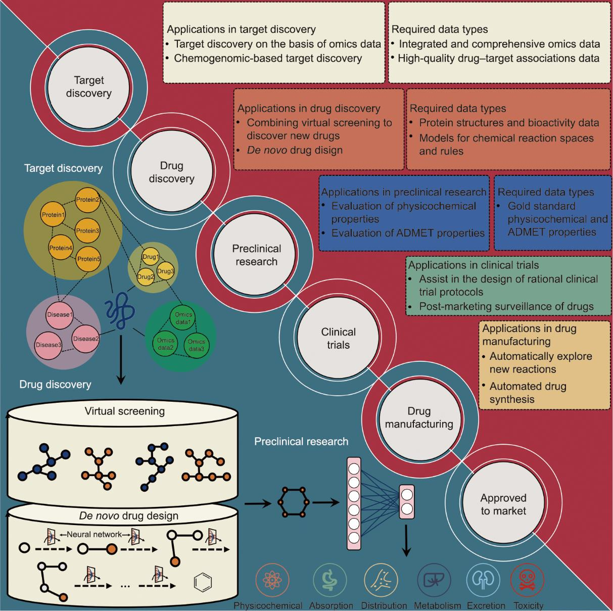
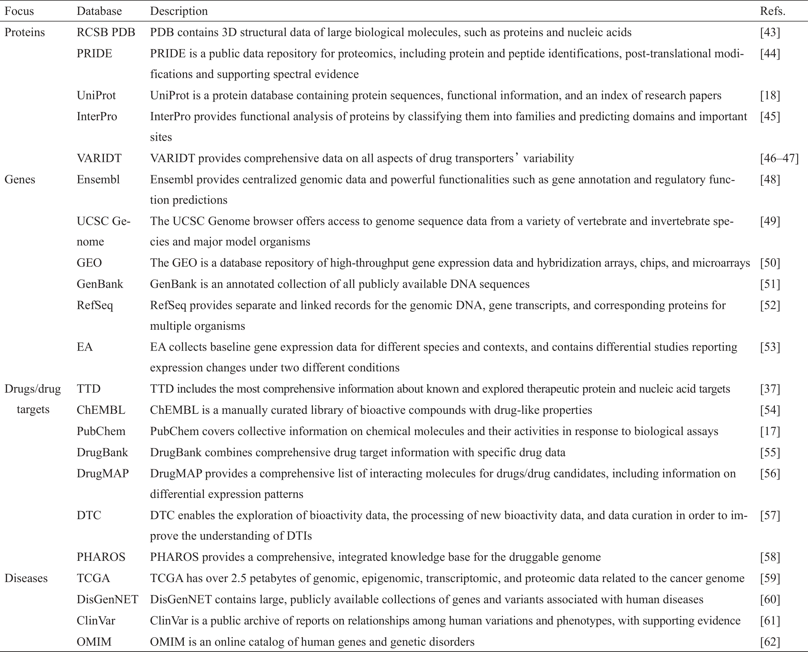
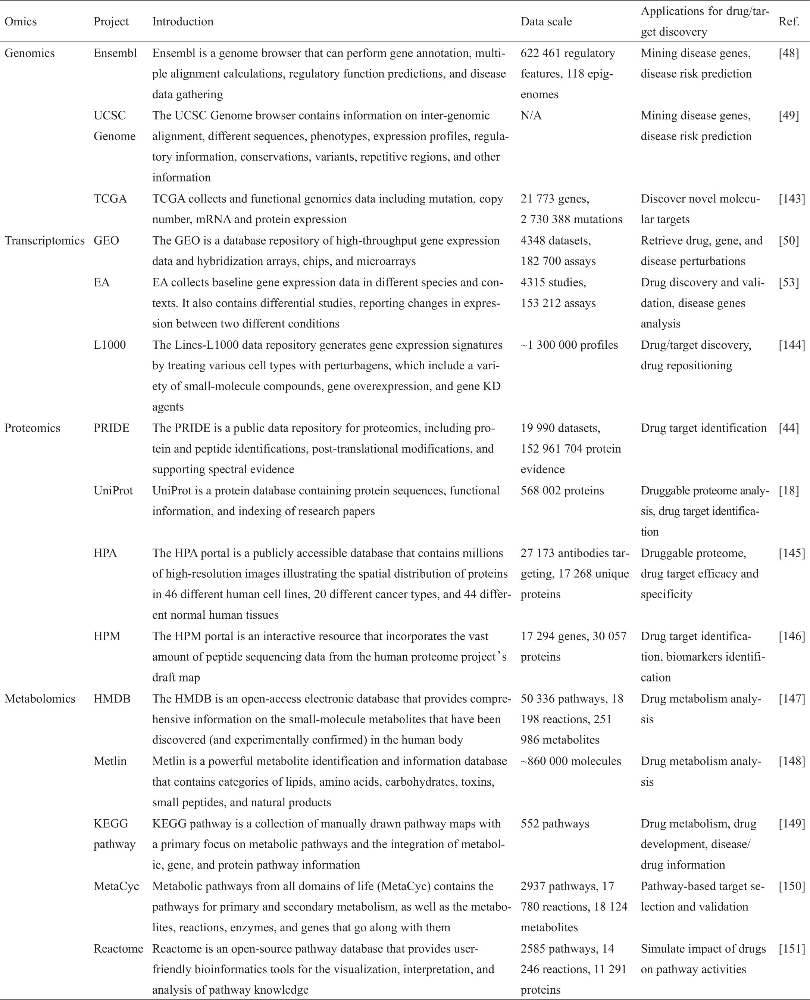
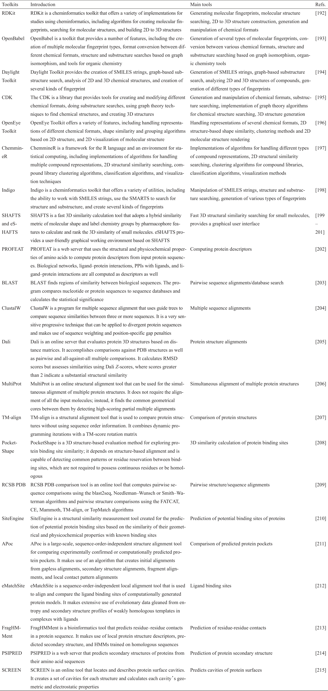
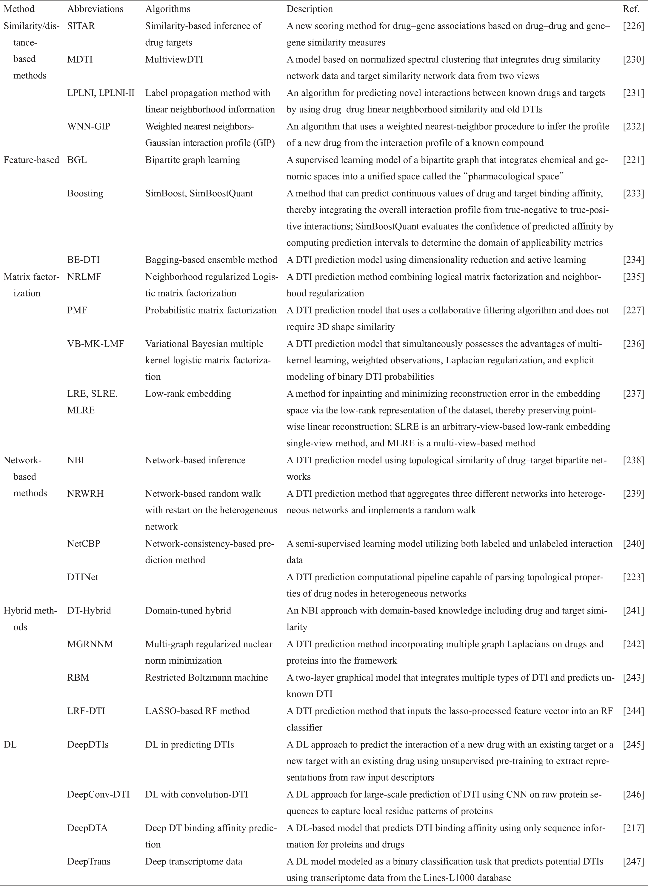
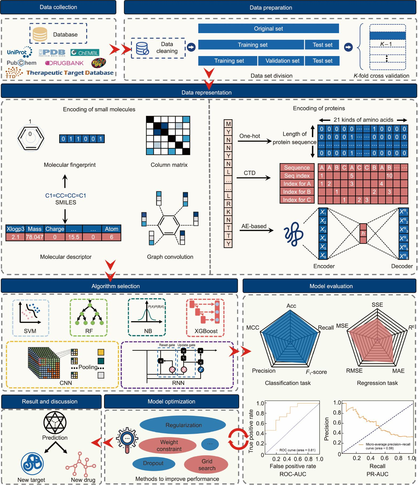

# AI-drug-design

## 人工智能辅助药物发现与设计

## Artificial intelligence-assisted drug discovery and design

## Artificial Intelligence Drug Design

## 全世界唯一的实战开源从0基础入门学习AIDD，手把手教学入门到博士大佬级别的教程

### The only practical open source in the world to learn AIDD from the 0-based entry, hand-to-hand teaching entry to the doctoral level tutorial.

让我为大家简要介绍一下我负责的领域——**人工智能辅助药物发现与设计**。为了更好地帮助大家理解这一复杂的前沿技术，我将通过中文为大家进行讲解，特别是为那些可能在语言上有所障碍的同学提供支持。尽管这种内容通常更适合以英语呈现，但为了确保大家能够更好地掌握核心概念并迅速上手，我选择用中文为大家提供更加直观的学习路径。

**人工智能辅助药物发现与设计**是一种利用人工智能（AI）技术来加速和优化药物开发过程的方法。传统药物研发周期长、成本高、成功率低，而 AI 能够通过大数据处理、模型预测和自动化分析，大幅提升药物设计的效率和准确性。

### **AI 在药物设计中的优势**

- **加速研发周期**：AI 能够快速筛选大量化合物，减少实验筛选的工作量。
- **提高准确性**：AI 能够通过大规模数据训练模型，提升药物设计中的预测准确性。
- **成本降低**：由于减少了实验的重复性和失败率，AI 能够有效降低药物研发成本。
- **个性化药物设计**：AI 能帮助设计个性化药物，针对特定患者或疾病特征，优化治疗效果。

人工智能在药物发现与设计中的应用，使得药物开发过程更加智能化、自动化。通过化合物筛选、靶标预测、药物生成、ADMET 分析等关键步骤，AI 能有效加速药物研发的进程，同时提高设计的准确性和效率。

##  致谢 

- 首先我感谢我的中山大学的导师雷教授带我入门这一行，我踏入校园一无所知，所以也不知道自己的方向，一脸茫然的，所以还是特别感谢我的导师的。并且还要感谢淮阴工学院——喻教授，在他的帮助下才能写出来。同时也感谢张胜玉同学的大力支持完成学业。
- 第二个首先感谢，南京工业大学的计算化学大佬——“郭为涛”同学，一直帮助我，给我讲解制药的流程。
- 第三，我还是得感谢我的好朋友——南京医科大学的“周仪萍”同学，是她聪明漂亮善良的姑娘，大力帮助我。
- 其次，感谢我的群里面的大佬各路指导。
- 最后感谢社会人士和同道中人来帮我批评指正，让我的这一份文档，这一份代码写得更完整，更加完善，让我们祖国做的更好更强大，感谢祖国，感谢党。
- 感谢这些帮助我的人完成我的学业！

## Abstract

Abstract: Drug discovery and development affects various aspects of human health and dramatically impacts the pharmaceutical market. However, investments in a new drug often go unrewarded due to the long and complex process of drug research and development (R&D). With the advancement of experimental technology and computer hardware, artificial intelligence (AI) has recently emerged as a leading tool in analyzing abundant and high-dimensional data. Explosive growth in the size of biomedical data provides advantages in applying AI in all stages of drug R&D. Driven by big data in biomedicine, AI has led to a revolution in drug R&D, due to its ability to discover new drugs more efficiently and at lower cost. This review begins with a brief overview of common AI models in the field of drug discovery; then, it summarizes and discusses in depth their specific applications in various stages of drug R&D, such as target discovery, drug discovery and design, preclinical research, automated drug synthesis, and influences in the pharmaceutical market. Finally, the major limitations of AI in drug R&D are fully discussed and possible solutions are proposed.

Keywords: Artificial intelligence; Machine learning; Deep learning; Target identification; Target discovery; Drug design; Drug discovery

- 👉🏻👉🏻👉🏻👉🏻👉🏻目前目录分为了，第一节和第二节分别：提供没有基础的同学，有基础的同学

## 目录

## 第一节 基础部分

0. 人工智能在医学中的应用
   - Python基础
   - Numpy、Pandas
   - Matplotlib
   - 机器学习和Scikit-Learn
   - 深度学习
   - CADD
   - 图神经网络

1. Python和机器学习基础
   - 分子的文本表示：SMILES
   - 分子的向量表示：描述符和指纹
   - RDKit简介
   - 经典机器学习模型：线性回归、随机森林、支持向量机

2. 公开可用的小分子数据集的探索
   - 生物活性分子 ChEMBL 数据库
   - ZINC 数据库
   - PubChem 数据库
   - 探索性数据分析 (EDA)
   - 定量构效关系 (QSAR) 和虚拟筛选 (VS)

3. 图神经网络
   - 神经网络架构和训练
   - 分子图、原子特征化
   - 消息传递神经网络
   - 图卷积神经网络
   - 可解释性：Grad-CAM

4. 分子对接
   - 分子数据格式：SMI、SDF、MOL2、PDB
   - 力场
   - 蛋白质折叠
   - 使用 AutoDock Vina、Smina、QuickVina 进行分子对接
   - 交互指纹
   - 药效团

5. 深度生成模型
   - 自动编码器
   - 循环神经网络
   - SMILES生成器：ReLeaSE 和 REINVENT
   - 基于图的生成模型：JT-VAE
   - 分子特性优化：强化学习和贝叶斯优化

6. 蛋白质深度学习
   - 简化的蛋白质图表示
   - 体素网格表示
   - 用于编码蛋白质表面的网格表示
   - 3D卷积神经网络

7. 不确定性预测
   - 任意和认知的不确定性
   - 共形预测

## 第二节 化学信息学

1. 基础知识
   - 化学信息学 RDKit 简介
   - Pandas 在化学信息学中的应用
   - SMILES 教程
   - SMARTS 教程
   - 反应列举基础知识
   - 立体异构体和互变异构体列举

2. 使用 Datamol 和 Molfeat 精简化学信息学工作流
   - 数据处理、描述符和聚类

3. 聚类
   - K-Means 聚类
   - Taylor-Butina 聚类

4. 复杂的化学信息学分析
   - Chembl 系统分析
   - 基于 Chembl 数据库的药物数据分析
   - 基于 BindingDB 中的专利数据进行分析

5. SAR 分析
   - 脚手架识别
   - R-group 分析
   - 位置模拟扫描分析
   - Free-Wilson 分析
   - 匹配的分子对
   - 匹配的分子集

6. 机器学习模型
   - 构建并测试一个 QSAR 模型
   - 分类模型构建与比较
   - 回归模型构建与比较

7. 主动学习
   - 主动分类
   - 主动回归
   - 主动形状搜索

8. 神经网络潜能
   - 使用 Auto3D 的同分异构体能量预测

## 第三节 实战部分

### 1. **化合物数据采集与初步处理**

   - 01_从 ChEMBL 化合物数据采集
   - 02_从 PubChem 获取数据
   - 03_从 KLIFS 获取数据
     - 03_1 完整项目：《基于机器学习的生物活性预测》
   - 04_查询在线 API 网络服务

### 2. **分子过滤与预处理**

   - 05_分子过滤：ADMET 和先导化合物相似标准
     - 05_1 完整项目：《基于机器学习与深度学习的分子ADMET预测》
     - 05_2 完整项目：《基于GNN的分子毒性预测》
   - 06_分子过滤：不需要的子结构
     - 06_1 完整项目：《基于ADMET和RO5的分子筛选与化合物相似性的配体筛选》

### 3. **分子表示与相似性分析**

   - 07_分子表示
   - 08_基于配体的筛选：化合物相似性
   - 09_复合聚类
   - 10_最大公共子结构

### 4. **药效团与脱靶预测**

   - 11_基于配体的药效团
   - 12_结合位点相似性和脱靶预测

### 5. **蛋白质数据获取与结合位点检测**

   - 13_蛋白质数据获取：蛋白质数据库（PDB）
   - 14_结合位点检测

### 6. **蛋白质-配体对接**

   - 15_蛋白质-配体对接
     - 15_1 预测生物活性分子的逆合成可及性
   - 16_蛋白质-配体相互作用
   - 17_NGLview 高级使用

### 7. **分子动力学模拟**

   - 18_分子动力学模拟
   - 19_分析分子动力学模拟

### 8. **先导化合物优化与自动化流程**

   - 20_先导化合物优化的自动化流程

### 9. **机器学习与分子性质预测**

   - 21_基于配体的筛选：机器学习
   - 22_基于配体的筛选：神经网络
   - 23_基于 RNN 的分子性质预测
   - 24_基于 GNN 的分子性质预测
   - 25_分子特性预测转换器
   - 26_不确定性估计

### 10. **RNA Aptamer 设计与分析**

#### **1. 数据采集与准备**

- **27_1 RNA Aptamer 数据来源**
  - 数据来源：RNAapt3D (https://rnaapt3d.medals.jp/)
- **27_2 数据清洗与预处理**

#### **2. RNA 结构预测**

- **28_1 一级结构预测**
- **28_2 结构可视化与分析**

- **29_1 二级结构预测**
- **29_2 能量最小化与折叠稳定性分析**
  - ΔG（自由能）和折叠稳定性图

#### **30_RNA Aptamer 结合位点分析**

- **30_1 RNA Aptamer 与靶标的结合位点预测**
- **30_2 结合能计算与优化**

#### **3. 药物设计与优化**

- **30_3 基于 RNA Aptamer 的药物设计**
- **30_4 药物化学与虚拟筛选**

#### **5. 分子动力学模拟与实验验证**

- **30_5 分子动力学模拟**
- **30_6 实验验证**

### 11. **激酶相似性与分析**

   - 31_激酶相似性：序列
   - 32_激酶相似性：激酶口袋（KiSSim 指纹）
   - 33_激酶相似性：相互作用指纹
   - 34_激酶相似性：配体概况
   - 35_激酶相似性：不同观点比较
   - 36_基于激酶片段库设计激酶抑制剂

### 12. **蛋白质-配体相互作用与预测**

   - 37_蛋白质-配体相互作用预测
     - 完整项目：《项目实战：基于Transformer的有机化学反应产量预测 （Prediction of chemical reaction yields using deep learning）》
     - 完整项目：《项目实战：Mapping the space of chemical reactions using attention-based neural networks》
     - 完整项目：《项目实战：基于图数据的小分子化合物生成模型（A Graph to Graphs Framework for Retrosynthesis Prediction）》
     - 完整项目：《项目实战：基于NLP的抗体生成模型（Generative language modeling for antibody design）》

### 13. **高级建模与虚拟筛选**

   - 38_基于 KLIFS 数据跑 3D 动力学
   - 39_基于共识对接的一体化结构虚拟筛选（蛋白质制备、对接、结合位点选择、重新评分和排序）

### 14. **可视化与编码工具**

   - 40_One-Hot 编码
   - 41_使用代码绘制分子图


## 项目结构

```
|-- Al-drug-design-reference.Data   <- 参考文献文件夹
|-- README.md                       <- 详细简介
|-- img                             <- md的图片
|-- docs                            <- 文档
|-- Al-drug-design-reference.enl    <- 参考文献文件
|-- list                            <- 项目结构目录
|-- Al-drug-design.yml                             <- 环境配置
|   |-- 00_ai in_medicine                          <- Python基础知识（❤️如果你有Python基础，或者你有Python与药物设计基础，你可以跳过这一章节，直接从01开始看）
|   |-- 01_Compound_data_acquisition               <- 化合物采集
```


## 配置代码环境


--------------------------------------⚠️如果你是大佬，直接看下面的这一步 beginning------------------------

应安装 Anaconda 和 Git。请参阅[Anaconda 的网站](https://www.anaconda.com/)和[Git 的网站](https://git-scm.com/downloads)进行下载。

### first 

❤️ u must need  read paper ⚠️:

Where r u ***AIDrugDesign.yml*** ?

u first git clone my link!!!, it is have AIDrugDesign.yml.

```bash
conda env create -f AIDrugDesign.yml
```

如果你在国外或者有🪜，请您打开 AIDrugDesign.yml

删除：

```bash
  - pytorch
  - https://mirrors.tuna.tsinghua.edu.cn/anaconda/pkgs/main
  - https://mirrors.tuna.tsinghua.edu.cn/anaconda/pkgs/free
```


### second

```bash
conda env list
```

 Check to see if the  ***AI-drug-design*** 

### Then  

```bash
conda activate AIDrugDesign
```


------------------------------------------⚠️如果你是大佬，直接看下面的这一步 end------------------------


### ❤️如果你是小白的话，请您谦虚的看着下面的步骤：

### 一、Windows 和 macOS 系统上安装和配置 Git，并拉取我的代码到本地。

如果你想要了解 更多的Git的知识，请您前往[如果操作git流程.md]

接下来，我将一步步为你讲解如何在 Windows 和 macOS 系统上安装和配置 Git，并拉取我的代码到本地。

### Windows 系统

#### 1. 下载并安装 Git

- 前往 [Git 官方下载页面](https://git-scm.com/)。
- 选择 Windows 版本进行下载，并按照提示完成安装。
  - 安装时，默认选项即可。如果想要自定义，可以根据需要选择不同的配置，比如编辑器、环境变量等。

#### 2. 配置 Git

安装完成后，打开终端（或 Git Bash）并配置你的 Git 用户信息：

```bash
git config --global user.name "Your Name"
git config --global user.email "youremail@example.com"
```

这样，Git 就会在你每次提交代码时使用这些信息来标识你的身份。

#### 3. 生成 SSH 密钥

在 Windows 上，打开 Git Bash，输入以下命令生成 SSH 密钥：

```bash
ssh-keygen -t rsa -b 4096 -C "youremail@example.com"
```

- 按回车后，你会看到提示选择存储密钥的位置，默认按回车即可。
- 然后你需要设置一个密码，可以为空，但建议设置。

#### 4. 添加 SSH 密钥到 GitHub

- 使用以下命令显示你生成的公钥：

```bash
cat ~/.ssh/id_rsa.pub
```

- 复制公钥并登录 GitHub。
- 前往 GitHub 的 [SSH 和 GPG 密钥页面](https://github.com/settings/keys)，点击 **New SSH key**。
- 将你刚才复制的公钥粘贴到文本框中，添加后保存。

#### 5. 克隆 GitHub 仓库

完成 SSH 密钥配置后，你可以使用以下命令克隆代码仓库：

```bash
git clone git@github.com:itWangCode/AI-drug-design.git
```

#### 6. 成功拉取代码

运行命令后，Git 会将代码拉取到本地的文件夹中。如果成功，你将看到类似如下的信息：

```bash
Cloning into 'AI-drug-design'...
```

这时，代码已经拉取成功。

---

### macOS 系统

#### 1. 安装 Git

macOS 上通常已经自带 Git，如果没有，可以通过 Homebrew 安装 Git：

- 打开终端，输入以下命令安装 Homebrew（如果没有安装）：

```bash
/bin/bash -c "$(curl -fsSL https://raw.githubusercontent.com/Homebrew/install/HEAD/install.sh)"
```

- 安装完成后，输入以下命令安装 Git：

```bash
brew install git
```

#### 2. 配置 Git

- 打开终端，输入以下命令配置 Git：

```bash
git config --global user.name "Your Name"
git config --global user.email "youremail@example.com"
```

#### 3. 生成 SSH 密钥

- 在终端中输入以下命令生成 SSH 密钥：

```bash
ssh-keygen -t rsa -b 4096 -C "youremail@example.com"
```

- 跟 Windows 一样，按回车使用默认路径存储密钥，设置密码（可选）。

#### 4. 添加 SSH 密钥到 GitHub

- 在终端中使用以下命令查看公钥：

```bash
cat ~/.ssh/id_rsa.pub
```

- 复制输出的公钥，登录 GitHub，将公钥添加到 [GitHub SSH Keys](https://github.com/settings/keys) 页面。

#### 5. 克隆 GitHub 仓库

使用以下命令克隆你的仓库到本地：

```bash
git clone git@github.com:itWangCode/AI-drug-design.git
```

#### 6. 成功拉取代码

Git 会将代码下载到当前目录，表示代码拉取成功。

这样，你就成功配置了 Git 并克隆了代码仓库。


### 二、如何在 Windows 和 macOS 系统上下载和安装 Anaconda-Navigator 并配置你的环境

#### 1. 下载 Anaconda-Navigator

##### Windows：

- 前往 [Anaconda 官方网站](https://www.anaconda.com/products/distribution)。
- 点击下载按钮，选择适合 Windows 系统的版本（通常为 64-bit）。
- 下载完成后，运行安装程序并按照提示完成安装。

##### macOS：

- 同样前往 [Anaconda 官方网站](https://www.anaconda.com/products/distribution)。
- 选择 macOS 系统的版本下载并安装。

安装过程中，建议勾选 "Add Anaconda to my PATH environment variable" 选项，以便在终端中可以直接使用 `conda` 命令。

#### 2. 打开 Anaconda-Navigator

安装完成后：

- 在 Windows 上，可以通过开始菜单找到 Anaconda-Navigator 并运行它。
- 在 macOS 上，可以在 "应用程序" 文件夹中找到 Anaconda-Navigator，点击启动。

#### 3. Git clone 你的仓库

在 Anaconda 环境中进行配置之前，首先需要将你的 GitHub 仓库克隆到本地。

1. 打开终端（macOS）或 Git Bash（Windows）。
2. 运行以下命令，克隆你的仓库：

```bash
git clone git@github.com:itWangCode/AI-drug-design.git
```

这将下载包含 `AIDrugDesign.yml` 文件的仓库到本地。

#### 4. 创建 Conda 环境

进入克隆的项目文件夹，并通过 `.yml` 文件创建新的 Conda 环境：

1. 在终端或 Git Bash 中，切换到你克隆的仓库目录：

```bash
cd AI-drug-design
```

2. 运行以下命令，根据 `AIDrugDesign.yml` 文件创建 Conda 环境：

```bash
conda env create -f AIDrugDesign.yml
```

❤️请您耐心等待15分钟以上，请您连接       ***wifi***        !!!!!!!

3. Conda 将自动根据 `.yml` 文件安装所需的依赖包并创建环境。

#### 5. 列出 Conda 环境

安装完成后，使用以下命令查看所有环境，检查是否创建了 `AI-drug-design` 环境：

```bash
conda env list
```

你应该会看到类似如下的输出，其中包含 `AI-drug-design`：

```bash
# conda environments:
#
base                  *  /path/to/anaconda3
AI-drug-design           /path/to/anaconda3/envs/AI-drug-design
```

#### 6. 激活环境

最后，使用以下命令激活 `AI-drug-design` 环境：

```bash
conda activate AI-drug-design
```

你现在已成功配置并激活了 `AI-drug-design` 环境，可以开始使用该环境进行开发了。

## 安装好所有的配置

### 运行


## ☕️☕️☕️能否支持我喝一杯咖啡☕️☕️☕️☕️☕️，谢谢！！让我更有动力，写作💪🏻！！！

<figure class="third">
  <div style="display: flex;align-items: center;justify-content: space-between;">
      
      
  </div>

</figure>


###  三、software

- https://www.jetbrains.com/pycharm/


####  Pycharm 2024.2.1 最新激活码，破解版安装教程（亲测至2099年~）

废话不多说，先上 Pycharm 2024.2.1 版本破解成功的截图，如下，可以看到已经成功破解到 2099 年辣，舒服！


###  卸载老版本 Pycharm

接下来，我就将通过图文的方式, 来详细讲解如何激活 Pycharm 2024.2.1 版本至 2099 年。首先，如果小伙伴的电脑上有安装老版本的 Pycharm , 需要将其卸载掉，如下所示（没有安装则不用管，直接安装即可）：


将**删除缓存和本地历史勾选上**，点击*卸载*按钮开始卸载：


卸载完成后，点击*关闭*按钮。

###  下载 Pycharm 安装包

访问 Pycharm 官网：https://www.jetbrains.com/pycharm/download，下载 Pycharm 2024.2.1 版本的安装包。


###  开始安装

下载完成后，双击 `.exe` 安装包开始安装 Pycharm :


点击*下一步*按钮：


**自定义安装路径**，我这里安装在了 `E:\` 盘下，继续点击*下一步*按钮：


进入到**安装选项**的选择，**将下图标注的部分，全部勾选上**，点击*下一步*按钮：


点击*安装*按钮，等待 Pycharm 安装完成：


安装成功后，会弹出如下提示框，一个是立即启动，不要勾选它。我们勾选 “*否，我会在之后重新启动*”，因为需要先破解成功后再启动 Pycharm :


点击*完成*按钮，关闭弹框。

###  下载破解脚本

破解脚本我放置在了网盘中，并提供了多个备用链接，以防下载失效。

> **提示：破解脚本的网盘链接文末获取 ~**
>
> **提示：破解脚本的网盘链接文末获取 ~**
>
> **提示：破解脚本的网盘链接文末获取 ~**

下载成功后，如下，是个压缩包，先对它进行解压：


###  开始激活

进入到解压后的文件夹 `/win2020-2024(一键激活)` 中，双击 *Pycharm 激活.vbs* ，若提示 `Success!!! Now you can enjoy Pycharm to 2099` , 则表示 Pycharm 激活成功啦 ~


###  检查是否激活成功

激活成功后，双击桌面的 Pycharm 快捷启动图标，来打开 Pycharm 。注意，首次安装 Pycharm 可能会弹出如下提示框，勾选 `Do not import settings`, 点击 *OK* 按钮即可：


进入 Pycharm 中后，点击菜单栏 *Help | Register...* , 即可查看 Pycharm 的激活到期时间：


### Pycharm 激活码

EUWT4EE9X2-eyJsaWNlbnNlSWQiOiJFVVdUNEVFOVgyIiwibGljZW5zZWVOYW1lIjoic2lnbnVwIHNjb290ZXIiLCJhc3NpZ25lZU5hbWUiOiIiLCJhc3NpZ25lZUVtYWlsIjoiIiwibGljZW5zZVJlc3RyaWN0aW9uIjoiIiwiY2hlY2tDb25jdXJyZW50VXNlIjpmYWxzZSwicHJvZHVjdHMiOlt7ImNvZGUiOiJQU0kiLCJmYWxsYmFja0RhdGUiOiIyMDI1LTA4LTAxIiwicGFpZFVwVG8iOiIyMDI1LTA4LTAxIiwiZXh0ZW5kZWQiOnRydWV9LHsiY29kZSI6IlBDIiwiZmFsbGJhY2tEYXRlIjoiMjAyNS0wOC0wMSIsInBhaWRVcFRvIjoiMjAyNS0wOC0wMSIsImV4dGVuZGVkIjpmYWxzZX0seyJjb2RlIjoiUFBDIiwiZmFsbGJhY2tEYXRlIjoiMjAyNS0wOC0wMSIsInBhaWRVcFRvIjoiMjAyNS0wOC0wMSIsImV4dGVuZGVkIjp0cnVlfSx7ImNvZGUiOiJQV1MiLCJmYWxsYmFja0RhdGUiOiIyMDI1LTA4LTAxIiwicGFpZFVwVG8iOiIyMDI1LTA4LTAxIiwiZXh0ZW5kZWQiOnRydWV9LHsiY29kZSI6IlBDV01QIiwiZmFsbGJhY2tEYXRlIjoiMjAyNS0wOC0wMSIsInBhaWRVcFRvIjoiMjAyNS0wOC0wMSIsImV4dGVuZGVkIjp0cnVlfV0sIm1ldGFkYXRhIjoiMDEyMDIyMDkwMlBTQU4wMDAwMDUiLCJoYXNoIjoiVFJJQUw6MzUzOTQ0NTE3IiwiZ3JhY2VQZXJpb2REYXlzIjo3LCJhdXRvUHJvbG9uZ2F0ZWQiOmZhbHNlLCJpc0F1dG9Qcm9sb25nYXRlZCI6ZmFsc2V9-FT9l1nyyF9EyNmlelrLP9rGtugZ6sEs3CkYIKqGgSi608LIamge623nLLjI8f6O4EdbCfjJcPXLxklUe1O/5ASO3JnbPFUBYUEebCWZPgPfIdjw7hfA1PsGUdw1SBvh4BEWCMVVJWVtc9ktE+gQ8ldugYjXs0s34xaWjjfolJn2V4f4lnnCv0pikF7Ig/Bsyd/8bsySBJ54Uy9dkEsBUFJzqYSfR7Z/xsrACGFgq96ZsifnAnnOvfGbRX8Q8IIu0zDbNh7smxOwrz2odmL72UaU51A5YaOcPSXRM9uyqCnSp/ENLzkQa/B9RNO+VA7kCsj3MlJWJp5Sotn5spyV+gA==-MIIETDCCAjSgAwIBAgIBDTANBgkqhkiG9w0BAQsFADAYMRYwFAYDVQQDDA1KZXRQcm9maWxlIENBMB4XDTIwMTAxOTA5MDU1M1oXDTIyMTAyMTA5MDU1M1owHzEdMBsGA1UEAwwUcHJvZDJ5LWZyb20tMjAyMDEwMTkwggEiMA0GCSqGSIb3DQEBAQUAA4IBDwAwggEKAoIBAQCUlaUFc1wf+CfY9wzFWEL2euKQ5nswqb57V8QZG7d7RoR6rwYUIXseTOAFq210oMEe++LCjzKDuqwDfsyhgDNTgZBPAaC4vUU2oy+XR+Fq8nBixWIsH668HeOnRK6RRhsr0rJzRB95aZ3EAPzBuQ2qPaNGm17pAX0Rd6MPRgjp75IWwI9eA6aMEdPQEVN7uyOtM5zSsjoj79Lbu1fjShOnQZuJcsV8tqnayeFkNzv2LTOlofU/Tbx502Ro073gGjoeRzNvrynAP03pL486P3KCAyiNPhDs2z8/COMrxRlZW5mfzo0xsK0dQGNH3UoG/9RVwHG4eS8LFpMTR9oetHZBAgMBAAGjgZkwgZYwCQYDVR0TBAIwADAdBgNVHQ4EFgQUJNoRIpb1hUHAk0foMSNM9MCEAv8wSAYDVR0jBEEwP4AUo562SGdCEjZBvW3gubSgUouX8bOhHKQaMBgxFjAUBgNVBAMMDUpldFByb2ZpbGUgQ0GCCQDSbLGDsoN54TATBgNVHSUEDDAKBggrBgEFBQcDATALBgNVHQ8EBAMCBaAwDQYJKoZIhvcNAQELBQADggIBABqRoNGxAQct9dQUFK8xqhiZaYPd30TlmCmSAaGJ0eBpvkVeqA2jGYhAQRqFiAlFC63JKvWvRZO1iRuWCEfUMkdqQ9VQPXziE/BlsOIgrL6RlJfuFcEZ8TK3syIfIGQZNCxYhLLUuet2HE6LJYPQ5c0jH4kDooRpcVZ4rBxNwddpctUO2te9UU5/FjhioZQsPvd92qOTsV+8Cyl2fvNhNKD1Uu9ff5AkVIQn4JU23ozdB/R5oUlebwaTE6WZNBs+TA/qPj+5/we9NH71WRB0hqUoLI2AKKyiPw++FtN4Su1vsdDlrAzDj9ILjpjJKA1ImuVcG329/WTYIKysZ1CWK3zATg9BeCUPAV1pQy8ToXOq+RSYen6winZ2OO93eyHv2Iw5kbn1dqfBw1BuTE29V2FJKicJSu8iEOpfoafwJISXmz1wnnWL3V/0NxTulfWsXugOoLfv0ZIBP1xH9kmf22jjQ2JiHhQZP7ZDsreRrOeIQ/c4yR8IQvMLfC0WKQqrHu5ZzXTH4NO3CwGWSlTY74kE91zXB5mwWAx1jig+UXYc2w4RkVhy0//lOmVya/PEepuuTTI4+UJwC7qbVlh5zfhj8oTNUXgN0AOc+Q0/WFPl1aw5VV/VrO8FCoB15lFVlpKaQ1Yh+DVU8ke+rt9Th0BCHXe0uZOEmH0nOnH/0onD

如下图标注所示，根据日期显示直到 2099 年才会失效，确实是破解成功了：


###  激活脚本下载地址

> PS: 激活脚本由于**提取人数过多**，**导致分享的百度网盘链接容易被封**：蛋疼 ing，为限制人数，目前暂不提供页面直接下载，**改为从笔者公众号下载**。

> 需要的小伙伴，**扫描下方公众号二维码**，或者**关注公众号**： *Python 见习室*，**回复关键字**：*2099*, **即可免费无套路获取激活码、破解补丁，持续更新中 ~。**


更多的额操作：请您参考：【https://www.exception.site/article/1762】


## 文章所用到的 ***Python*** 语法

### Python 学习目录和教案 —— 适用于 AI-drug-design 项目

在学习 Python 用于 AI 药物设计（AI-drug-design）项目时，您需要掌握以下知识点。学习计划将涵盖基础知识、数据处理、机器学习、深度学习框架、药物设计相关库的使用等内容。以下是详细的学习目录和教案：

---

### 目录

1. **Python 基础**

   ```
   1.1 Python 环境配置（Anaconda、虚拟环境、Jupyter Notebook）
   1.2 Python 基础语法（变量、数据类型、运算符）
   1.3 控制结构（条件语句、循环）
   1.4 函数与模块（自定义函数、导入库）
   1.5 文件操作（读取和写入文件）
   1.6 异常处理
   ```

   

2. **数据处理与分析**

   ```
   2.1 Numpy 数组操作
   2.2 Pandas 数据框操作
   2.3 数据清洗与处理
   2.4 数据可视化（Matplotlib、Seaborn）
   2.5 基础统计与数据分析方法
   ```

   

3. **科学计算与机器学习基础**

   ```
   3.1 Scikit-learn 入门
   3.2 常用算法（线性回归、分类、聚类、决策树等）
   3.3 模型评估与优化
   3.4 模型调参与交叉验证
   ```

   

4. **深度学习框架**

   ```
   4.1 TensorFlow 基础
   4.2 Keras 快速上手
   4.3 PyTorch 基础
   4.4 GPU 加速与优化
   4.5 神经网络的构建与训练
   ```

   

5. **AI 药物设计基础**

   ```
   5.1 药物设计相关的 Python 库介绍
   5.2 RDKit（化学信息学工具）入门与使用
   5.3 Mol2Vec 分子特征表示方法
   5.4 化合物的预处理与分子特征提取
   5.5 分子对接与虚拟筛选
   5.6 药物活性预测模型
   ```

   

6. **高级主题**

   ```
   6.1 深度学习在药物设计中的应用
   6.2 分子生成模型（GAN、VAE）
   6.3 分子动力学模拟简介
   6.4 蛋白质结构预测与分子对接
   6.5 AI 在药物筛选和优化中的应用
   ```

   

---

### 教案

#### 1. Python 基础

**目标**：掌握 Python 基本语法、数据结构及控制流，能够编写简单的 Python 程序。

**教学内容**：

- Python 环境配置与解释器运行
- 基本数据类型（字符串、整数、浮点数、布尔）
- 数据结构：列表、字典、集合、元组
- 控制结构：if、else、for、while 循环
- 函数与参数传递，理解递归
- 模块的导入与创建（如 `math`、`random` 模块）

**作业**：

- 编写一个处理简单文本的 Python 程序（如计算文本单词频率）
- 编写一个函数，接受多个参数并返回最大值

#### 2. 数据处理与分析

**目标**：学习 Numpy 和 Pandas 库，能够进行高效的数据处理和分析。

**教学内容**：

- Numpy 基础：数组创建、形状修改、索引与切片、数组运算
- Pandas 基础：Series 和 DataFrame 的操作，缺失值处理，数据筛选与排序
- 数据的导入与导出（CSV、Excel 等格式）
- 数据可视化：柱状图、折线图、散点图
- 数据统计分析：均值、中位数、标准差等

**作业**：

- 使用 Pandas 读取 CSV 文件，计算每列的均值和标准差
- 使用 Matplotlib 绘制简单的柱状图和折线图

#### 3. 科学计算与机器学习基础

**目标**：掌握机器学习基础理论，能够使用 Scikit-learn 进行模型训练和评估。

**教学内容**：

- 监督学习和无监督学习简介
- 数据集的划分：训练集、验证集与测试集
- 线性回归、逻辑回归、KNN、决策树等基本算法
- 模型的评估：准确率、混淆矩阵、ROC 曲线
- 超参数优化与交叉验证

**作业**：

- 使用 Scikit-learn 进行一个简单的分类问题（如鸢尾花数据集分类）
- 绘制模型的 ROC 曲线并计算 AUC

#### 4. 深度学习框架

**目标**：熟悉常用的深度学习框架（TensorFlow、Keras、PyTorch），能够搭建简单的神经网络。

**教学内容**：

- TensorFlow 和 Keras 的基本用法：张量操作、模型构建
- PyTorch 的基本操作：Tensors、Autograd、优化器
- 构建简单的全连接神经网络
- 使用 GPU 进行模型训练
- 优化方法：SGD、Adam 等优化器
- 避免过拟合的正则化方法（如 Dropout）

**作业**：

- 使用 Keras 实现一个手写数字识别模型（MNIST 数据集）
- 使用 PyTorch 实现一个简单的卷积神经网络

#### 5. AI 药物设计基础

**目标**：学习 AI 药物设计相关的库，能够进行分子数据的处理与建模。

**教学内容**：

- RDKit 入门：分子结构的读取、绘制与操作
- 化合物分子描述符的计算
- 化学库的虚拟筛选
- Mol2Vec 特征表示方法
- 基于机器学习的药物活性预测模型
- 小分子的对接模拟（AutoDock、PyMOL 简介）

**作业**：

- 使用 RDKit 对一组化合物进行特征提取
- 使用机器学习模型预测药物活性

#### 6. 高级主题

**目标**：掌握深度学习在分子生成与药物设计中的应用。

**教学内容**：

- 分子生成模型：生成对抗网络（GAN）、变分自编码器（VAE）
- 基于深度学习的分子优化方法
- 蛋白质结构预测：AlphaFold 介绍
- 分子动力学模拟基础与应用
- 药物筛选流程与 AI 在其中的应用

**作业**：

- 使用 GAN 模型生成新的分子结构
- 编写脚本对某一蛋白质靶点进行分子对接模拟


## **1、 引言**

在过去几十年中，制药行业受制于药学科学前沿研究的程度，因为新药的开发是一个长期而复杂的过程，伴随着高风险和高成本[1‒2]。换句话说，当前的药物研发领域需要显著提高生产力，以缩短药物开发的周期和成本[3]。网络药理学、RNA测序（RNA-seq）、高通量筛选（HTS）或虚拟筛选等技术在一定程度上加速了新靶点和新药物的发现[4‒9]。然而，这些技术在当前新药发现过程中往往未起到决定性作用。因此，迫切需要新技术推动新药的开发。

随着算力的大幅增长，由于AI学习、处理和预测大量信息的能力，其已被广泛应用于许多实际案例，如图像分类和语音识别[10‒12]。目前，在长期的数据积累过程中，结合高通量RNA-seq技术的发展，已经产生了大量的生物医学数据[13‒18]。而生物医学数据具有高度异质性和复杂性，来源多样，包括来自不同平台的组学数据、生物或化学实验室的实验数据、制药公司产生的数据、公开披露的文本信息以及从公开可用数据库手动整理的数据[19‒22]。人工智能（AI）可以用于学习这些海量生物医学数据中的潜在模式，从而为药学和产业带来新的机遇和挑战。

AlphaFold2在Critical Assessment of Protein Structure Prediction (CASP14)竞赛中利用AI方法在准确预测蛋白质的三维结构方面表现出色[23]。同样，在Open-Graph Benchmark Large-Scale Challenge (OGB-LSC)竞赛中，将图神经网络与Transformer模型相结合，在预测通过密度泛函理论（DFT）计算的分子性质方面取得了最好成绩，与之相比，传统方法表现不佳且耗时较长[24]。这些竞赛展示了AI在分析生物或化学数据方面的强大能力。由于其可以利用相关的生物医学数据来理解复杂的生物系统和化学反应空间的强大能力[25‒26]，AI对药物研发的各个阶段都产生了革命性的影响，不仅包括蛋白质和小分子的研究，还包括临床试验的辅助设计和上市后监测[27]。此外，在制药公司中，许多最先进的AI模型已被应用于不同的流程中，以缩短研发周期和降低成本[28‒30]。

在这一背景下，AI技术主要涉及机器学习（machine learning, ML）和深度学习（deep learning, DL）。在靶点的发现和验证[31]、药物的发现和设计[32]以及临床前药物研究[33]等方面，ML以及DL均被应用于分析不同格式的各种数据特征。当一个药物候选进入临床试验阶段[34]后，DL在临床试验设计、监督和分析临床四期数据方面发挥了至关重要的作用[33]。已获批的药物对企业[35]和市场经济有着重要影响，DL也在这些领域发挥了作用。因此，在本文中，我们全面介绍了AI在制药科学中的大部分应用领域。重点关注AI如何促进靶点发现和药物发现（图1），并思考如何进一步加速该领域的发展。



**图1** AI在制药科学中的应用概述。ADMET：吸收、分布、代谢、排泄和毒性。

### 关键词：人工智能 ; 机器学习 ; 深度学习 ; 靶标识别 ; 靶标发现 ; 药物设计 ; 药物发现

## 2、 AI的基本概念及其应用范围

AI最早于1956年在达特茅斯会议上提出，并被定义为一种使机器具备推理和执行功能的算法[36]。从感知机到支持向量机（SVM）和人工神经网络（ANNs），AI的发展经历了几次起伏，并得益于现有的硬件支持，目前正在蓬勃发展。机器学习（ML）和深度学习（DL）都属于AI的范畴；严格来说，DL可以归类为ML。然而，在本文中，我们对ML的讨论仅集中在传统的机器学习方法，如随机森林（RF）和支持向量机（SVM）等。

### 2.1 大数据时代

在当前的大数据时代，庞大的生物和临床数据为AI在医药研究领域的应用奠定了基础。尽管AI已经在药物研发过程的多个方面取得了成功和有效的应用，但医学数据的数量和质量已成为制约AI在药学中发展的主要阻碍之一。迄今为止，由全球的药物研究人员构建的包含详细和结构化大数据的药物数据库在促进AI在医药研究中的应用方面起着关键作用。

例如，治疗靶点数据库（TTD）包含有关已知和探索的治疗蛋白质和核酸靶点、靶向疾病、通路信息以及针对每个靶点的相应药物的最全面信息。它提供了有关靶点功能的详细知识，以及它们的序列、三维结构、配体结合性质、相关酶和相应药物信息[37]。PubChem [17]提供了与生物测定相关的化学分子及其活性的集合信息，包括分子结构、标识符、物理化学性质、专利信息和分子毒性。一些旨在解决各种药物问题的常用数据库已被提出并被经常使用，它们在推动AI在医药研究中的应用方面发挥着重要作用[38‒42]。通过总结各种常用的药物数据库，表1 [17‒18,37,43‒62]提供了有关常用药物数据库的简要信息，按照蛋白质相关、基因相关、药物相关和疾病相关的数据库进行了分类。

**表1 以蛋白质、基因、药物/药物靶点和疾病为重点的医药数据库**



### 2.2 机器学习与深度学习

与传统的计算机编程计算不同，ML和DL可以从输入数据中学习潜在的模式，而无需显式编程。它们不受输入数据格式的限制，可以包括文本、图像、声音等各种类型的数据（所有可以进行编码的数据类型）[63]。类似于人类学习模式，ML和DL可以逐渐识别数据的不同特征，推断其中的模式，并通过不断迭代更新模型参数，直到形成有效的模型。

根据应用场景，模型可以分为回归模型和分类模型。分类和回归任务的区别主要在于输出变量的类型是连续还是离散。Cheng等[64]应用机器学习方法预测全氟烷基物质（PFAS）的生物活性，输出为连续值，这是一种典型的回归任务。Hong等[65]构建了一个深度学习模型，用于预测细菌中的蛋白质是否属于T4SE类型，输出为离散值（如0/1），这是一种典型的分类任务。

根据解决问题所需的学习算法类型，模型可以概念化为三类：监督学习、无监督学习和强化学习。监督学习是一个基于标记数据的过程，通过训练模型来学习输入与预先确定的输出之间的关系，以预测未来输入的类别或连续变量。相比之下，无监督方法用于识别无标签数据集中的模式，并探索数据集的潜在结构，以便对数据进行进一步的聚类分析等。此外，半监督学习介于监督学习和无监督学习之间；它仅接受部分标记数据来开发训练模型，并可用作缺乏高质量数据的问题的潜在解决方案[66]。强化学习通过持续的交互式学习进行模型构建，依赖失败的惩罚或成功的奖励来指导模型的构建。

### 2.3 对ML/DL算法的基础介绍

ML和DL方法已成功应用于解决相关的生物医学问题，采用的建模方法因不同问题甚至相同问题而异。例如，过去常常对小分子进行特征工程，将其表征直接送入不同的ML模型中以预测性质；然而，最近，图神经网络（GNNs）也可以用于描述小分子以预测性质[67]。对蛋白质进行功能注释对于发现作为潜在靶点的可药靶蛋白质至关重要。Maxat等[68]使用卷积神经网络（CNN）对蛋白质的基因本体论（GOA）进行注释。Nadav等[69]构建了一个循环神经网络（RNN）用于蛋白质功能注释，Xia等[70]结合了CNN和RNN来预测蛋白质的基因本体（GO）标签。

ML构建了一种非特定的算法，它关注数据的特征并将其转化为机器可以读取的知识，以提供给人类新的见解。研究人员可以选择多种常见的算法。朴素贝叶斯（NB）算法是基于贝叶斯定理和特征之间独立假设的概率分类器，它是一种简单直观的算法[71]。随机森林（RF）算法构建了一组无关的决策树，形成一个完整的层次结构；在模型构建过程中，每棵决策树分别负责相应的问题[72]。基于决策树的大多数投票产生最终决策。通过这种方法进行决策的模型通常被称为集成模型。极限梯度提升（XGBOOST）是一种基于梯度提升的可扩展机器学习算法，也是一种集成模型[73]。多层感知器（MLP）可以被视为由多个节点层组成的有向图，每个节点层与下一层完全连接，以将一组输入向量映射到一组输出向量。支持向量机（SVM）是应用最广泛的机器学习算法之一。它使用最优超平面对样本进行分类，这些样本通过在特定维度空间中最大化不同类之间的间隔来获得，维度由特征数量确定[74]。*k*最近邻（KNN）被认为是一种“惰性学习”，在区分类别时仅根据少数相邻样本对样本进行分类[75]。除上述方法外，还有其他一些机器学习方法，如主成分分析（PCA）、偏最小二乘（PLS）、线性判别分析（LDA）和逻辑回归（LR），在生物医学数据处理中得到应用[76‒77]。

DL由于其强大的泛化和特征提取能力而受到欢迎；其学习和预测过程是端到端的。与传统的机器学习过程（通常由多个独立模块组成）不同，深度学习在模型训练过程中直接从输入数据（输入端）获得输出数据（输出端），并根据输出与真实值之间的误差不断调整和优化模型，直到达到预期的结果。深度神经网络（DNN）是一种前馈神经网络，由密集连接的输入层、隐藏层和输出层组成。它通过模拟神经元之间的非线性变换来实现对输入数据的特征学习，而每一层都由多个神经元组成[78]。卷积神经网络（CNN）是一种前馈神经网络，由卷积层（特征提取）和池化层（降维）组成。卷积和池化层有助于在不消耗太多时间和计算资源的情况下提取数据集中的所有信息[79]。循环神经网络（RNN）是一类人工神经网络，其中链接的节点沿着时间序列形成有向或无向图。RNN包括一个反馈组件，允许信号从一层反馈到前一层。它是唯一具有内部记忆的神经网络，有助于解决学习和存储长期信息的难题[80]。图神经网络（GNN）是一种连接模型，通过节点之间的信息传递推导出图中的依赖关系[81‒82]。GNN根据节点的邻居更新节点的状态，该状态能够表示节点的信息。上述四种网络的神经网络结构如图2所示。


自动编码器（AE）由编码器和解码器组成，用于学习输入数据的有效编码。通过将输入数据输入到编码器生成的编码，可以通过解码器重新生成输入。AE通过对数据集的表征（即编码）进行数据压缩和降维[83]。生成对抗网络（GAN）由两个基础神经网络组成：生成器神经网络和判别器神经网络。前者用于生成内容，而后者用于区分生成的内容[84]。模型也可以组合使用以解决更广泛的问题。例如，图卷积网络（GCN）将传统数据（如图像）的卷积操作扩展到图数据[85]。

当模型无法有效学习数据特征中的潜在模式，并且失去了对新数据的泛化能力时，这种问题通常被称为模型欠拟合（underfitting）[86]。相反，过拟合（overfitting）发生在模型训练时，数据中的噪声被拟合为代表性特征，导致对新数据的预测效果不佳[87]。与欠拟合相比，模型过拟合更难处理。通常由于过于复杂或数据的不充分表征而导致模型过拟合。用于模型的数据集通常被划分为训练集、验证集和测试集。这些集合分别用于模型的训练、调整和评估。简单来说，既在训练集上表现不佳又在测试集上表现不佳的模型是欠拟合模型，而在训练集上表现良好但在测试集上表现不佳的模型是过拟合模型。抑制过拟合的典型方法包括正则化、数据增强[88]、dropout [89]、提前停止和集成学习等方法。

在预测COVID-19大流行的长期趋势时，研究人员遇到了模型欠拟合和过拟合的问题，当时他们只使用了传统流行病模型或机器学习模型中的一个模型。为了解决这些问题，Sun等[90]提出了一个称为动态易感-潜伏-感染-隔离（D-SEIQ）的新模型。D-SEIQ模型通过适当修改易感-潜伏-感染-康复（SEIR）模型，并在合理的流行病学约束条件下整合基于机器学习的参数优化，可以准确预测COVID-19暴发的长期趋势。

不同的模型有不同的评估标准。在回归模型中，常用的评估标准包括均方误差（MSE）、均方根误差（RMSE）和*R*²。在分类模型中，常用标准是召回率（Recall）、精确率（Precision）和*F*1分数（*F*1 Score）。同时，接收者操作特征（ROC）曲线和精确率-召回率曲线（PRC）是分类模型中最常用的评估标准，ROC曲线考虑了正负样本来评估模型的整体性能，而PRC更关注正样本情况[91]。

### 2.4 简述作为模型输入的分子表征方法

随着时间的推移，关于小分子和蛋白质的数据积累已经形成了一个极其庞大的数据资源。不同组织机构已经收集和整理了分子序列、结构、物理化学性质等数据库，其中包含大量的知识和信息。然而，数据的不同来源和格式使得从多个异构源整合相关数据变得困难。采用适当的方法以表征分子，并通过AI挖掘分子数据中的关键信息尤为重要[92]。当前的AI算法高度依赖数据的质量，因此，在进行模型构建时，有必要统一分子的输入格式，例如，将小分子和蛋白质表示为模型可读的向量或矩阵。

目前，小分子的表征通常采用以下四种主要方法之一。第一种方法是基于知识的表示。基于人类先验知识的分子描述符和分子指纹广泛应用于各种ML或DL算法[93]。第二种方法是基于图像的直接表示。CNN现在已经用于从二维数字图像中学习规则。分子的二维化学数字网格可以直接用作输入，使得CNN模型能够学习分子的特性[94]。第三种方法是基于字符串的表示。例如，典型的简化分子输入行表示系统（SMILES）将小分子表示为字符串形式。因此，CNN和RNN可以进一步从化学结构的字符串表示中学习分子嵌入[95‒97]。第四种方法涉及基于图的特征表示。基于图卷积或图注意力的表示方法广泛用于探索小分子的特征表示。在这些方法中，原子和键分别被视为节点和边，在单个节点上的信息持续更新过程中以获得新的分子表征。基于图的表征在各种学习任务中取得了出色的性能[98‒99]。

蛋白质的表征方法基本上也可以分为四类：基于序列内在性质的表示、基于物理化学性质的表示、基于蛋白质结构的表示和基于图的表示。基于序列的蛋白质表示方法包括氨基酸组成（AAC）、二肽组成、自相关描述符、位置特异性评分矩阵（PSSMs）和独热编码（one-hot）[100‒107]；这些方法反映了氨基酸的不同组成、二肽的组成以及氨基酸在序列上的分布。基于物理化学性质的蛋白质表征方法包括组成、转换和分布（CTD），伪氨基酸组成（PAAC）和疏水性伪氨基酸组成（APAAC）[108‒110]，这些方法反映了每个氨基酸的性质以及这些性质在序列上的分布。上述两种特征表示方法被广泛应用于各种模型，因为它们可以仅通过序列信息获取蛋白质特征。众所周知，蛋白质的高级结构决定了其功能，因此有时会直接表征蛋白质的结构。基于结构性质的蛋白质表征方法包括拓扑分子结构、蛋白质二级结构和溶剂可及性（PSSSA）[111‒113]，这些方法反映了蛋白质中每个氨基酸的结构性质和蛋白质的结构类型。PSSSA也是基于图的蛋白质表示方法。在最简单的图中，每个节点对应一个氨基酸残基，而边连接在一定距离内的残基对[114]。基于结构和图的蛋白质表征方法能够有效地表示蛋白质的结构以及结构中氨基酸残基之间的关系，并可应用于各种新颖的模型架构，如图神经网络（GNNs）、Transformer模型和生成对抗网络（GANs）[114‒117]。

近年来，出现了一些新颖的分子表征方法，如基于知识图谱和大规模预训练的表征方法[118‒119]；这些方法在适当的下游任务中也表现出色。总体而言，使用捕捉分子关键特征的向量或矩阵来表示分子的原始数据对于后续的数据探索和分析至关重要。

### 2.5 药物与疾病研究的AI算法

在研究不同类型的药物并进行疾病研究时，选择合适的模型可以最大限度地利用数据中的潜在信息。对于小型数据集的分类或回归问题，ML通常可以在短时间内达到令人满意的性能。例如，基于定量构效关系（QSAR）模型的药物-蛋白质亲和性预测研究可以选择使用支持向量机（SVM）或随机森林（RF）模型（详见第5节）[120‒121]。当数据量逐渐增多时，DL算法通常更为适用。例如，在蛋白质折叠问题的预测中，CNN模型可以更好地预测残基[122]。在药物从头设计领域，生成模型和变分自动编码器（VAE）可以帮助设计与愿景相吻合的分子[123‒124]（详见第4节）。研究往往不是从任务的角度选择模型，而是通过数据的表征形式来选择适当的算法。因此，研究人员可以从可用于相同任务的不同AI算法中进行选择。在预测分子的吸收、分布、代谢、排泄和毒性（ADMET）性质时，CNN、RNN和多任务学习可以取得出色的结果[125]（详见第5节）。基于图的AI算法通过从数据之间的关系入手，允许对非结构化数据进行建模。在药学中，复杂的生物网络关系至关重要。因此，通过加入药物-药物相互作用、药物-蛋白质相互作用、蛋白质-蛋白质相互作用等，可以增强模型的学习能力[126]（详见第3节）。当与这些生物实体本身的表征相结合时，可以在更深层次上学习到有关实体的关键信息，以助于进行预测，并构建更具解释性的模型。

因此，在将这些方法应用于实际的药物和疾病问题研究时，不同算法之间的边界变得越来越模糊。根据可用数据的类型，并考虑生物学上的意义，可以为模型选择和构建提供见解。

## 3、 靶点发现与验证

从传统的角度来看，新药发现（first-in-clas）有两种范式[127]：表型药物发现（PDD）和靶向药物发现（TDD）。早期的生物研究技术依赖于显微镜、成像和细胞技术，观察活体系统中的表型变化。PDD通过构建与疾病高度相关的动物模型或实验，对化合物或抗体库进行筛选。接下来，观察细胞或实验动物对这些化合物的反应，以便确定具有一定疗效水平的分子，进行进一步的结构修饰和优化[128]。随着分子生物学和各种测序技术的发展，对生物大分子的研究达到了新的高度。药物发现研究进入了TDD时代[129]，并逐渐取代PDD成为主流的药物发现范例。TDD以“一个基因、一种药物、一种疾病”的概念为中心[4]。该方法依赖于与疾病高度相关的靶点，可以是酶、蛋白质或其他基因产物，以及针对该靶点的精心设计的小分子，用于调节靶点以作为治疗该疾病的药物。尽管PDD的药物发现范例近年来重新兴起[128]，但筛选出的药物通常需要进一步的靶点验证和机制研究。因此，靶点发现往往是药物开发阶段的首要关键步骤[129]。靶点发现过程涉及多方面的研究，包括研究与疾病相关的基因、信号通路、蛋白质相互作用和小分子-蛋白质相互作用。尤其值得注意的是，受限于通量、准确性和成本方面的限制，基于实验手段的靶点发现很难快速广泛地进行，而基于AI的发现可以高效地识别具有可药靶性的生物分子。

### 3.1 基于组学的药物靶点发现

随着高通量测序技术的进步，大量的组学数据不断生成。对这种大规模组学数据（如基因组学、转录组学、蛋白质组学、代谢组学等）进行处理和分析[130‒138]对于生物学、医学和药学具有革命性意义，特别是在帮助研究人员理解复杂的生物系统和过程方面。基于组学数据已经确定了许多可能与特定疾病相关的生物过程中扮演重要角色的基因或蛋白质[135,139‒141]，从而促进了药物靶点发现的研究。例如，利用组学数据已经揭示了诸如SETD2和VGLL4等新的候选疾病靶点。然而，处理和分析这些复杂且高维组学数据极具挑战性；因此，ML和DL方法可用于从大规模组学数据集中学习潜在知识，有助于发现对生物过程至关重要的基因或通路[142]。表2 [18,44,48‒50,53,143‒151]提供了药物、蛋白质和疾病分析的组学项目的示例。

**表2 用于分析药物、蛋白质和疾病的组学项目**



潜在靶点是与特定疾病相关且与其他疾病关联度最小的分子。复杂疾病如肿瘤学、心血管病和免疫性疾病常常由多个关键基因、分子或信号通路调控，因此有必要揭示多个分子与疾病之间的联系。组学数据对于发现和评估潜在靶点的生物效应或毒性至关重要。例如，癌症干细胞（CSCs）会对肺腺癌（LUAD）的治疗产生很大的阻力。研究LUAD中干细胞相关基因的表达可以为LUAD的治疗提供新的见解。Zhang等[152]应用一种无监督的机器学习算法，称为单类逻辑回归（OCLR），对正常干细胞及其后代的分子数据集进行分析，得到基于mRNA表达的干细胞指数（mRNAsi）、基于DNA甲基化的干细胞指数（mDNAsi）和基于表观遗传调控的指数（EREG-mRNAsi），以分析癌症基因组图谱（TCGA）中的LUAD案例数据，计算样本干细胞指数的得分。在这个过程中，使用加权基因共表达网络分析（WGCNA）来寻找与LUAD相关的关键基因。最终，鉴定出了13个之前被忽视的与LUAD整体相关的关键基因，这些基因可以通过抑制干细胞特征，作为治疗LUAD的潜在靶点。

Connectivity Map（cMap）和基于集成网络的细胞特征文库（LINCS-L1000）自发布以来，已被广泛用于研究小分子化合物的作用机制和靶点，目的是发现用于疾病的潜在药物或药物的潜在靶点[153‒155]。网络服务PharmMapper [156‒158]从TargetBank、DrugBank、BindingDB和潜在药物靶点数据库（PDTD）收集了52 431个药效团模型，并利用快速药效团映射方法，通过这些模型识别所给定的探针小分子的潜在靶点候选物。ChemMapper [159]是另一个网络服务，旨在基于三维相似性计算预测小分子的多重药理效应、潜在蛋白质靶点和作用模式，其数据库包含4 350 000个具有生物活性和相关靶点注释的化学结构。iDrug [160]平台提供了一个多功能、用户友好且高效的在线计算机辅助药物设计工具，基于药效图和三维分子相似性搜索，通过无缝接口以交互方式进行结合位点检测、虚拟筛选和药物靶点预测。Noh等[161]基于普通微分方程（ODE）模型设计了DeltaNet，用于分析基因转录过程并预测化合物的潜在靶点。DeltaNet有两个版本，分别是DeltaNet-LAR和DeltaNet-LASSO，它们分别使用最后角回归（LAR）及最小绝对收缩和选择算子（LASSO）正则化来解决线性回归问题。DeltaNet输出预测目标基因的排名，进行进一步的富集分析以找到其他关键的分子靶点。Zhu等[162]构建了一个基于深度学习的药效预测系统（DLEPS），用于识别新的药物候选物和发现靶点。DLEPS通过转录谱数据进行训练，其主要来自L1000项目，利用疾病状态下基因表达谱的变化作为输入。除了发现三个新的候选药物外，DLEPS还证明了MEK-ERK是非酒精性脂肪性肝炎的关键信号通路，这一知识可以用于开发特定的靶点。通过ML和DL对这种转录组的数据挖掘分析不仅有助于发现药物靶点，还可以阐明药物的作用方式和疾病机制[163]。

分析组学数据已帮助研究人员发现许多被忽视的疾病候选靶点[164]。随着测序技术的进步和更深入的研究，只对单一组学数据进行更深层挖掘的局限性变得越来越明显，因为这种挖掘既不能反映生物过程的相关性和可变性（例如，简单的基因表达水平不能反映真实的蛋白质表达水平），也不能揭示复杂的生物系统和疾病机制（例如，糖酵解过程与基因组学、蛋白质组学和代谢组学相关）。特别地，疾病的发生往往涉及多个途径，需要整合多模态数据。例如，已发现增加DNA拷贝数的基因参与重要的癌症途径，而体细胞突变频率和表达水平也是癌症驱动因子的重要因素[143,165‒166]。通过在多个组学层面上集成信息，并通过AI方法挖掘线性或非线性关联，可以在更深层次上识别候选关键因子，这对于发现疾病的候选靶点至关重要。

心血管疾病、精神分裂症、癌症和阿尔茨海默病等复杂疾病具有许多治疗靶点，并且可以通过个体患者的多组学特征发现多个潜在的致病基因。Jeon等[31]使用具有径向基函数（RBF）核的SVM算法构建了三个模型，分别用于预测乳腺癌（BrCa）、胰腺癌（PaCa）和卵巢癌（Ovca）特异的潜在靶点。基因的基本性质、基因表达、DNA拷贝数变异、体细胞突变和蛋白质相互作用（PPI）网络拓扑结构是主要的输入特征，SVM能够深入探索这些特征之间的关联和差异，以区分潜在的药物靶蛋白和非靶蛋白。该模型经过10折交叉验证，具有较高的受试者工作特征曲线下面积（AUROC）值和较低的假阳性率。通过使用训练好的模型预测15 663个人类蛋白质并评分预测结果，总共鉴定出122个全癌症靶点（其中，69个与已经严格验证的116个已知靶点相对应）。此外，还发现了大量特异于BrCa、PaCa和OvCa的潜在靶点。当然，确定的靶点仅供参考，不是真正的药物靶点。

此外，一个团队利用多组学数据和蛋白质相互作用网络开发了一种基于网络的贝叶斯算法框架[167]，推断阿尔茨海默病全基因组关联研究（AD GWAS）的基因座，揭示了103个AD风险基因（ARGs）。该研究包括来自单细胞转录组学的基因表达数据、微阵列的基因表达数据和蛋白质组学数据，充分展示了AI方法整合多源和多模态数据发现潜在治疗靶点的能力。

机器学习在推动多组学数据的学习过程中起到了关键作用，但在处理更大规模的多组学数据和更复杂的问题时可能会不堪重负。然而，深度学习可以处理更大量的多组学数据，并挖掘更深层次的关联。在药物靶点抑制和靶基因敲除应导致类似的生物过程发生，从而导致相似的mRNA表达谱的假设下，Pabon等[168]在CMap中探索了化合物诱导特征与基因敲除之间的直接特征相关性和间接特征相关性，并将这些特征与其他特征（如蛋白质相互作用）结合作为输入，用于随机森林模型预测药物靶点。为了更好地挖掘化学干扰（CP）特征与基因敲除（KD）遗传干扰特征之间的关联，Zhong等[169]提出了一种名为SSGCN的图卷积网络模型，用于挖掘转录组数据以预测化合物-蛋白质相互作用（CPI）。SSGCN构建了两个并行的GCN模型，分别用于提取CP特征和KD特征的特征表示，其中CP特征和KD特征与PPI网络整合（网络节点的属性值为基因差异表达值，如果两个节点之间存在相互作用，则它们通过边连接）。在特征提取后，得到两组图嵌入向量，通过简单的线性回归层获得CP特征与KD特征之间的相关程度。相关程度以Pearson系数*R*2表示，并与细胞系、CP时间、剂量和KD时间一起作为特征输入给分类器，用于区分化合物与相应蛋白质的相互作用。随后，该模型经过外部验证，证明在识别潜在药物靶点和促进药物再定位研究方面具有有效性。

大多数靶标发现模型使用端到端模型直接发现可药靶的蛋白质。深度学习还可以在靶标发现过程中的多个特定步骤中发挥关键作用，例如，使用SpliceAI [170]从前mRNA转录序列预测剪接、使用scVI从转录组数据中预测和分析单个细胞中的基因表达概率[171]，以及使用PLEDA预测增强子[172]。一些研究对COVID-19进行了全基因组关联分析（GWAS），结果表明COVID-19易感性可能与染色体的3p21.21区域相关。在这些研究的基础上，Damien等[173]利用多种深度学习方法结合多组学数据发现，功能增强风险A等位基因的单核苷酸多态性（SNP）rs17713054G>A可能是一种导致疾病的变异体。进一步分析揭示，由rs17713054调控的类亮氨酸拉链转录因子1（LZTFL1）是上皮间质转化（EMT）发展的关键基因。EMT是与肺炎炎症相关的发育途径，经常由SARS-CoV-2病毒在肺癌细胞系和呼吸道中诱导。作为这一系列生物过程中的关键基因，LZTFL1可以作为潜在的治疗靶点。

使用AI方法可以有效预测癌细胞对药物的反应，推动精准医学的发展[174‒176]。一组研究使用弹性网络回归和随机森林（RF）来确定多组学数据如何影响药物反应预测[177]。在这项研究中，对990个癌细胞系中的265种药物进行筛选，构建了药物基因组学数据集。为了全面研究不同分子数据组合的影响，建立了线性和非线性机器学习模型。在全基因组的基因表达、DNA甲基化、基因拷贝数和体细胞突变数据中，基因表达数据在泛癌症分析中是最具预测力的数据类型，而基因组数据（如驱动突变、拷贝数变异或DNA甲基化数据）在特定癌症分析中是最具预测力的数据类型。

多组学数据在药物反应预测中的重要性也得到了证明。然而，大多数方法没有考虑药物/细胞系的特异性、药物/细胞系或药物-蛋白质的关联。为了解决这个问题，Peng等[178]结合了多组学数据和图卷积网络构建了一个名为MOFGCN的端到端模型。药物/细胞系关联用于构建初始异构网络，其中，节点是药物或细胞系。通过计算分子指纹的相似性获取药物的属性，通过融合多组学数据（如基因表达、拷贝数变异和体细胞突变数据）并计算它们的相似性获取细胞系的属性。完整构建的异构网络作为图卷积的输入，通过在节点之间传递信息来进一步学习药物和细胞系的潜在关联。为了预测药物敏感性，还需要基于从更新后的药物和细胞系特征计算得到的线性相关矩阵进一步重构癌细胞系-药物相关矩阵。预测药物敏感性的深度学习框架DeepDRK [179]将突变、拷贝数变异、DNA甲基化、基因表达和药物筛选作为细胞系特征，并提取分子-蛋白质信息作为药物特征。然后，将这两个特征拼接作为癌细胞系（CCL）-药物对的特征，并输入深度神经网络进行药物敏感性预测。

组学数据与AI方法的结合可以帮助研究人员在分子尺度上快速获得所需信息，因为各种级别的组学数据反映了生命活动的各个过程。整合和分析这些信息可以帮助理解复杂的生物系统，从而有助于发现新的药物靶点。

### 3.2 基于化学基因组学的药物-靶点相互作用研究

药物靶标相互作用（DTIs）的验证对药物发现研究十分重要。新发现的DTIs可用于寻找与现有药物相互作用的新靶点，或者发现与疾病相关的靶点相互作用的新化合物。因此，关于DTIs的研究结果广泛应用于先导化合物的发现、新靶点的发现、药物再定位和药物副作用预测领域[3,180‒181]等。尽管高通量筛选（HTS）已经发展出能够同时检测数千种化合物活性的方法，但无论是成本消耗还是测量的化合物数量，它们都无法与AI方法相媲美。一般来说，预测DTIs的方法可以分为三种主要方法：基于配体的方法、基于结构的方法和化学基因组学方法。这三种方法各有优缺点，其中化学基因组学方法是最广泛适用和流行的方法。因此，本节重点回顾化学基因组学方法，而另外两种方法将在第4节中介绍。

化学基因组学方法不仅使用与药物和靶点相关的信息，还将这些信息与多个生物医学信息源相连接，以更好地预测DTIs。公开可访问的数据库资源包含大量结构化和非结构化的生物医学数据，以支持信息的获取。ML和DL可以从这一大量异构数据中提取相关的功能信息，并减少噪声，从而精确高效地发现新的蛋白质靶点。表3 [37,54‒55,57‒58,182‒191]列出了一些目前高质量的公共数据库。

**表3 药物与目标相互作用研究数据库**


DTIs预测通常被视为二元分类问题。使用ML方法预测DTI非常方便，通常只需获取小分子的SMILES和目标蛋白质的序列。这些序列通过不同的规则转换成特征向量，然后作为模型的输入来预测它们的最终分类。这些分子和蛋白质的表征方式多种多样，通常包含有关分子和蛋白质的理化性质及其结构的信息。表4列出了一些用于分子和蛋白质表征的工具包和库[192‒215]。例如，用MACCS指纹表征的小分子与用组成、转变和分布（CTD）描述符表征的蛋白质向量拼接，并作为SVM的输入来预测DTI [216]。DTI的出现受多种因素的影响，并与代表分子和蛋白质结构与特性的多维特征相对应。研究人员希望该模型能从这些特征中发现更多有关DTI机制的信息，然后根据相关信息做出分类判断。这类问题也可以被当作回归问题来处理。DeepDTA是一个CNN模型，它利用小分子与蛋白质序列的SMILES来预测小分子与蛋白质的亲和力[217]。仅使用单一特征表示法并不能完全表征小分子或蛋白质，因此一些研究使用多种描述符来表征小分子和蛋白质，并将这些特征整合为输入向量来预测DTI。这在一定程度上提高了模型的分类性能[218]。为了让研究人员更方便地使用DL对DTI进行预测，Huang等[219]提出了DeepPurpose，它实现了50多个DL模型（包括CNN、MLP、RNN等）。DeepPurpose可以用7种不同的方式对蛋白质进行编码。对于化合物，有8种编码方法。这些编码方法仅使用SMILES和氨基酸序列作为输入。这样，研究人员就可以在不同的模型上使用不同的编码方法方便地预测DTIs。

**表4 用于分析小分子和蛋白质的工具和库**



上述研究仅利用SMILES序列和蛋白质氨基酸序列就能取得良好的性能。同时，整合各种数据源来预测DTI非常重要，如药物-药物相互作用、蛋白质-蛋白质相互作用和药物-疾病关联。Bleakley和Yamanishi [220]在后续工作中构建了一个关于DTI [221‒222]的二分图，并应用SVM模型进行DTI预测。该工作构建的四个数据集后来成为后续DTI预测模型的黄金标准数据集。受到这项工作的启发，出现了大量基于网络的方法来预测DTI。其中DTINet整合了多个异构数据源来构建DTI网络[223]。在这项研究中，基于①药物-药物相互作用网络、②药物-疾病关联信息、③药物副作用关联信息和④化学结构信息，构建了四个药物相似性网络。类似地，基于①蛋白质-蛋白质相互作用、②蛋白质-疾病关联和③基因组序列，构建了三个蛋白质相似性网络。利用这些相似性网络，首先在各个网络上分别应用了一种网络扩散算法——随机游走重启（RWR），并优化了特征向量。在学习过程中获得的低维向量表征包含了来自各种异构数据源的信息，并能更好地表示药物/蛋白质的特定属性。然后，根据药物和蛋白质之间的空间对应关系，利用这些获得的向量来发现新的DTI。

使用深度学习模型可以整合来自多个来源的异构数据，同时提供对药物或生物分子的全面描述。Zeng等[224]提出了一个名为deepDTnet的框架，用于整合异构数据源进行DTI预测。在这项研究中，整合了15个网络，包括基因组学、GOA、蛋白质相关相似性和药物相关相似性等，构建了一个连接药物靶点和疾病信息的异构网络。开发了一种称为图表示的深度神经网络（DNGR）算法，基于构建的网络获取了药物和靶点的信息向量。然而，公共数据库中缺乏负样本导致模型训练过程中存在困难，因此采用了一种PU矩阵补全算法来推断两种药物是否共享一个靶点。结果显示，将异构数据结合起来重新表示药物和靶点，而无需描述符或指纹，可以获得出色的性能。

正如前面提到的，组学数据、系统生物学、化学、药理学等大规模知识的出现为DTI预测提供了新的视角。然而，从多个来源整合异构数据无疑引入了大量噪声，并且不能很好地解决“冷启动”问题。在这里，知识图谱（KG）以其强大的整合异构信息能力脱颖而出。通过利用表型、药物、靶点和基因之间的相互作用，知识图谱可以帮助进一步理解疾病的分子机制并探索潜在的药物靶点。最近的研究整合了来自多个数据库（如Drugbank、TTD、ChEMBL、BindingDB、SIDER、Gene Ontology等）的资源，构建了BioKG、PharmKG、Hetionet和DRKG等知识图谱[30,225]。知识图谱通常将知识表示为三元组，由头实体、关系和尾实体组成。在DTI识别领域，通常使用知识图谱嵌入模型来通过低秩向量表示实体和关系，这也被称为知识图谱的表示学习。通过知识图谱获得的表示向量可以进一步用于链接预测，以发现药物-靶点关系[30]。知识图谱通常整合了大量的数据和几十甚至上百种关系。通过知识图谱获得的向量通常包含了生物网络中该实体的某种准确定位和关系，但不包括其自身的结构或物理化学性质。蛋白质也是如此。为了解决这个问题，Ye等[118]开发了一个名为KGE_NFM的框架，结合了知识图谱嵌入（KGE）技术和推荐系统技术进行DTI预测。在这个过程中，首先从异构网络中学到的潜在信息通过KGE获得准确的实体向量。然后，从分子指纹和蛋白质描述符中获取药物和靶点的结构信息。最后，使用神经因子分解机（NFM）提取多模态信息，并使用深度学习方法预测DTI。该方法在药物或蛋白质的“冷启动”场景中进行了测试，并取得了卓越的性能，尤其是对于蛋白质的“冷启动”场景。

除了上述用于预测DTI的方法之外，还可以使用基于相似性的方法[226]和基于矩阵分解的方法[227]等，这些方法过去对DTI预测做出了重要贡献。随着深度学习、基于网络的方法、基于特征的方法等的发展，现在常常将它们结合使用，发挥各种方法的优势，以更好地预测DTI并发现新的靶点[228‒229]。根据该领域的最新研究，DTI研究方法大致可以分为6类；表5 [217,221,223,226‒227,230‒247]简要总结了相关策略。

**表5 DTI发现的常用方法和算法**



未来的研究应将组学数据与生物医学数据网络更紧密地结合起来，以更准确地描述药物或蛋白质的特征。此外，相似性方法对DTI预测有至关重要的影响，结合多种相似性结果可提高模型性能。模型训练中的一个常见问题是无法获得准确的负数据集。公开数据源中准确的药物-靶标相互作用数据都经过严格的实验验证，每一个数据的实验验证过程都是详尽无遗的；然而，大多数失败的实验都不会被报道。此外，人工验证数据非常耗时，而且大量数据尚未经过精确的相互作用验证。因此，DTI使用的数据集应始终使用最新、最全面的药物靶标数据库，如TTD和DrugBank，并应开源更多的阴性实验数据，以完善当前的DTI数据体系。

## 4、 AI在药物设计中的最新应用

药物发现是一个长期而费力的过程。在过去几十年中，高通量筛选（HTS）和组合化学等技术以及其他技术在先导化合物的发现中发挥了重要作用。随后，对获得的先导化合物进行进一步的结构修饰，以减少毒性并提高疗效。然而，随着这些技术逐渐成为主流，它们的各种缺点也逐渐显露出来。类似地，在20世纪80年代，计算机辅助药物设计（CADD）与今天的AI一样受到热捧。例如，定量构效关系（QSAR）一经提出就被广泛使用。然而，在那个时代，基于QSAR的模型受限于可用的计算能力、数据集大小和其他问题，它们的预测性能无法令人满意[248‒250]。

近年来，算力的进步推动了AI的快速发展，同时极大地促进了计算化学和药理学的发展。例如，ML和DL方法在各种Kaggle竞赛中被用于提高QSAR方法的预测性能，所有这些方法都取得了很高的表现[78]。如上所述，深度学习允许识别新的分子表示方法，而不仅仅依赖现成的和由专家提取的化学标识。依赖丰富的生物医学数据的AI算法在生物活性预测、药物虚拟筛选和新药设计等领域显示出有希望的前景。

在进一步讨论之前，有必要简要介绍构效关系（SARs）和定量构效关系（QSARs）的概念。这两个概念经常在通过机器学习和深度学习方法进行药物设计时被使用，并且是药物设计、优化和开发的有力辅助工具。构效关系基于假设：具有相似结构的分子具有相似的活性。在药物发现中，定量构效关系基于各种分子表征方法（如分子描述符和分子指纹）和数学模型，描述分子结构与其特定生物活性之间的数学关系。QSAR模型假设化合物的结构决定其物理化学性质和生物活性。因此，可以建立化合物的结构与其物理化学性质、生物活性、毒理效应等之间的定量关系。QSAR分析过程通常包括准备初步数据集、计算和选择分子描述符、建立相关模型以及评估和验证模型结果[248,251]。

### 4.1 前沿AI技术促进了虚拟筛选的发展

虚拟筛选（virtual screening, VS）已经持续发展了几十年。为了减少实际需要测量的化合物数量并提高先导化合物发现的效率，采用了基于计算模拟的方法来模拟靶点与小分子之间的相互作用，并在进行生物活性测试之前预测二者之间的亲和力[252]。VS方法通常被分为基于结构的虚拟筛选（structure-based virtual screening, SBVS）和基于配体的虚拟筛选（ligand-based virtual screening, LBVS）[253‒255]。AI与VS的结合为该领域带来了新的活力。多种分子表征方法结合各种新颖的模型架构为新化合物的发现提供了新的见解[9]。

SBVS基于蛋白质的三维构象选择潜在配体，并根据输入的生物物理方法的知识评分配体与蛋白质的结合能力，从而对药物候选物进行排名。以前，使用各种对接软件进行模拟的方法占主导地位，并产生了许多算法，如Monte Carlo (MC)算法[256]和分子动力学（MD）算法[252,257‒258]。模拟结果的一个主要限制是得分函数的构建，它必须考虑许多因素以及这些因素作为参数的合理性。AI将这些许多因素视为数据的特征，隐含地学习特征与实验结果之间的关系，从中提取有用的非线性映射关系，并给出最终得分。一种名为ID-Score的VS方法[120]选择了九类属性描述符（如范德华相互作用、氢键相互作用、静电相互作用、π-体系相互作用、金属-配体结合相互作用、脱溶效应、熵损失效应、形状匹配和表面性质匹配）作为特征，使用2278个化合物作为训练集，并使用支持向量回归（SVR）算法拟合小分子与蛋白质的结合亲和力。结果显示，ID-Score能够正确区分结构相似的配体，证明其作为评估基于结构的药物-蛋白质亲和性的强大工具。

在另一项研究中，使用了CNN对蛋白质配体进行评分。与传统方法不同，CNN具有足够强大的能力，可以接受蛋白质-配体相互作用的三维表示作为输入。在模型的训练过程中，CNN从三维表示中学习影响结合的关键特征，用于确定正确或错误的结合姿态以及已知的结合物和非结合物。Xie等[259]采用了不同的视角，通过将SVM分类模型与基于对接的VS方法相结合，以提高首选化合物发现的效率。更具体地说，他们开发了一个SVM模型来区分靶点的抑制剂和非抑制剂，并在此基础上进行了VS。这种组合极大地提高了VS的命中率和富集因子。与Xie等[259]的工作相反，Pereira等[260]开发了DeepVS，它采用DL方法来优化基于对接的VS。在这项研究中，使用了DUD [261]作为基准数据集来评估该方法。Dock [262]和Autodock Vina1.1.2 [263]被用作对接程序来生成蛋白质-化合物复合物。然后，对蛋白质-化合物复合物进行必要的处理，并将结果作为输入提供给CNN模型。CNN模型从这个关键数据中提取出关键特征，用于评估配体的得分。结果显示，DeepVS取得了先进的性能。

与基于结构的虚拟筛选（SBVS）方法相比，基于配体的虚拟筛选（LBVS）可以充分利用已知配体的生物活性数据，并筛选大量化合物数据库以发现潜在的先导化合物。因此，基于AI的虚拟筛选更倾向于LBVS。LBVS的起点是结构相似的化合物具有相似的生物活性的假设。所以，在这个领域中使用的AI方法既包括活性预测的回归模型，也包括基于化合物相似性的分类模型。

由于定量构效关系（quantitative structure-activity relationship, QSAR）使用数学模型将分子结构与定量生物活性相关联，它在LBVS中得到广泛应用。NB、RF和SVM是LBVS中非常流行的算法。AbdulHameed等[264]使用基于QSAR的NB算法和分子的物理化学性质作为特征，对一个近2000个化合物的数据库进行了筛选。最终发现，孕烷X受体（PXR）的激动剂往往是亲水性的，而其体外和体内的活性通常是一致的。Profile-QSAR 2.0提出了预测化合物活性的方法[265]。与较早的pQSAR 1.0方法相比，Profile-QSAR 2.0方法使用了化合物的历史活性值作为变量。优化后的pQSAR使用RF模型预测IC50值，达到了较高的准确性。Chen和Visco [266]创建了一个将QSAR与SVM模型集成在一起的流程，以识别Cathepsin L的抑制剂。他们使用了基于片段的描述符作为模型的输入。在优化模型之后，12个经筛选化合物中有9个得到了实验证实。人工神经网络（ANN）是QSAR研究中常用的工具之一。Myint等[267]报道了一种基于ANN的QSAR方法，称为FANN-QSAR，它使用了三种不同的分子指纹：ECFP6、FP2和MACCS。经过训练的模型用于预测大麻配体的亲和力，并找到了具有良好CB2亲和力的化合物。在另一项研究中，利用拓扑描述符的ANN确定了喹诺酮类化合物的最小抑菌浓度（MIC）[268]。随着越来越多的DL方法逐渐被用于与QSAR相关的研究中，研究人员发现DL在单任务和多任务学习中的性能往往优于机器学习（ML）[269‒271]。

QSAR方法不是LBVS中唯一使用的工具[272‒274]。Li等[275]使用多种机器学习方法构建分类模型，以选择肝X受体（LXR）激动剂。在这个过程中，优化的属性描述符和拓扑指纹被用来表征数据库中的小分子，并用四种算法（NB、SVM、KNN和RP）构成了共计324个模型。选择表现较好的前15个模型进行评估，发现其中10个模型的准确性超过90%。在另一项研究中，使用带有NB的SVM来识别丁酰胆碱酯酶（BuChE）抑制剂[276]。最初选择了1870个描述符，经分析后选择与活性相关的描述符以减少噪声，最终取得了更好的性能。在LBVS中，还有许多使用自组织映射（self-organizing mapping, SOM）的例子[277]。例如，Hristozov等[278]使用SOM作为模型，识别并排除不太可能具有特定生物活性的化合物。SOM的强大功能使其在其他软件中也被广泛应用[279]。

近年来，已知化合物数量的快速增加使得DL架构被发现更适合处理大规模的化合物数据集。其中一组研究者使用现有高通量筛选（HTS）数据训练了一个神经网络，并将分子图作为输入来学习分子表示[280]。具有相似表征的化合物在邻近的高维特征空间中被分配。在学习特征之后，使用余弦相似度来衡量与大型化合物库中药物分子的相似性，并对库中的小分子进行排名和筛选，以获得先导化合物。与使用图模型生成小分子特征不同的是，Kadurin等[281]使用对抗自编码器（AAE）构建了一个小分子特征生成器。基于获得的特征，对PubChem中的7200万个化合物进行筛选，以发现潜在的抗癌药物分子。CNN在图像识别中得到广泛应用，因此，在药物研究中使用CNN模型时，分子或蛋白质通常以矩阵的形式进行表征。Xu等[282]直接将分子图像作为CNN模型的输入，筛选CDK4的抑制剂效果优于竞争模型。近年来，越来越多的研究开始探索将DL应用于基于配体的虚拟筛选（LBVS），RNN [283]和RL [284]等算法已用于药物发现，为LBVS提供了更多机遇。

总体而言，通过虚拟筛选实现高效的先导化合物发现仍然是一个巨大的挑战，因为尚无令人满意的方法来解决活性悬崖等问题。AI算法是强大的工具，不仅可用于基于结构的虚拟筛选（SBVS），还可用于LBVS，以帮助突破相关挑战并辅助新药设计。随着算法复杂性的提高和未来高质量数据的可用性，现有技术中的瓶颈将不断被突破，以促进新药的发现。

### 4.2 新药设计的最新进展

药物设计的目标是设计具有特定性质的药物，满足特定的标准，包括疗效、安全性、合理的化学和生物性质以及结构的新颖性。近年来，借助深度生成模型和强化学习算法进行的全新药物设计被认为是一种有效的药物发现手段。这种方法可以绕过传统经验主导的药物设计范式的缺点，使计算机能够自主学习药物靶点和分子特征，以更快、更低成本的方式生成符合特定要求的化合物[285‒287]。

根据蛋白质结构进行的全新药物设计曾经是主要的方法。在这种方法中，无论是直接从蛋白质结构设计新分子，还是根据已知配体的性质进行合理推断，都会根据目标蛋白质结合口袋的空间和电位约束设计相应的配体，以发现具有特定性质的分子。这些早期方法的一个巨大限制是所得到的新分子在化学上是无法合成的，即它们的结构实际上是不可能合成或极难合成的，或者这些分子的可药性较差。此外，许多全新药物设计方法利用具有已知性质的分子片段进行分子组装，并使用大型分子片段库生成和设计具有新颖结构的分子，同时确保这些分子可以合成。然而，这种方法依赖于化学知识来替换或添加分子片段，这将限制搜索空间并忽略某些潜在的分子结构。利用深度生成模型生成新分子，并利用强化学习算法对模型进行有针对性的优化，可以更令人满意地解决上述传统方法的问题[288‒290]。

深度生成模型在全新药物设计领域具有很大优势，因为它们在分子生成过程中不需要明确输入化学知识。这些模型可以在更广阔的未知化学空间中搜索，自动生成超越现有分子骨架限制的新颖分子骨架。在全新药物设计中广泛使用的深度生成模型包括基于循环神经网络的生成模型、变分自编码器、对抗自编码器和生成对抗网络。利用生成模型进行分子设计的过程具有高度的随机性，生成的分子在结构上具有很高的变异性和质量不均匀性。强化学习可以通过微调模型参数使生成模型进行有针对性的优化，使生成的分子具有特定的药物分子性质。

基于循环神经网络（RNN）的生成模型可以生成具有与样本化合物相似的生物化学性质，但具有全新的骨架结构。训练过程首先使用大型化学数据库对RNN模型进行训练，以使模型能够学习生成正确的化学结构。然后使用强化学习算法对RNN参数进行微调，以便模型能够将生成的化学结构映射到指定的化学空间。强化学习使得基于RNN的生成模型能够生成具有有希望药理特性的新分子，同时确保所生成分子的结构多样性。单一的强化学习奖励机制通常会导致生成的分子结构相对简单，因此需要选择适当的多角度奖励函数来指导分子的生成。Olivecrona等[123]提出了一种称为REINVENT的基于序列的全新药物设计方法。首先，研究人员从ChEMBL数据库中收集了150万个满足特定要求的分子，并使用这些分子的SMILES表示方法来训练RNN模型，学习活性分子的特征并生成新的分子。然后使用强化学习算法对生成的分子进行评分，微调RNN参数，以便生成对特定靶点具有活性的新化合物。该方法在研究中应用于多个不同的分子生成任务，包括生成无硫分子、从单个分子进行骨架扩展以生成类似Celecoxib的结构，以及生成用于2型多巴胺受体的新抑制剂分子。

基于RNN的生成模型应用于药物设计的另一个领域是优化先导化合物的问题[291]。一种称为支架约束分子生成（SAMOA）的新分子生成算法被提出，用于解决先导化合物优化问题中的骨架约束问题。该研究使用RNN生成模型生成新分子的SMILES序列，然后使用精细的采样过程实现骨架约束并生成分子。还应用了基于策略的强化学习算法来探索相关的化学空间，并生成符合预期的新分子。Stahl等[292]提出的DeepFMPO框架从一组初始的先导化合物开始，通过替换其中的一些片段来修改这些先导分子的结构。该研究确认了基于RNN的生成模型在分子生成领域的广泛应用。

作为深度生成模型，变分自编码器（VAE）经常用于各种生成任务，包括全新小分子的设计和肽序列的生成。一组研究人员构建了基于条件VAE的分子生成模型，使用三层RNN作为编码器和解码器。结果表明，该模型可以设计具有五个目标属性的类药物分子，并且还可以调整单个分子属性而不影响其他属性[124]。

2019年，Insilico Medicine发表了一项使用VAE进行快速全新设计具有强效DDR1激酶抑制剂的研究[28]。他们在仅21天内确定了多个具有抑制DDR1激酶活性的新化合物，并进行了化学合成和实验证实。该研究展示了该方法在进行快速高效的分子设计方面的潜力。GENTRL模型由两个主要组件组成：VAE和策略梯度强化学习算法。VAE用于生成新的分子，而强化学习则微调模型参数，使VAE生成的新分子更符合预期的性质。VAE的编码器用于将已知分子编码为隐藏向量。解码器基于隐藏向量空间对隐藏向量进行采样和解码，生成新的分子。在训练过程中，使用强化学习算法来引导VAE定向优化。Insilico Medicine使用GENTRL生成了四个新的活性化合物，并在细胞实验中验证了其中两个。此外，其中一种先导化合物在小鼠实验中表现出良好的药代动力学特性。这项研究提供了有力的证据，表明强化学习与深度生成模型相结合可以加速全新药物设计的过程，并提供新的见解。

生成对抗网络（GANs）能够生成与真实数据具有类似分布的新样本，在图像识别和自然语言处理（NLP）领域具有优势。在制药领域，GANs经常与特征学习和强化学习等技术结合使用，并在蛋白质功能预测、小分子生成等方面发挥重要作用。基于GANs构建了各种分子生成模型，如Mol-CycleGAN [293]、ORGANIC [294]和RANC [295]。ORGANIC是一个著名的分子生成模型，已成为其他模型的比较基准模型。它的GAN模型和强化学习算法的结合可以生成新颖有效的分子。RANC模型在许多方面的分子生成性能都超过了ORGANIC，包括生成新的分子结构和分子的类药物性质，可以设计出针对不同生物靶点的活性新分子，并覆盖广泛的化学空间。

此外，Harel和Radinsky [296]提出了一种分子模板驱动神经网络，结合了VAE、CNN和RNN，可以生成具有与模板分子相似性质但结构多样的化学结构。研究人员通过调整VAE的采样过程，显著提高了生成分子中有效分子的比例。

计算机设计的分子不仅必须具有良好的物理化学性质，还必须对研究靶点具有高活性和选择性。因此，在强化学习中如何建立有效的奖励函数是一个重要挑战。深度生成模型与强化学习算法的结合推动了药物设计领域的发展，并将在未来的全新小分子和肽药物设计中具有重要的应用。

### 4.3 在抗体设计中应用的先进技术

由于ML和DL在化学、生物学和医学中的广泛应用，以及它们在各个领域的基础研究中的应用，研究人员对生物分子和系统生物学有了深入的理解。未来，药物研发的方向将偏向于小分子的研究，此外，生物创新药物将获得更多的发展机会。同样，现在和不久的将来，会有许多DL方法用于研究生物大分子药物，如寡核苷酸、单克隆抗体或具有特定药理特性的肽等。在这里，我们将详细介绍抗体的设计。

由于抗体本质上是生物大分子，因此对抗体的表征类似于蛋白质和RNA的编码。有六种常见的抗体编码策略[297]。AI在抗体中的应用与其在普通生物分子中的应用不同，因为抗体是可用于疾病治疗的生物药物。因此，抗体的设计更多地与药物的设计有共同之处，因为必须考虑药物的安全性和有效性。目前，基于AI的方法通常用于抗体结构预测、抗原-抗体结合预测、抗体生成/设计、去免疫化研究和基于抗体序列的研究[297]。

AlphaFold2深度学习系统已能够解决大多数蛋白质结构预测问题；然而，对于抗体结构预测来说，作为蛋白质结构预测的一个特殊子领域，需要极高精度地捕捉结构中的微小差异。已经开发了许多方法来解决这个问题，如DeepAb [298]和DeepH3 [299]。为了对抗体与靶抗原的结合进行虚拟筛选，提出了一种基于结构的框架，称为抗体深度学习（DLAB），用于改进抗体-抗原的对接[300]。由于DLAB是一种基于结构的方法，它可以优化抗体对接实验的位姿排序，并选择生成准确位姿且排序合适的抗体-抗原对。这种方法还表明，基于结构的抗体虚拟筛选可以有效地补充传统的实验筛选方法。

在抗体发现中，寻找新的抗体序列是一个重要的研究热点。早期的计算方法尝试使用枚举方法来发现新的序列并进行后续的预测工作。尽管这些方法反映了设计抗体的多样性，但它们在生物意义上没有解释这些发现，并且缺乏说服力。最近，使用生成对抗网络（GANs）或变分自编码器（VAEs）学习了抗体的潜在特征，包括氨基酸位置的频率和抗体的物理化学性质[301]。这些方法为抗体的生成和设计提供了一种新的思路和方法，未来可以依靠它们来通过深度学习设计治疗性抗体。

上述讨论的抗体药物发展方向源于与小分子药物设计类似的出发点。由于抗体具有较大的分子量和生物分子功能等属性，因此其设计可以与传统药物不同。在设计抗体药物时，需要考虑药物进入体内时引起的免疫反应。因此，利用机器学习算法分析下一代测序（NGS）数据进行抗体去免疫化研究是至关重要的[302]。此外，必须设计与人类抗体相似且在人源化过程中不丧失活性的抗体[303]。Sapiens和OASis是两种基于数据的方法来解决这些问题的算法。Sapiens使用遮蔽语言建模（MLM）模型来学习抗体的人源化方法，而OASis用于评估抗体序列的人源化程度。BioPhi成功地将这两个算法结合起来，捕捉了抗体复合物的内在特征，并提供了与实验中用于人源化突变相似的突变选择。这一成果表明，DL在抗体去免疫化研究中将成为不可或缺的工具。DL在抗体研究中的另一个重要特点是其利用自然语言处理（NLP）来学习和编码抗体空间，以揭示抗体的生物功能方面的新见解。例如，AntiBERTa [304]和AbLang [305]可以理解抗体序列之间的相互关联，并基于此理解推断特定的遮蔽区域。

在进行抗体药物研究时，DL可以将分子的微观特性与实验的宏观结果相连接，并为与免疫球蛋白相关的生物学提供额外的洞察。因此，越来越多地DL方法将被应用于治疗性抗体的研究和设计，以实现新抗体的高效开发，并为未来的抗体设计提供新策略。总的来说，AI在药物靶标识别和新药发现方面展现出了强大的潜力。图3展示了使用AI进行靶标和药物识别的一般工作流程。



**图3** 基于AI的新靶点和药物发现工作流程简介。首先，收集并初步处理建模和评估模型所需的有用数据，然后将其分为训练集、验证集和测试集。然后，将不同格式的数据编码成向量或矩阵，输入模型。准备好的数据可以用多种方式表示，例如，小分子可以用分子描述符、分子指纹和基于图的表示方法表示，而蛋白质可以用序列相关特征（PSSM、AAC、CTD等）、AE、预训练蛋白质语言模型等表示。根据要研究的问题，必须选择合适的算法来执行预测任务。采用评估指标来评估所提出模型的性能；根据这些指标，有必要不断调整模型的参数，以提高模型的性能。最后，需要对预测结果进行合理的讨论和分析。

## 5、 AI在药物临床前研究中的应用

临床前研究主要关注非临床药理学、药代动力学和毒理学研究。药物的理化特性和ADMET特性对于药代动力学和毒理学研究至关重要[33,306]。候选药物的不适宜特性将导致药物研发失败[307]。通过对候选药物的相关特性进行早期评估，可以降低临床研究的失败率和各项损失。

### 5.1 预测理化性质

药物候选物的ADMET特性可以直接受其理化特性的影响，并且对药物能否成功进入市场具有重要影响[308‒309]。例如，离子化常数（p*K*a）是影响诸如lg*D*和溶解度等特性的基本参数，它影响分子的溶解度，从而进一步影响药物制剂方法。此外，化合物在不同pH条件下的ADMET受化合物的电荷状态影响[310]。虽然具有特殊理化性质的先导化合物并不总是能够成功上市，但这些有前途的特性仍然可以为药物设计提供帮助。然而，理化特性不易直接测量，准确预测小分子药物候选物的特性有助于进一步进行结构优化，以使其设计符合所需的特性。

一些预测分子理化特性的方法侧重于预测某一特定的理化特性，如亲脂性[311]或溶解度[312]，而其他方法可以同时预测几个理化特性[99]。虽然分子可以以多种方式表示，但预测单一特性仍会使用特定的特征，如氢键数量[313]和与溶解度相关的各种分子的连接性指数[314]。迄今为止，准确预测小分子的溶解度仍然是一个挑战[315]，但与以前的机器学习方法相比，深度学习方法在这方面表现更佳[316]。在第二次预测溶解度挑战中，其中一个模型[317]结合了一种基于小分子SMILES的NLP方法，以获得嵌入向量，然后将这些向量输入到Transformer模型中来预测分子的溶解度。Francoeur和Koes [317]发现，在这个任务中，过于复杂的模型并没有像参数较小的模型那样表现出色，这可能是由于复杂模型和数据量较少导致模型过拟合。

为了解决同时预测小分子多个理化特性的问题，研究人员专注于分子特征学习和表征，例如，基于GNN架构的分子特征学习和表示[98]，将传统的分子表示方法与通过消息传递神经网络（MPNN）学习的特征相结合[99]，以及基于扩展连接循环指纹（ECFP）的分子设计的图形表示形式[318]。Shen等[319]提出了一种新型的分子表示形式，首先分别计算分子指纹的距离矩阵和800万个分子的分子描述符的距离矩阵，然后通过UMAP将距离矩阵降维为二维散点图。然后，使用J-V算法将降维散点图分配到二维网格图中。最后，根据不同的分子指纹或描述符将数据划分为不同的通道。这些分子表示形式被输入一个用于预测分子特性的CNN，在多个数据集上实现了SOTA性能。

### 5.2 预测ADMET相关的性质

大多数临床试验的失败常常归咎于药物的不充分的ADMET研究，而不是缺乏特定的功效。ADMET中的“ADME”部分通常决定药物分子是否能在体内到达目标蛋白质，哪种蛋白质将运输或代谢该药物[47,320]，它在血液中停留的时间以及何时被失活，而“T”部分（即毒性评估）是I期临床试验的一个重要关注点。如果通过初步ADMET研究可以减少临床试验失败的风险，将避免大量的金钱和时间成本[321‒322]。在早期药物发现阶段，有数百种化合物等待评估其ADMET特性，通过广泛的动物研究验证每种化合物将是耗时且昂贵的。因此，广泛采用使用AI快速准确预测药物的ADMET特性[323]。

QSAR和结构-性质关系（QSPR）模型在小分子的ADMET预测中起着关键作用。许多机器学习方法与QSAR或QSPR模型相结合在ADMET预测中表现良好[324]。这些机器学习方法中的大多数都关注几个ADMET特性[325]，如hERG介导的心脏毒性[326]、血脑屏障穿透[327]、渗透性糖蛋白（P-gp）[328]、细胞色素P450酶家族[329]、急性口服毒性[330]、致癌性[331]、致突变性[332]、呼吸毒性[333]或刺激/腐蚀性[333]。Zhu等[334]使用QSPR模型预测血脑分配系数（logBB）。研究人员使用了四种机器学习方法，即SVM、多元线性回归、多元自适应回归样条和RF，预测了287种化合物的该特性，并发现极性表面积和辛醇-水分配系数与血脑分配相关性很强。基于C5.0算法（决策树模型算法）构建了一个基于CYP酶抑制的预测模型，该模型使用几种分子指纹或分子描述符作为输入来预测与药物氧化或水解相关的五种CYP酶[335]。

大多数ADMET数据集存在不平衡和高维度问题，集成学习已被应用于处理这两种类型的问题。不平衡数据的处理、多模型的组合和优化步骤已被整合成自适应集成分类框架（AECF）[336]。Yang等[336]使用AECF利用多种机器学习方法预测各种ADME（吸收、分布、代谢、排泄）特性；其结果的AUROC值都在0.78~0.91之间。通过与DrugBank数据库的验证，这种集成方法被证明是一个非常有用的多分类系统。

深度学习方法也被广泛应用于ADMET特性的预测。例如，经典的前馈反向传播神经网络（BPNN）架构和重复双重交叉验证（rdCV）方法被结合起来估算血脑屏障穿透[337]。深度学习使模型能够使用更大、更具代表性的数据集进行训练，确保涵盖比机器学习更多种类的化合物。通过外部数据集的验证，这种方法预测的值与许多实验推导的logBB值吻合良好。在另一项工作中，它同样证明了神经网络在ADMET特性预测方面通常优于机器学习方法。Montanari等[121]预测了与七个不同的ADMET特性相对应的以下终点：lg*D*、溶解度、熔点、膜亲和性和人血清白蛋白结合。此外，Wang等[338]开发了一个深度学习模型，用于预测药物代谢物，其准确性优于常用的基于规则的方法SyGMa。通过对多任务图卷积模型、全连接神经网络和RF模型的比较，结果显示多任务图卷积模型表现最佳。然而，对于更复杂的任务，如Caco2渗透性或体外代谢稳定性的预测，多任务图卷积网络无法取得良好的结果，可能是由于本研究中构建的模型较为简单，阻碍了模型对更深层次特征的学习。此外，本研究中的多任务模型被认为是一个试错的过程，没有关于哪些任务应该组合在一起的具体经验和规则。

其他最近的研究同样证明了多任务模型在ADMET特性预测中的潜力。已经开发了各种用户友好的ADMET软件和Web服务器来预测分子的ADMET特性[125,339‒342]；其中，ADMETlab 2.0 [125]得到了广泛的赞誉。ADMETlab 2.0基于多任务图注意（MGA）框架，可以预测药物的多个ADMET特性（共包含88个相关参数，包括23个ADME特性、27个毒性终点和8个毒性药效团规则）。训练所使用的大部分数据来自开放获取数据库的生物活性数据、相关文献和毒性预测软件（toxicity estimation software tools, TEST）。基于这些训练集和新颖的模型架构，ADMETlab 2.0预测的一些特性与类似工具的结果相比具有独特性。它是非专家用户的便捷工具，同时能够为药物化学家提供目标分子的全面准确的ADMET特性。

## 6、结论

总之，AI在新药研发的各个方面都具有优势。它可用于药物靶点的发现、新药的设计和开发、临床前研究、临床试验设计和上市后监管，以协助设计安全有效的药物，同时大大缩短药物研发的周期和成本。基于AI的药物研发过程仍存在一些局限性。但我们相信，AI的出现正在逐步帮助我们揭开大型复杂生物系统的神秘面纱，AI已经成为药物研发过程中不可或缺的技术。此外，AI技术将在未来改变医药科学的研发范式，帮助我们更好地攻克复杂疾病，同时为患者提供个性化医疗服务。在这一过程中，需要进一步开展研究，为这一领域注入新的活力。


文章引入：
Mingkun Lu, Jiayi Yin, Qi Zhu, Gaole Lin, Minjie Mou, Fuyao Liu, Ziqi Pan, Nanxin You, Xichen Lian, Fengcheng Li, Hongning Zhang, Lingyan Zheng, Wei Zhang, Hanyu Zhang, Zihao Shen, Zhen Gu, Honglin Li, Feng Zhu,
Artificial Intelligence in Pharmaceutical Sciences,
Engineering,
Volume 27,
2023,
Pages 37-69,
ISSN 2095-8099,
https://doi.org/10.1016/j.eng.2023.01.014.
(https://www.sciencedirect.com/science/article/pii/S2095809923001649)
Abstract: Drug discovery and development affects various aspects of human health and dramatically impacts the pharmaceutical market. However, investments in a new drug often go unrewarded due to the long and complex process of drug research and development (R&D). With the advancement of experimental technology and computer hardware, artificial intelligence (AI) has recently emerged as a leading tool in analyzing abundant and high-dimensional data. Explosive growth in the size of biomedical data provides advantages in applying AI in all stages of drug R&D. Driven by big data in biomedicine, AI has led to a revolution in drug R&D, due to its ability to discover new drugs more efficiently and at lower cost. This review begins with a brief overview of common AI models in the field of drug discovery; then, it summarizes and discusses in depth their specific applications in various stages of drug R&D, such as target discovery, drug discovery and design, preclinical research, automated drug synthesis, and influences in the pharmaceutical market. Finally, the major limitations of AI in drug R&D are fully discussed and possible solutions are proposed.
Keywords: Artificial intelligence; Machine learning; Deep learning; Target identification; Target discovery; Drug design; Drug discovery


## 来源的出处

- 跟我我的论文里面的内容，进行书写


## QS问题区

### 1. 比如说你会遇见这样子的情况？


- 然后我们如何解决，那么就去win高级环境变量中去配置？

  


## 进群讨论


### Link: t.me/AIDD_itwangyang

## ☕️☕️☕️能否支持我喝一杯咖啡☕️☕️☕️☕️☕️，谢谢！！让我更有动力，写作💪🏻！！！

<figure class="third">
    
</figure>

## Reference

[0] Visan, A. I., & Negut, I. (2024). Integrating Artificial Intelligence for Drug Discovery in the Context of Revolutionizing Drug Delivery. *Life*, *14*(2), 233. https://www.mdpi.com/2075-1729/14/2/233 

[ 1 ] Martin L, Hutchens M, Hawkins C, Radnov A. How much do clinical trials cost? Nat Rev Drug Discov 2017;16(6):381‒2. [链接1](http://dx.doi.org/10.1038/nrd.2017.70)

[ 2 ] Moore TJ, Zhang H, Anderson G, Alexander GC. Estimated costs of pivotal trials for novel therapeutic agents approved by the US Food and Drug Administration, 2015‒2016. JAMA Intern Med 2018;178(11):1451‒7. [链接1](http://dx.doi.org/10.1001/jamainternmed.2018.3931)

[ 3 ] Paul SM, Mytelka DS, Dunwiddie CT, Persinger CC, Munos BH, Lindborg SR, et al. How to improve R&D productivity: the pharmaceutical industry’s grand challenge. Nat Rev Drug Discov 2010;9(3):203‒14. [链接1](http://dx.doi.org/10.1038/nrd3078)

[ 4 ] Hopkins AL. Network pharmacology: the next paradigm in drug discovery. Nat Chem Biol 2008;4(11):682‒90. [链接1](http://dx.doi.org/10.1038/nchembio.118)

[ 5 ] Wang Z, Gerstein M, Snyder M. RNA-Seq: a revolutionary tool for transcriptomics. Nat Rev Genet 2009;10(1):57‒63. [链接1](http://dx.doi.org/10.1038/nrg2484)

[ 6 ] Giacomotto J, Ségalat L. High-throughput screening and small animal models, where are we? Br J Pharmacol 2010;160(2):204‒16. [链接1](http://dx.doi.org/10.1111/j.1476-5381.2010.00725.x)

[ 7 ] Mayr LM, Bojanic D. Novel trends in high-throughput screening. Curr Opin Pharmacol 2009;9(5):580‒8. [链接1](http://dx.doi.org/10.1016/j.coph.2009.08.004)

[ 8 ] Shoichet BK. Virtual screening of chemical libraries. Nature 2004;432(7019):862‒5. [链接1](http://dx.doi.org/10.1038/nature03197)

[ 9 ] Kitchen DB, Decornez H, Furr JR, Bajorath J. Docking and scoring in virtual screening for drug discovery: methods and applications. Nat Rev Drug Discov 2004;3(11):935‒49. [链接1](http://dx.doi.org/10.1038/nrd1549)

[10] LeCun Y, Bengio Y, Hinton G. Deep learning. Nature 2015;521(7553):436‒44. [链接1](http://dx.doi.org/10.1038/nature14539)

[11] Farabet C, Couprie C, Najman L, LeCun Y. Learning hierarchical features for scene labeling. IEEE Trans Pattern Anal Mach Intell 2013;35(8):1915‒29. [链接1](http://dx.doi.org/10.1109/tpami.2012.231)

[12] Dahl GE, Yu D, Deng L, Acero A. Context-dependent pre-trained deep neural networks for large-vocabulary speech recognition. IEEE Trans Audio Speech 2012;20(1):30‒42. [链接1](http://dx.doi.org/10.1109/tasl.2011.2134090)

[13] Ding J, Sharon N, Bar-Joseph Z. Temporal modelling using single-cell transcriptomics. Nat Rev Genet 2022;23(6):355‒68. [链接1](http://dx.doi.org/10.1038/s41576-021-00444-7)

[14] Liu S, Trapnell C. Single-cell transcriptome sequencing: recent advances and remaining challenges. F1000 Res 2016;5(1):182. [链接1](http://dx.doi.org/10.12688/f1000research.7223.1)

[15] Luecken MD, Theis FJ. Current best practices in single-cell RNA-seq analysis: a tutorial. Mol Syst Biol 2019;15(6):e8746. [链接1](http://dx.doi.org/10.15252/msb.20188746)

[16] Aebersold R, Mann M. Mass spectrometry-based proteomics. Nature 2003;422(6928):198‒207. [链接1](http://dx.doi.org/10.1038/nature01511)

[17] Kim S, Chen J, Cheng T, Gindulyte A, He J, He S, et al. PubChem in 2021: new data content and improved web interfaces. Nucleic Acids Res 2021;49(D1): D1388‒95. [链接1](http://dx.doi.org/10.1093/nar/gkaa971)

[18] Bateman A, Martin MJ, Orchard S, Magrane M, Agivetova R, Ahmad S, et al.; Consortium UniProt. UniProt: the universal protein knowledgebase in 2021. Nucleic Acids Res 2021;49(D1):D480‒9.

[19] Manzoni C, Kia DA, Vandrovcova J, Hardy J, Wood NW, Lewis PA, et al. Genome, transcriptome and proteome: the rise of omics data and their integration in biomedical sciences. Brief Bioinform 2018;19(2):286‒302. [链接1](http://dx.doi.org/10.1093/bib/bbw114)

[20] Shi Y, Prieto PL, Zepel T, Grunert S, Hein JE. Automated experimentation powers data science in chemistry. Acc Chem Res 2021;54(3):546‒55. [链接1](http://dx.doi.org/10.1021/acs.accounts.0c00736)

[21] Nam AS, Chaligne R, Landau DA. Integrating genetic and non-genetic determinants of cancer evolution by single-cell multi-omics. Nat Rev Genet 2021;22(1):3‒18. [链接1](http://dx.doi.org/10.1038/s41576-020-0265-5)

[22] Waring MJ, Arrowsmith J, Leach AR, Leeson PD, Mandrell S, Owen RM, et al. An analysis of the attrition of drug candidates from four major pharmaceutical companies. Nat Rev Drug Discov 2015;14(7):475‒86. [链接1](http://dx.doi.org/10.1038/nrd4609)

[23] Tunyasuvunakool K, Adler J, Wu Z, Green T, Zielinski M, Žídek A, et al. Highly accurate protein structure prediction for the human proteome. Nature 2021;596(7873):590‒6. [链接1](http://dx.doi.org/10.1038/s41586-021-03828-1)

[24] Ying C, Cai T, Luo S, Zheng S, Ke G, He D, et al. Do transformers really perform badly for graph representation? Adv Neural Inf Process Syst 2021;34(1):28877‒88.

[25] Seyed Tabib NS, Madgwick M, Sudhakar P, Verstockt B, Korcsmaros T, Vermeire S. Big data in IBD: big progress for clinical practice. Gut 2020;69(8):1520‒32. [链接1](http://dx.doi.org/10.1136/gutjnl-2019-320065)

[26] Granda JM, Donina L, Dragone V, Long DL, Cronin L. Controlling an organic synthesis robot with machine learning to search for new reactivity. Nature 2018;559(7714):377‒81. Corrected in: Nature 2019;570:E67‒9. [链接1](http://dx.doi.org/10.1038/s41586-018-0307-8)

[27] Zhong F, Xing J, Li X, Liu X, Fu Z, Xiong Z, et al. Artificial intelligence in drug design. Sci China Life Sci 2018;61(10):1191‒204. [链接1](http://dx.doi.org/10.1007/s11427-018-9342-2)

[28] Zhavoronkov A, Ivanenkov YA, Aliper A, Veselov MS, Aladinskiy VA, Aladinskaya AV, et al. Deep learning enables rapid identification of potent DDR1 kinase inhibitors. Nat Biotechnol 2019;37(9):1038‒40. [链接1](http://dx.doi.org/10.1038/s41587-019-0224-x)

[29] Winter R, Montanari F, Noé F, Clevert DA. Learning continuous and datadriven molecular descriptors by translating equivalent chemical representations. Chem Sci 2019;10(6):1692‒701. [链接1](http://dx.doi.org/10.1039/c8sc04175j)

[30] Zheng S, Rao J, Song Y, Zhang J, Xiao X, Fang EF, et al. PharmKG: a dedicated knowledge graph benchmark for bomedical data mining. Brief Bioinform 2021;22(4):bbaa344. [链接1](http://dx.doi.org/10.1093/bib/bbaa344)

[31] Jeon J, Nim S, Teyra J, Datti A, Wrana JL, Sidhu SS, et al. A systematic approach to identify novel cancer drug targets using machine learning, inhibitor design and high-throughput screening. Genome Med 2014;6(7):57. [链接1](http://dx.doi.org/10.1186/preaccept-8096551512514564)

[32] Riniker S, Wang Y, Jenkins JL, Landrum GA. Using information from historical high-throughput screens to predict active compounds. J Chem Inf Model 2014;54(7):1880‒91. [链接1](http://dx.doi.org/10.1021/ci500190p)

[33] Basile AO, Yahi A, Tatonetti NP. Artificial intelligence for drug toxicity and safety. Trends Pharmacol Sci 2019;40(9):624‒35. [链接1](http://dx.doi.org/10.1016/j.tips.2019.07.005)

[34] Cruz Rivera S, Liu X, Chan AW, Denniston AK, Calvert MJ; The SPIRIT-AI and CONSORT-AI Working Group. Guidelines for clinical trial protocols for interventions involving artificial intelligence: the SPIRIT-AI extension. Lancet Digit Health 2020;2(10):e549‒60.

[35] Steiner S, Wolf J, Glatzel S, Andreou A, Granda JM, Keenan G, et al. Organic synthesis in a modular robotic system driven by a chemical programming language. Science 2019;363(6423):eaav2211. [链接1](http://dx.doi.org/10.1126/science.aav2211)

[36] Hamet P, Tremblay J. Artificial intelligence in medicine. Metabolism 2017;69(Suppl):S36‒40. [链接1](http://dx.doi.org/10.1016/j.metabol.2017.01.011)

[37] Zhou Y, Zhang Y, Lian X, Li F, Wang C, Zhu F, et al. Therapeutic target database update 2022: facilitating drug discovery with enriched comparative data of targeted agents. Nucleic Acids Res 2022;50(D1):D1398‒407. [链接1](http://dx.doi.org/10.1093/nar/gkab953)

[38] Amahong K, Zhang W, Zhou Y, Zhang S, Yin J, Li F, et al. CovInter: interaction data between coronavirus RNAs and host proteins. Nucleic Acids Res 2022; 51(D1):D546‒56. [链接1](http://dx.doi.org/10.1093/nar/gkac834)

[39] Liu S, Chen L, Zhang Y, Zhou Y, He Y, Chen Z, et al. M6AREG: m6A-centered regulation of disease development and drug response. Nucleic Acids Res 2022;51(D1):D1333‒44. [链接1](http://dx.doi.org/10.1093/nar/gkac801)

[40] Sun X, Zhang Y, Li H, Zhou Y, Shi S, Chen Z, et al. DRESIS: the first comprehensive landscape of drug resistance information. Nucleic Acids Res 2022;51(D1):D1263‒75. [链接1](http://dx.doi.org/10.1093/nar/gkac812)

[41] Wang X, Li F, Qiu W, Xu B, Li Y, Lian X, et al. SYNBIP: synthetic binding proteins for research, diagnosis and therapy. Nucleic Acids Res 2022;50(D1): D560‒70. [链接1](http://dx.doi.org/10.1093/nar/gkab926)

[42] Zhang S, Sun X, Mou M, Amahong K, Sun H, Zhang W, et al. REGLIV: molecular regulation data of diverse living systems facilitating current multiomics research. Comput Biol Med 2022;148(1):105825. [链接1](http://dx.doi.org/10.1016/j.compbiomed.2022.105825)

[43] Burley SK, Bhikadiya C, Bi C, Bittrich S, Chen L, Crichlow GV, et al. RCSB Protein Data Bank: powerful new tools for exploring 3D structures of biological macromolecules for basic and applied research and education in fundamental biology, biomedicine, biotechnology, bioengineering and energy sciences. Nucleic Acids Res 2021;49(D1):D437‒51. [链接1](http://dx.doi.org/10.1093/nar/gkaa1038)

[44] Perez-Riverol Y, Bai J, Bandla C, García-Seisdedos D, Hewapathirana S, Kamatchinathan S, et al. The PRIDE database resources in 2022: a hub for mass spectrometry-based proteomics evidences. Nucleic Acids Res 2022; 50(D1):D543‒52. [链接1](http://dx.doi.org/10.1093/nar/gkab1038)

[45] Blum M, Chang HY, Chuguransky S, Grego T, Kandasaamy S, Mitchell A, et al. The InterPro protein families and domains database: 20 years on. Nucleic Acids Res 2021;49(D1):D344‒54. [链接1](http://dx.doi.org/10.1093/nar/gkaa977)

[46] Yin J, Sun W, Li F, Hong J, Li X, Zhou Y, et al. VARIDT 1.0: variability of drug transporter database. Nucleic Acids Res 2020;48(D1):D1042‒50. [链接1](http://dx.doi.org/10.1093/nar/gkz779)

[47] Fu T, Li F, Zhang Y, Yin J, Qiu W, Li X, et al. VARIDT 2.0: structural variability of drug transporter. Nucleic Acids Res 2022;50(D1):D1417‒31. [链接1](http://dx.doi.org/10.1093/nar/gkab1013)

[48] Cunningham F, Allen JE, Allen J, Alvarez-Jarreta J, Amode MR, Armean IM, et al. Ensembl 2022. Nucleic Acids Res 2022;50(D1):D988‒95. [链接1](http://dx.doi.org/10.1093/nar/gkab1049)

[49] Kent WJ, Sugnet CW, Furey TS, Roskin KM, Pringle TH, Zahler AM, et al. The human genome browser at UCSC. Genome Res 2002;12(6):996‒1006. [链接1](http://dx.doi.org/10.1101/gr.229102)

[50] Barrett T, Wilhite SE, Ledoux P, Evangelista C, Kim IF, Tomashevsky M, et al. NCBI GEO: archive for functional genomics data sets—update. Nucleic Acids Res 2013;41(D1):D991‒5. [链接1](http://dx.doi.org/10.1093/nar/gks1193)

[51] Sayers EW, Cavanaugh M, Clark K, Pruitt KD, Schoch CL, Sherry ST, et al. GenBank. Nucleic Acids Res 2022;50(D1):D161‒4. [链接1](http://dx.doi.org/10.1093/nar/gkab1135)

[52] Li W, O’Neill KR, Haft DH, DiCuccio M, Chetvernin V, Badretdin A, et al. RefSeq: expanding the prokaryotic genome annotation pipeline reach with protein family model curation. Nucleic Acids Res 2021;49(D1):D1020‒8. [链接1](http://dx.doi.org/10.1093/nar/gkaa1105)

[53] Papatheodorou I, Moreno P, Manning J, Fuentes AM, George N, Fexova S, et al. Expression Atlas update: from tissues to single cells. Nucleic Acids Res 2020;48(D1):D77‒83.

[54] Mendez D, Gaulton A, Bento AP, Chambers J, De Veij M, Félix E, et al. ChEMBL: towards direct deposition of bioassay data. Nucleic Acids Res 2019;47(D1): D930‒40. [链接1](http://dx.doi.org/10.1093/nar/gky1075)

[55] Wishart DS, Feunang YD, Guo AC, Lo EJ, Marcu A, Grant JR, et al. DrugBank 5.0: a major update to the DrugBank database for 2018. Nucleic Acids Res 2018;46 (D1):D1074‒82. [链接1](http://dx.doi.org/10.1093/nar/gkx1037)

[56] Li F, Yin J, Lu M, Mou M, Li Z, Zeng Z, et al. DrugMAP: molecular atlas and pharma-information of all drugs. Nucleic Acids Res 2022;51(D1):D1288‒99. [链接1](http://dx.doi.org/10.1093/nar/gkac813)

[57] Tang J, Tanoli ZU, Ravikumar B, Alam Z, Rebane A, Vähä-Koskela M, et al. Drug target commons: a community effort to build a consensus knowledge base for drug‒target interactions. Cell Chem Biol 2018;25(2):224‒9. [链接1](http://dx.doi.org/10.1016/j.chembiol.2017.11.009)

[58] Sheils TK, Mathias SL, Kelleher KJ, Siramshetty VB, Nguyen DT, Bologa CG, et al. TCRD and Pharos 2021: mining the human proteome for disease biology. Nucleic Acids Res 2021;49(D1):D1334‒46. [链接1](http://dx.doi.org/10.1093/nar/gkaa993)

[59] Hutter C, Zenklusen JC. The Cancer Genome Atlas: creating lasting value beyond its data. Cell 2018;173(2):283‒5. [链接1](http://dx.doi.org/10.1016/j.cell.2018.03.042)

[60] Piñero J, Saüch J, Sanz F, Furlong LI. The DisGeNET Cytoscape App: exploring and visualizing disease genomics data. Comput Struct Biotechnol J 2021;19(1):2960‒7. [链接1](http://dx.doi.org/10.1016/j.csbj.2021.05.015)

[61] Landrum MJ, Chitipiralla S, Brown GR, Chen C, Gu B, Hart J, et al. ClinVar: improvements to accessing data. Nucleic Acids Res 2020;48(D1):D835‒44. [链接1](http://dx.doi.org/10.1093/nar/gkz972)

[62] Amberger JS, Bocchini CA, Scott AF, OMIMHamosh A..org: leveraging knowledge across phenotype-gene relationships. Nucleic Acids Res 2019;47(D1):D1038‒43. [链接1](http://dx.doi.org/10.1093/nar/gky1151)

[63] Hashimoto DA, Witkowski E, Gao L, Meireles O, Rosman G. Artificial intelligence in anesthesiology: current techniques, clinical applications, and limitations. Anesthesiology 2020;132(2):379‒94. [链接1](http://dx.doi.org/10.1097/aln.0000000000002960)

[64] Cheng W, Ng CA. Using machine learning to classify bioactivity for 3486 perand polyfluoroalkyl substances (PFASs) from the OECD list. Environ Sci Technol 2019;53(23):13970‒80. [链接1](http://dx.doi.org/10.1021/acs.est.9b04833)

[65] Hong J, Luo Y, Mou M, Fu J, Zhang Y, Xue W, et al. Convolutional neural network-based annotation of bacterial type IV secretion system effectors with enhanced accuracy and reduced false discovery. Brief Bioinform 2020;21(5):1825‒36. [链接1](http://dx.doi.org/10.1093/bib/bbz120)

[66] Rifaioglu AS, Atas H, Martin MJ, Cetin-Atalay R, Atalay V, Doğan T. Recent applications of deep learning and machine intelligence on in silico drug discovery: methods, tools and databases. Brief Bioinform 2019;20(5):1878‒912. [链接1](http://dx.doi.org/10.1093/bib/bby061)

[67] Kulmanov M, Hoehndorf R. DeepGOPlus: improved protein function prediction from sequence. Bioinformatics 2020;36(2):422‒9. [链接1](http://dx.doi.org/10.1093/bioinformatics/btz595)

[68] Kulmanov M, Khan MA, Hoehndorf R. DeepGO: predicting protein functions from sequence and interactions using a deep ontology-aware classifier. Bioinformatics 2018;34(4):660‒8. [链接1](http://dx.doi.org/10.1093/bioinformatics/btx624)

[69] Gligorijevic´ V, Renfrew PD, Kosciolek T, Leman JK, Berenberg D, Vatanen T, et al. Structure-based protein function prediction using graph convolutional networks. Nat Commun 2021;12(1):3168. [链接1](http://dx.doi.org/10.1038/s41467-021-23303-9)

[70] Xia W, Zheng L, Fang J, Li F, Zhou Y, Zeng Z, et al. PFmulDL: a novel strategy enabling multi-class and multi-label protein function annotation by integrating diverse deep learning methods. Comput Biol Med 2022;145(1):105465. [链接1](http://dx.doi.org/10.1016/j.compbiomed.2022.105465)

[71] Carracedo-Reboredo P, Liñares-Blanco J, Rodríguez-Fernández N, Cedrón F, Novoa FJ, Carballal A, et al. A review on machine learning approaches and trends in drug discovery. Comput Struct Biotechnol J 2021;19(1):4538‒58. [链接1](http://dx.doi.org/10.1016/j.csbj.2021.08.011)

[72] Ubels J, Schaefers T, Punt C, Guchelaar HJ, de Ridder J. RAINFOREST: a random forest approach to predict treatment benefit in data from (failed) clinical drug trials. Bioinformatics 2020;36(Suppl 2):i601‒9. [链接1](http://dx.doi.org/10.1093/bioinformatics/btaa799)

[73] Yang C, Zhang Y. Delta machine learning to improve scoring-rankingscreening performances of protein‒ligand scoring functions. J Chem Inf Model 2022;62(11):2696‒712. [链接1](http://dx.doi.org/10.1021/acs.jcim.2c00485)

[74] Heikamp K, Bajorath J. Support vector machines for drug discovery. Expert Opin Drug Discov 2014;9(1):93‒104. [链接1](http://dx.doi.org/10.1517/17460441.2014.866943)

[75] Zhang S, Li X, Zong M, Zhu X, Wang R. Efficient kNN classification with different numbers of nearest neighbors. IEEE Trans Neural Netw Learn Syst 2018;29(5):1774‒85. [链接1](http://dx.doi.org/10.1109/tnnls.2017.2673241)

[76] Liu B, He H, Luo H, Zhang T, Jiang J. Artificial intelligence and big data facilitated targeted drug discovery. Stroke Vasc Neurol 2019;4(4):206‒13. [链接1](http://dx.doi.org/10.1136/svn-2019-000290)

[77] Cirillo D, Valencia A. Big data analytics for personalized medicine. Curr Opin Biotechnol 2019;58(1):161‒7. [链接1](http://dx.doi.org/10.1016/j.copbio.2019.03.004)

[78] Ma J, Sheridan RP, Liaw A, Dahl GE, Svetnik V. Deep neural nets as a method for quantitative structure‒activity relationships. J Chem Inf Model 2015;55(2):263‒74. [链接1](http://dx.doi.org/10.1021/ci500747n)

[79] Shin HC, Roth HR, Gao M, Lu L, Xu Z, Nogues I, et al. Deep convolutional neural networks for computer-aided detection: CNN architectures, dataset characteristics and transfer learning. IEEE Trans Med Imaging 2016;35(5):1285‒98. [链接1](http://dx.doi.org/10.1109/tmi.2016.2528162)

[80] Hou BJ, Zhou ZH. Learning with interpretable structure from gated RNN. IEEE Trans Neural Netw Learn Syst 2020;31(7):2267‒79.

[81] Zhang Z, Chen L, Zhong F, Wang D, Jiang J, Zhang S, et al. Graph neural network approaches for drug‒target interactions. Curr Opin Struct Biol 2022;73(1):102327. [链接1](http://dx.doi.org/10.1016/j.sbi.2021.102327)

[82] Zhang H, Wang Y, Pan Z, Sun X, Mou M, Zhang B, et al. ncRNAInter: a novel strategy based on graph neural network to discover interactions between lncRNA and miRNA. Brief Bioinform 2022;23(6):bbac411. [链接1](http://dx.doi.org/10.1093/bib/bbac411)

[83] Sun C, Cao Y, Wei JM, Liu J. Autoencoder-based drug‒target interaction prediction by preserving the consistency of chemical properties and functions of drugs. Bioinformatics 2021;37(20):3618‒25. [链接1](http://dx.doi.org/10.1093/bioinformatics/btab384)

[84] Yi X, Walia E, Babyn P. Generative adversarial network in medical imaging: a review. Med Image Anal 2019;58(1):101552. [链接1](http://dx.doi.org/10.1016/j.media.2019.101552)

[85] Zhou X, Shen F, Liu L, Liu W, Nie L, Yang Y, et al. Graph convolutional network hashing. IEEE Trans Cybern 2020;50(4):1460‒72. [链接1](http://dx.doi.org/10.1109/tcyb.2018.2883970)

[86] Handelman GS, Kok HK, Chandra RV, Razavi AH, Huang S, Brooks M, et al. Peering into the black box of artificial intelligence: evaluation metrics of machine learning methods. AJR Am J Roentgenol 2019;212(1):38‒43. [链接1](http://dx.doi.org/10.2214/ajr.18.20224)

[87] Richards BA, Frankland PW. The persistence and transience of memory. Neuron 2017;94(6):1071‒84. [链接1](http://dx.doi.org/10.1016/j.neuron.2017.04.037)

[88] Krizhevsky A, Sutskever I, Hinton GE. ImageNet classification with deep convolutional neural networks. Commun ACM 2017;60(6):84‒90. [链接1](http://dx.doi.org/10.1145/3065386)

[89] Srivastava N, Hinton G, Krizhevsky A, Sutskever I, Salakhutdinov R. Dropout: a simple way to prevent neural networks from overfitting. J Mach Learn Res 2014;15(1):1929‒58.

[90] Sun J, Chen X, Zhang Z, Lai S, Zhao B, Liu H, et al. Forecasting the long-term trend of COVID-19 epidemic using a dynamic model. Sci Rep 2020;10(1):21122. [链接1](http://dx.doi.org/10.1038/s41598-020-78084-w)

[91] Jiao Y, Du P. Performance measures in evaluating machine learning based bioinformatics predictors for classifications. Quant Biol 2016;4(4):320‒30. [链接1](http://dx.doi.org/10.1007/s40484-016-0081-2)

[92] Xue L, Bajorath J. Molecular descriptors in chemoinformatics, computational combinatorial chemistry, and virtual screening. Comb Chem High Throughput Screen 2000;3(5):363‒72. [链接1](http://dx.doi.org/10.2174/1386207003331454)

[93] Wenzel J, Matter H, Schmidt F. Predictive multitask deep neural network models for ADME-Tox properties: learning from large data sets. J Chem Inf Model 2019;59(3):1253‒68. [链接1](http://dx.doi.org/10.1021/acs.jcim.8b00785)

[94] Goh GB, Siegel C, Vishnu A, Hodas N. Using rule-based labels for weak supervised learning: a ChemNet for transferable chemical property prediction. In: Proceedings of the 24th ACM SIGKDD International Conference on Knowledge Discovery & Data Mining; 2018 Aug 19‒23; London, UK. New York City: Association for Computing Machinery; 2018. p. 302‒10. [链接1](http://dx.doi.org/10.1145/3219819.3219838)

[95] Popova M, Isayev O, Tropsha A. Deep reinforcement learning for de novo drug design. Sci Adv 2018;4(7):eaap7885. [链接1](http://dx.doi.org/10.1126/sciadv.aap7885)

[96] Karpov P, Godin G, Tetko IV. Transformer-CNN: Swiss knife for QSAR modeling and interpretation. J Cheminform 2020;12(1):17. [链接1](http://dx.doi.org/10.1186/s13321-020-00423-w)

[97] Goh GB, Hodas NO, Siegel C, Vishnu A. SMILES2Vec: an interpretable generalpurpose deep neural network for predicting chemical properties. 2017. arXiv:171202034. [链接1](http://dx.doi.org/10.1109/wacv.2018.00151)

[98] Xiong Z, Wang D, Liu X, Zhong F, Wan X, Li X, et al. Pushing the boundaries of molecular representation for drug discovery with the graph attention mechanism. J Med Chem 2020;63(16):8749‒60. [链接1](http://dx.doi.org/10.1021/acs.jmedchem.9b00959)

[99] Yang K, Swanson K, Jin W, Coley C, Eiden P, Gao H, et al. Analyzing learned molecular representations for property prediction. J Chem Inf Model 2019;59(8):3370‒88. [链接1](http://dx.doi.org/10.1021/acs.jcim.9b00237)

[100] Li K, Xu C, Huang J, Liu W, Zhang L, Wan W, et al. Prediction and identification of the effectors of heterotrimeric G proteins in rice (Oryza sativa L.). Brief Bioinform 2017;18(2):270‒8.

[101] Wu M, Yang Y, Wang H, Xu Y. A deep learning method to more accurately recall known lysine acetylation sites. BMC Bioinf 2019;20(1):49. [链接1](http://dx.doi.org/10.1186/s12859-019-2632-9)

[102] Li YH, Xu JY, Tao L, Li XF, Li S, Zeng X, et al. SVM-Prot 2016: a web-server for machine learning prediction of protein functional families from sequence irrespective of similarity. PLoS One 2016;11(8):e0155290. [链接1](http://dx.doi.org/10.1371/journal.pone.0155290)

[103] Zou L, Nan C, Hu F. Accurate prediction of bacterial type IV secreted effectors using amino acid composition and PSSM profiles. Bioinformatics 2013;29(24):3135‒42. [链接1](http://dx.doi.org/10.1093/bioinformatics/btt554)

[104] Petrilli P. Classification of protein sequences by their dipeptide composition. Comput Appl Biosci 1993;9(2):205‒9. [链接1](http://dx.doi.org/10.1093/bioinformatics/9.2.205)

[105] Seo S, Oh M, Park Y, Kim S. DeepFam: deep learning based alignment-free method for protein family modeling and prediction. Bioinformatics 2018;34(13):i254‒62. [链接1](http://dx.doi.org/10.1093/bioinformatics/bty275)

[106] Wang J, Yang B, Revote J, Leier A, Marquez-Lago TT, Webb G, et al. POSSUM: a bioinformatics toolkit for generating numerical sequence feature descriptors based on PSSM profiles. Bioinformatics 2017;33(17):2756‒8. [链接1](http://dx.doi.org/10.1093/bioinformatics/btx302)

[107] Hong J, Luo Y, Zhang Y, Ying J, Xue W, Xie T, et al. Protein functional annotation of simultaneously improved stability, accuracy and false discovery rate achieved by a sequence-based deep learning. Brief Bioinform 2020;21(4):1437‒47. [链接1](http://dx.doi.org/10.1093/bib/bbz081)

[108] Yu CY, Li XX, Yang H, Li YH, Xue WW, Chen YZ, et al. Assessing the performances of protein function prediction algorithms from the perspectives of identification accuracy and false discovery rate. Int J Mol Sci 2018;19(1):183. [链接1](http://dx.doi.org/10.3390/ijms19010183)

[109] Chou KC. Using amphiphilic pseudo amino acid composition to predict enzyme subfamily classes. Bioinformatics 2005;21(1):10‒9. [链接1](http://dx.doi.org/10.1093/bioinformatics/bth466)

[110] Chou KC. Prediction of protein cellular attributes using pseudo-amino acid composition. Proteins 2001;43(3):246‒55. [链接1](http://dx.doi.org/10.1002/prot.1035)

[111] Mosier PD, Counterman AE, Jurs PC, Clemmer DE. Prediction of peptide ion collision cross sections from topological molecular structure and amino acid parameters. Anal Chem 2002;74(6):1360‒70. [链接1](http://dx.doi.org/10.1021/ac0112059)

[112] Ren B. Atomic-level-based AI topological descriptors for structure‒property correlations. J Chem Inf Comput Sci 2003;43(1):161‒9. [链接1](http://dx.doi.org/10.1021/ci020382n)

[113] Magnan CN, Baldi P. SSpro/ACCpro 5: almost perfect prediction of protein secondary structure and relative solvent accessibility using profiles, machine learning and structural similarity. Bioinformatics 2014;30(18):2592‒7. [链接1](http://dx.doi.org/10.1093/bioinformatics/btu352)

[114] Strokach A, Becerra D, Corbi-Verge C, Perez-Riba A, Kim PM. Fast and flexible protein design using deep graph neural networks. Cell Syst 2020;11(4):402‒11. [链接1](http://dx.doi.org/10.1016/j.cels.2020.08.016)

[115] Ingraham J, Garg V, Barzilay R, Jaakkola T. Generative models for graph-based protein design. Adv Neural Inf Process Syst 2019;32(1):15820‒31.

[116] Greener JG, Moffat L, Jones DT. Design of metalloproteins and novel protein folds using variational autoencoders. Sci Rep 2018;8(1):16189. [链接1](http://dx.doi.org/10.1038/s41598-018-34533-1)

[117] Karimi M, Zhu S, Cao Y, Shen Y. De novo protein design for novel folds using guided conditional Wasserstein generative adversarial networks. J Chem Inf Model 2020;60(12):5667‒81. [链接1](http://dx.doi.org/10.1021/acs.jcim.0c00593)

[118] Ye Q, Hsieh CY, Yang Z, Kang Y, Chen J, Cao D, et al. A unified drug‒target interaction prediction framework based on knowledge graph and recommendation system. Nat Commun 2021;12(1):6775. [链接1](http://dx.doi.org/10.1038/s41467-021-27137-3)

[119] Rives A, Meier J, Sercu T, Goyal S, Lin Z, Liu J, et al. Biological structure and function emerge from scaling unsupervised learning to 250 million protein sequences. Proc Natl Acad Sci USA 2021;118(15):e2016239118. [链接1](http://dx.doi.org/10.1073/pnas.2016239118)

[120] Li GB, Yang LL, Wang WJ, Li LL, Yang SY. ID-Score: a new empirical scoring function based on a comprehensive set of descriptors related to protein‒ ligand interactions. J Chem Inf Model 2013;53(3):592‒600. [链接1](http://dx.doi.org/10.1021/ci300493w)

[121] Montanari F, Kuhnke L, Ter Laak A, Clevert DA. Modeling physico-chemical ADMET endpoints with multitask graph convolutional networks. Molecules 2019;25(1):44. [链接1](http://dx.doi.org/10.3390/molecules25010044)

[122] Dara S, Dhamercherla S, Jadav SS, Babu CM, Ahsan MJ. Machine learning in drug discovery: a review. Artif Intell Rev 2022;55(3):1947‒99. [链接1](http://dx.doi.org/10.1007/s10462-021-10058-4)

[123] Olivecrona M, Blaschke T, Engkvist O, Chen H. Molecular de-novo design through deep reinforcement learning. J Cheminform 2017;9(1):48. [链接1](http://dx.doi.org/10.1186/s13321-017-0235-x)

[124] Dean SN, Alvarez JAE, Zabetakis D, Walper SA, Malanoski AP. PepVAE: variational autoencoder framework for antimicrobial peptide generation and activity prediction. Front Microbiol 2021;12(1):725727. [链接1](http://dx.doi.org/10.3389/fmicb.2021.725727)

[125] Xiong G, Wu Z, Yi J, Fu L, Yang Z, Hsieh C, et al. ADMETlab 2.0: an integrated online platform for accurate and comprehensive predictions of ADMET properties. Nucleic Acids Res 2021;49(W1):W5‒14. [链接1](http://dx.doi.org/10.1093/nar/gkab255)

[126] Gaudelet T, Day B, Jamasb AR, Soman J, Regep C, Liu G, et al. Utilizing graph machine learning within drug discovery and development. Brief Bioinform 2021;22(6):bbab159. [链接1](http://dx.doi.org/10.1093/bib/bbab159)

[127] Swinney DC, Anthony J. How were new medicines discovered? Nat Rev Drug Discov 2011;10(7):507‒19. [链接1](http://dx.doi.org/10.1038/nrd3480)

[128] Vincent F, Nueda A, Lee J, Schenone M, Prunotto M, Mercola M. Publisher correction: phenotypic drug discovery: recent successes, lessons learned and new directions. Nat Rev Drug Discov 2022;21(7):541. [链接1](http://dx.doi.org/10.1038/s41573-022-00503-6)

[129] Li YH, Li XX, Hong JJ, Wang YX, Fu JB, Yang H, et al. Clinical trials, progressionspeed differentiating features and swiftness rule of the innovative targets of first-in-class drugs. Brief Bioinform 2020;21(2):649‒62. [链接1](http://dx.doi.org/10.1093/bib/bby130)

[130] Misra BB, Langefeld CD, Olivier M, Cox LA. Integrated omics: tools, advances, and future approaches. J Mol Endocrinol 2019;62(1):21‒45. [链接1](http://dx.doi.org/10.1530/jme-18-0055)

[131] Fu J, Zhang Y, Wang Y, Zhang H, Liu J, Tang J, et al. Optimization of metabolomic data processing using NOREVA. Nat Protoc 2022;17(1):129‒51. [链接1](http://dx.doi.org/10.1038/s41596-021-00636-9)

[132] Tang J, Fu J, Wang Y, Li B, Li Y, Yang Q, et al. ANPELA: analysis and performance assessment of the label-free quantification workflow for metaproteomic studies. Brief Bioinform 2020;21(2):621‒36. [链接1](http://dx.doi.org/10.1093/bib/bby127)

[133] Li F, Zhou Y, Zhang Y, Yin J, Qiu Y, Gao J, et al. POSREG: proteomic signature discovered by simultaneously optimizing its reproducibility and generalizability. Brief Bioinform 2022;23(2):bbac040. [链接1](http://dx.doi.org/10.1093/bib/bbac040)

[134] Li F, Yin J, Lu M, Yang Q, Zeng Z, Zhang B, et al. ConSIG: consistent discovery of molecular signature from OMIC data. Brief Bioinform 2022;23(4):bbac253. [链接1](http://dx.doi.org/10.1093/bib/bbac253)

[135] Yang Q, Li B, Wang P, Xie J, Feng Y, Liu Z, et al. LargeMetabo: an out-of-the-box tool for processing and analyzing large-scale metabolomic data. Brief Bioinform 2022;23(6):bbac455. [链接1](http://dx.doi.org/10.1093/bib/bbac455)

[136] Mou M, Pan Z, Lu M, Sun H, Wang Y, Luo Y, et al. Application of machine learning in spatial proteomics. J Chem Inf Model 2022;62(23):5875‒95. [链接1](http://dx.doi.org/10.1021/acs.jcim.2c01161)

[137] Fu J, Yang Q, Luo Y, Zhang S, Tang J, Zhang Y, et al. Label-free proteome quantification and evaluation. Brief Bioinform 2022;24(1):bbac477. [链接1](http://dx.doi.org/10.1093/bib/bbac477)

[138] Yang Q, Wang Y, Zhang Y, Li F, Xia W, Zhou Y, et al. NOREVA: enhanced normalization and evaluation of time-course and multi-class metabolomic data. Nucleic Acids Res 2020;48(W1):W436‒48. [链接1](http://dx.doi.org/10.1093/nar/gkaa258)

[139] Zhang S, Amahong K, Zhang C, Li F, Gao J, Qiu Y, et al. RNA‒RNA interactions between SARS-CoV-2 and host benefit viral development and evolution during COVID-19 infection. Brief Bioinform 2022;23(1):bbab397. [链接1](http://dx.doi.org/10.1093/bib/bbab397)

[140] Yang Q, Li B, Tang J, Cui X, Wang Y, Li X, et al. Consistent gene signature of schizophrenia identified by a novel feature selection strategy from comprehensive sets of transcriptomic data. Brief Bioinform 2020;21(3):1058‒68. [链接1](http://dx.doi.org/10.1093/bib/bbz049)

[141] Zhang S, Amahong K, Sun X, Lian X, Liu J, Sun H, et al. The miRNA: a small but powerful RNA for COVID-19. Brief Bioinform 2021;22(2):1137‒49. [链接1](http://dx.doi.org/10.1093/bib/bbab062)

[142] Reel PS, Reel S, Pearson E, Trucco E, Jefferson E. Using machine learning approaches for multi-omics data analysis: a review. Biotechnol Adv 2021;49(1):107739. [链接1](http://dx.doi.org/10.1016/j.biotechadv.2021.107739)

[143] The Cancer Genome Atlas Research Network. Comprehensive genomic characterization defines human glioblastoma genes and core pathways. Nature 2008;455(7216):1061‒8. Corrected in: Nature 2013;494(7438):506. [链接1](http://dx.doi.org/10.1038/nature07385)

[144] Subramanian A, Narayan R, Corsello SM, Peck DD, Natoli TE, Lu X, et al. A next generation connectivity map: L1000 platform and the first 1,000,000 profiles. Cell 2017;171(6):1437‒52.

[145] Uhlén M, Fagerberg L, Hallström BM, Lindskog C, Oksvold P, Mardinoglu A, et al. Tissue-based map of the human proteome. Science 2015;347(6220):1260419. [链接1](http://dx.doi.org/10.1126/science.1260419)

[146] Kim MS, Pinto SM, Getnet D, Nirujogi RS, Manda SS, Chaerkady R, et al. A draft map of the human proteome. Nature 2014;509(7502):575‒81. [链接1](http://dx.doi.org/10.1038/nature13302)

[147] Wishart DS, Guo A, Oler E, Wang F, Anjum A, Peters H, et al. HMDB 5.0: the human metabolome database for 2022. Nucleic Acids Res 2022;50(D1): D622‒31. [链接1](http://dx.doi.org/10.1093/nar/gkab1062)

[148] Smith CA, O’Maille G, Want EJ, Qin C, Trauger SA, Brandon TR, et al. METLIN: a metabolite mass spectral database. Ther Drug Monit 2005;27(6):747‒51. [链接1](http://dx.doi.org/10.1097/01.ftd.0000179845.53213.39)

[149] Kanehisa M, Furumichi M, Tanabe M, Sato Y, Morishima K. KEGG: new perspectives on genomes, pathways, diseases and drugs. Nucleic Acids Res 2017;45(D1):D353‒61. [链接1](http://dx.doi.org/10.1093/nar/gkw1092)

[150] Caspi R, Billington R, Keseler IM, Kothari A, Krummenacker M, Midford PE, et al. The MetaCyc database of metabolic pathways and enzymes—a 2019 update. Nucleic Acids Res 2020;48(D1):D445‒53. [链接1](http://dx.doi.org/10.1093/nar/gkz862)

[151] Gillespie M, Jassal B, Stephan R, Milacic M, Rothfels K, Senff-Ribeiro A, et al. The Reactome pathway knowledgebase 2022. Nucleic Acids Res 2022;50(D1):D687‒92. [链接1](http://dx.doi.org/10.1093/nar/gkab1028)

[152] Zhang Y, Tseng JT, Lien IC, Li F, Wu W, Li H. mRNAsi index: machine learning in mining lung adenocarcinoma stem cell biomarkers. Genes 2020;11(3):257. [链接1](http://dx.doi.org/10.3390/genes11030257)

[153] Duda M, Zhang H, Li HD, Wall DP, Burmeister M, Guan Y. Brain-specific functional relationship networks inform autism spectrum disorder gene prediction. Transl Psychiatry 2018;8(1):56. [链接1](http://dx.doi.org/10.1038/s41398-018-0098-6)

[154] Liu TP, Hsieh YY, Chou CJ, Yang PM. Systematic polypharmacology and drug repurposing via an integrated L1000-based Connectivity Map database mining. R Soc Open Sci 2018;5(11):181321. [链接1](http://dx.doi.org/10.1098/rsos.181321)

[155] Gao Y, Kim S, Lee YI, Lee J. Cellular stress-modulating drugs can potentially be identified by in silico screening with Connectivity Map (CMap). Int J Mol Sci 2019;20(22):5601. [链接1](http://dx.doi.org/10.3390/ijms20225601)

[156] Liu X, Ouyang S, Yu B, Liu Y, Huang K, Gong J, et al. PharmMapper server: a web server for potential drug target identification using pharmacophore mapping approach. Nucleic Acids Res 2010;38(Suppl 2):W609‒14. [链接1](http://dx.doi.org/10.1093/nar/gkq300)

[157] Wang X, Shen Y, Wang S, Li S, Zhang W, Liu X, et al. PharmMapper 2017 update: a web server for potential drug target identification with a comprehensive target pharmacophore database. Nucleic Acids Res 2017;45(W1):W356‒60. [链接1](http://dx.doi.org/10.1093/nar/gkx374)

[158] Wang X, Pan C, Gong J, Liu X, Li H. Enhancing the enrichment of pharmacophore-based target prediction for the polypharmacological profiles of drugs. J Chem Inf Model 2016;56(6):1175‒83. [链接1](http://dx.doi.org/10.1021/acs.jcim.5b00690)

[159] Gong J, Cai C, Liu X, Ku X, Jiang H, Gao D, et al. ChemMapper: a versatile web server for exploring pharmacology and chemical structure association based on molecular 3D similarity method. Bioinformatics 2013;29(14):1827‒9. [链接1](http://dx.doi.org/10.1093/bioinformatics/btt270)

[160] Wang X, Chen H, Yang F, Gong J, Li S, Pei J, et al. iDrug: a web-accessible and interactive drug discovery and design platform. J Cheminform 2014;6(1):28. [链接1](http://dx.doi.org/10.1186/1758-2946-6-28)

[161] Noh H, Gunawan R. Inferring gene targets of drugs and chemical compounds from gene expression profiles. Bioinformatics 2016;32(14):2120‒7. [链接1](http://dx.doi.org/10.1093/bioinformatics/btw148)

[162] Zhu J, Wang J, Wang X, Gao M, Guo B, Gao M, et al. Prediction of drug efficacy from transcriptional profiles with deep learning. Nat Biotechnol 2021;39(11):1444‒52. [链接1](http://dx.doi.org/10.1038/s41587-021-00946-z)

[163] Woo JH, Shimoni Y, Yang WS, Subramaniam P, Iyer A, Nicoletti P, et al. Elucidating compound mechanism of action by network perturbation analysis. Cell 2015;162(2):441‒51. [链接1](http://dx.doi.org/10.1016/j.cell.2015.05.056)

[164] Li B, Tang J, Yang Q, Li S, Cui X, Li Y, et al. NOREVA: normalization and evaluation of MS-based metabolomics data. Nucleic Acids Res 2017;45(W1): W162‒70. [链接1](http://dx.doi.org/10.1093/nar/gkx449)

[165] The Cancer Genome Atlas Research Network. Integrated genomic analyses of ovarian carcinoma. Nature 2011;474(7353):609‒15. Erratum in: Nature 2012;490(7419):292. [链接1](http://dx.doi.org/10.1038/nature10166)

[166] Masica DL, Karchin R. Correlation of somatic mutation and expression identifies genes important in human glioblastoma progression and survival. Cancer Res 2011;71(13):4550‒61. [链接1](http://dx.doi.org/10.1158/0008-5472.can-11-0180)

[167] Fang J, Zhang P, Wang Q, Chiang CW, Zhou Y, Hou Y, et al. Artificial intelligence framework identifies candidate targets for drug repurposing in Alzheimer’s disease. Alzheimers Res Ther 2022;14(1):7. [链接1](http://dx.doi.org/10.1186/s13195-021-00951-z)

[168] Pabon NA, Xia Y, Estabrooks SK, Ye Z, Herbrand AK, Süß E, et al. Predicting protein targets for drug-like compounds using transcriptomics. PLoS Comput Biol 2018;14(12):e1006651. [链接1](http://dx.doi.org/10.1371/journal.pcbi.1006651)

[169] Zhong F, Wu X, Yang R, Li X, Wang D, Fu Z, et al. Drug target inference by mining transcriptional data using a novel graph convolutional network framework. Protein Cell 2022;13(4):281‒301. [链接1](http://dx.doi.org/10.1007/s13238-021-00885-0)

[170] Jaganathan K, Kyriazopoulou Panagiotopoulou S, McRae JF, Darbandi SF, Knowles D, Li YI, et al. Predicting splicing from primary sequence with deep learning. Cell 2019;176(3):535‒48. [链接1](http://dx.doi.org/10.1016/j.cell.2018.12.015)

[171] Lopez R, Regier J, Cole MB, Jordan MI, Yosef N. Deep generative modeling for single-cell transcriptomics. Nat Methods 2018;15(12):1053‒8. [链接1](http://dx.doi.org/10.1038/s41592-018-0229-2)

[172] Liu F, Li H, Ren C, Bo X, Shu W. PEDLA: predicting enhancers with a deep learning-based algorithmic framework. Sci Rep 2016;6(1):28517. [链接1](http://dx.doi.org/10.1038/srep28517)

[173] Downes DJ, Cross AR, Hua P, Roberts N, Schwessinger R, Cutler AJ, et al.; COMBAT Consortium. Identification of LZTFL1 as a candidate effector gene at a COVID-19 risk locus. Nat Genet 2021;53(11):1606‒15. [链接1](http://dx.doi.org/10.1038/s41588-021-00955-3)

[174] Barretina J, Caponigro G, Stransky N, Venkatesan K, Margolin AA, Kim S, et al. The cancer cell line encyclopedia enables predictive modelling of anticancer drug sensitivity. Nature 2012;483(7391):603‒7.

[175] Dry JR, Pavey S, Pratilas CA, Harbron C, Runswick S, Hodgson D, et al. Transcriptional pathway signatures predict MEK addiction and response to selumetinib (AZD6244). Cancer Res 2010;70(6):2264‒73. [链接1](http://dx.doi.org/10.1158/0008-5472.can-09-1577)

[176] Sharifi-Noghabi H, Zolotareva O, Collins CC, Ester M. MOLI: multi-omics late integration with deep neural networks for drug response prediction. Bioinformatics 2019;35(14):i501‒9. [链接1](http://dx.doi.org/10.1093/bioinformatics/btz318)

[177] Iorio F, Knijnenburg TA, Vis DJ, Bignell GR, Menden MP, Schubert M, et al. A landscape of pharmacogenomic interactions in cancer. Cell 2016;166(3):740‒54. [链接1](http://dx.doi.org/10.1016/j.cell.2016.06.017)

[178] Peng W, Chen T, Dai W. Predicting drug response based on multi-omics fusion and graph convolution. IEEE J Biomed Health Inform 2022;26 (3):1384‒93. [链接1](http://dx.doi.org/10.1109/jbhi.2021.3102186)

[179] Wang Y, Yang Y, Chen S, Wang J. DeepDRK: a deep learning framework for drug repurposing through kernel-based multi-omics integration. Brief Bioinform 2021;22(5):bbab048. [链接1](http://dx.doi.org/10.1093/bib/bbab048)

[180] Novac N. Challenges and opportunities of drug repositioning. Trends Pharmacol Sci 2013;34(5):267‒72. [链接1](http://dx.doi.org/10.1016/j.tips.2013.03.004)

[181] Keiser MJ, Setola V, Irwin JJ, Laggner C, Abbas AI, Hufeisen SJ, et al. Predicting new molecular targets for known drugs. Nature 2009;462(7270):175‒81. [链接1](http://dx.doi.org/10.1038/nature08506)

[182] Davis AP, Grondin CJ, Johnson RJ, Sciaky D, Wiegers J, Wiegers TC, et al. Comparative Toxicogenomics Database (CTD): update 2021. Nucleic Acids Res 2021;49(D1):D1138‒43. [链接1](http://dx.doi.org/10.1093/nar/gkaa891)

[183] Harding SD, Armstrong JF, Faccenda E, Southan C, Alexander SPH, Davenport AP, et al. The IUPHAR/BPS guide to PHARMACOLOGY in 2022: curating pharmacology for COVID-19, malaria and antibacterials. Nucleic Acids Res 2022;50(D1):D1282‒94. [链接1](http://dx.doi.org/10.1093/nar/gkab1010)

[184] Avram S, Bologa CG, Holmes J, Bocci G, Wilson TB, Nguyen DT, et al. DrugCentral 2021 supports drug discovery and repositioning. Nucleic Acids Res 2021;49(D1):D1160‒9. [链接1](http://dx.doi.org/10.1093/nar/gkaa997)

[185] Urán Landaburu L, Berenstein AJ, Videla S, Maru P, Shanmugam D, Chernomoretz A, et al. TDR Targets 6: driving drug discovery for human pathogens through intensive chemogenomic data integration. Nucleic Acids Res 2020;48(D1):D992‒1005.

[186] Chen TF, Chang YC, Hsiao Y, Lee KH, Hsiao YC, Lin YH, et al. DockCoV2: a drug database against SARS-CoV-2. Nucleic Acids Res 2021;49(D1):D1152‒9. [链接1](http://dx.doi.org/10.1093/nar/gkaa861)

[187] Kanehisa M, Furumichi M, Sato Y, Ishiguro-Watanabe M, Tanabe M. KEGG: integrating viruses and cellular organisms. Nucleic Acids Res 2021;49(D1): D545‒51. [链接1](http://dx.doi.org/10.1093/nar/gkaa970)

[188] Wang C, Hu G, Wang K, Brylinski M, Xie L, Kurgan L. PDID: database of molecular-level putative protein‒drug interactions in the structural human proteome. Bioinformatics 2016;32(4):579‒86. [链接1](http://dx.doi.org/10.1093/bioinformatics/btv597)

[189] Kuhn M, Letunic I, Jensen LJ, Bork P. The SIDER database of drugs and side effects. Nucleic Acids Res 2016;44(D1):D1075‒9. [链接1](http://dx.doi.org/10.1093/nar/gkv1075)

[190] Ochoa D, Hercules A, Carmona M, Suveges D, Gonzalez-Uriarte A, Malangone C, et al. Open Targets Platform: supporting systematic drug‍‒‍target identification and prioritisation. Nucleic Acids Res 2021;49(D1):D1302‒10. [链接1](http://dx.doi.org/10.1093/nar/gkaa1027)

[191] Gao Z, Li H, Zhang H, Liu X, Kang L, Luo X, et al. PDTD: a web-accessible protein database for drug target identification. BMC Bioinf 2008;9(1):104. [链接1](http://dx.doi.org/10.1186/1471-2105-9-104)

[192] RDKit: open-source cheminformatics software [Internet]. Basel: T5 Informatics GmbH; [cited 2023 Feb 9]. Available from: https://www.rdkit. org/. [链接1](http://dx.doi.org/10.1002/minf.201800082)

[193] O’Boyle NM, Banck M, James CA, Morley C, Vandermeersch T, Hutchison GR. Open Babel: an open chemical toolbox. J Cheminform 2011;3(1):33. [链接1](http://dx.doi.org/10.1186/1758-2946-3-33)

[194] Daylight Toolkit: C-language interface for SMILESTM, SMARTS®, and SMIRKS® [Internet]. Laguna Niguel: Daylight Chemical Information Systems, Inc.; [cited 2023 Feb 9]. Available from: https://www.daylight.com/products/toolkit.html. [链接1](http://dx.doi.org/10.1201/9781420051018.ch5)

[195] Steinbeck C, Han Y, Kuhn S, Horlacher O, Luttmann E, Willighagen E. The Chemistry Development Kit (CDK): an open-source Java library for chemoand bioinformatics. J Chem Inf Comput Sci 2003;43(2):493‒500. [链接1](http://dx.doi.org/10.1021/ci025584y)

[196] ToolkitsOpenEye 2022.2.2 [Internet]. Santa Fe: OpenEye Scientific Software, Inc.; [cited 2023 Feb 9]. Available from: https://docs.eyesopen.com/toolkits/ python/index.html. [链接1](https://docs.eyesopen.com/toolkits/python/index.html)

[197] Cao Y, Charisi A, Cheng LC, Jiang T, Girke T. ChemmineR: a compound mining framework for R. Bioinformatics 2008;24(15):1733‒4. [链接1](http://dx.doi.org/10.1093/bioinformatics/btn307)

[198] Indigo Toolkit [Internet]. Newtown: EPAM System, Inc.; [cited 2023 Feb 9]. Available from: https://lifescience.opensource.epam.com/indigo/. [链接1](http://dx.doi.org/10.1002/cprt.30781)

[199] Liu X, Jiang H, Li H. SHAFTS: a hybrid approach for 3D molecular similarity calculation. 1. Method and assessment of virtual screening. J Chem Inf Model 2011;51(9):2372‒85. [链接1](http://dx.doi.org/10.1021/ci200060s)

[200] Lu W, Liu X, Cao X, Xue M, Liu K, Zhao Z, et al. SHAFTS: a hybrid approach for 3D molecular similarity calculation. 2. Prospective case study in the discovery of diverse p90 ribosomal S6 protein kinase 2 inhibitors to suppress cell migration. J Med Chem 2011;54(10):3564‒74. [链接1](http://dx.doi.org/10.1021/jm200139j)

[201] He G, Song Y, Wei W, Wang X, Lu X, Li H. eSHAFTS: integrated and graphical drug design software based on 3D molecular similarity. J Comput Chem 2019;40(6):826‒38. [链接1](http://dx.doi.org/10.1002/jcc.25769)

[202] Zhang P, Tao L, Zeng X, Qin C, Chen S, Zhu F, et al. A protein network descriptor server and its use in studying protein, disease, metabolic and drug targeted networks. Brief Bioinform 2017;18(6):1057‒70.

[203] Boratyn GM, Camacho C, Cooper PS, Coulouris G, Fong A, Ma N, et al. BLAST: a more efficient report with usability improvements. Nucleic Acids Res 2013;41(W1):W29‒33. [链接1](http://dx.doi.org/10.1093/nar/gkt282)

[204] Thompson JD, Higgins DG, Gibson TJ. CLUSTAL W: improving the sensitivity of progressive multiple sequence alignment through sequence weighting, position-specific gap penalties and weight matrix choice. Nucleic Acids Res 1994;22(22):4673‒80. [链接1](http://dx.doi.org/10.1093/nar/22.22.4673)

[205] Holm L, Laakso LM. Dali server update. Nucleic Acids Res 2016;44(W1): W351‒5. [链接1](http://dx.doi.org/10.1093/nar/gkw357)

[206] Shatsky M, Nussinov R, Wolfson HJ. A method for simultaneous alignment of multiple protein structures. Proteins 2004;56(1):143‒56. [链接1](http://dx.doi.org/10.1002/prot.10628)

[207] Zhang Y, Skolnick J. TM-align: a protein structure alignment algorithm based on the TM-score. Nucleic Acids Res 2005;33(7):2302‒9. [链接1](http://dx.doi.org/10.1093/nar/gki524)

[208] Li S, Cai C, Gong J, Liu X, Li H. A fast protein binding site comparison algorithm for proteome-wide protein function prediction and drug repurposing. Proteins 2021;89(11):1541‒56. [链接1](http://dx.doi.org/10.1002/prot.26176)

[209] Prlić A, Bliven S, Rose PW, Bluhm WF, Bizon C, Godzik A, et al. Pre-calculated protein structure alignments at the RCSB PDB website. Bioinformatics 2010;26(23):2983‒5. [链接1](http://dx.doi.org/10.1093/bioinformatics/btq572)

[210] Shulman-Peleg A, Nussinov R, Wolfson HJ. Recognition of functional sites in protein structures. J Mol Biol 2004;339(3):607‒33. [链接1](http://dx.doi.org/10.1016/j.jmb.2004.04.012)

[211] Gao M, Skolnick J. APoc: large-scale identification of similar protein pockets. Bioinformatics 2013;29(5):597‒604. [链接1](http://dx.doi.org/10.1093/bioinformatics/btt024)

[212] Brylinski M. eMatchSite: sequence order-independent structure alignments of ligand binding pockets in protein models. PLoS Comput Biol 2014;10(9): e1003829. [链接1](http://dx.doi.org/10.1371/journal.pcbi.1003829)

[213] Björkholm P, Daniluk P, Kryshtafovych A, Fidelis K, Andersson R, Hvidsten TR. Using multi-data hidden Markov models trained on local neighborhoods of protein structure to predict residue‒residue contacts. Bioinformatics 2009;25(10):1264‒70. [链接1](http://dx.doi.org/10.1093/bioinformatics/btp149)

[214] McGuffin LJ, Bryson K, Jones DT. The PSIPRED protein structure prediction server. Bioinformatics 2000;16(4):404‒5. [链接1](http://dx.doi.org/10.1093/bioinformatics/16.4.404)

[215] Nayal M, Honig B. On the nature of cavities on protein surfaces: application to the identification of drug-binding sites. Proteins 2006;63(4):892‒906. [链接1](http://dx.doi.org/10.1002/prot.20897)

[216] Cao DS, Liu S, Xu QS, Lu HM, Huang JH, Hu QN, et al. Large-scale prediction of drug‒target interactions using protein sequences and drug topological structures. Anal Chim Acta 2012;752(1):1‒10. [链接1](http://dx.doi.org/10.1016/j.aca.2012.09.021)

[217] Öztürk H, Özgür A, Ozkirimli E. DeepDTA: deep drug‒target binding affinity prediction. Bioinformatics 2018;34(17):i821‒9. [链接1](http://dx.doi.org/10.1093/bioinformatics/bty593)

[218] Rayhan F, Ahmed S, Shatabda S, Farid DM, Mousavian Z, Dehzangi A, et al. iDTI-ESBoost: identification of drug target interaction using evolutionary and structural features with boosting. Sci Rep 2017;7(1):17731. [链接1](http://dx.doi.org/10.1038/s41598-017-18025-2)

[219] Huang K, Fu T, Glass LM, Zitnik M, Xiao C, Sun J. DeepPurpose: a deep learning library for drug‒target interaction prediction. Bioinformatics 2021;36(22‒23):5545‒7.

[220] Bleakley K, Yamanishi Y. Supervised prediction of drug‒target interactions using bipartite local models. Bioinformatics 2009;25(18):2397‒403. [链接1](http://dx.doi.org/10.1093/bioinformatics/btp433)

[221] Yamanishi Y, Araki M, Gutteridge A, Honda W, Kanehisa M. Prediction of drug‒target interaction networks from the integration of chemical and genomic spaces. Bioinformatics 2008;24(13):i232‒40. [链接1](http://dx.doi.org/10.1093/bioinformatics/btn162)

[222] Yıldırım MA, Goh KI, Cusick ME, Barabási AL, Vidal M. Drug‒target network. Nat Biotechnol 2007;25(10):1119‒26. [链接1](http://dx.doi.org/10.1038/nbt1338)

[223] Luo Y, Zhao X, Zhou J, Yang J, Zhang Y, Kuang W, et al. A network integration approach for drug‒target interaction prediction and computational drug repositioning from heterogeneous information. Nat Commun 2017;8(1):573. [链接1](http://dx.doi.org/10.1038/s41467-017-00680-8)

[224] Zeng X, Zhu S, Lu W, Liu Z, Huang J, Zhou Y, et al. Target identification among known drugs by deep learning from heterogeneous networks. Chem Sci 2020;11(7):1775‒97. [链接1](http://dx.doi.org/10.1039/c9sc04336e)

[225] Mohamed SK, Nounu A, Novácˇek V. Biological applications of knowledge graph embedding models. Brief Bioinform 2021;22(2):1679‒93. [链接1](http://dx.doi.org/10.1093/bib/bbaa012)

[226] Perlman L, Gottlieb A, Atias N, Ruppin E, Sharan R. Combining drug and gene similarity measures for drug‒target elucidation. J Comput Biol 2011;18(2):133‒45. [链接1](http://dx.doi.org/10.1089/cmb.2010.0213)

[227] Cobanoglu MC, Liu C, Hu F, Oltvai ZN, Bahar I. Predicting drug‒target interactions using probabilistic matrix factorization. J Chem Inf Model 2013;53(12):3399‒409. [链接1](http://dx.doi.org/10.1021/ci400219z)

[228] Sydow D, Burggraaff L, Szengel A, van Vlijmen HWT, IJzerman AP, van Westen GJP, et al. Advances and challenges in computational target prediction. J Chem Inf Model 2019;59(5):1728‒42. [链接1](http://dx.doi.org/10.1021/acs.jcim.8b00832)

[229] Bagherian M, Sabeti E, Wang K, Sartor MA, Nikolovska-Coleska Z, Najarian K. Machine learning approaches and databases for prediction of drug‒target interaction: a survey paper. Brief Bioinform 2021;22(1):247‒69. [链接1](http://dx.doi.org/10.1093/bib/bbz157)

[230] Zhang X, Li L, Ng MK, Zhang S. Drug‒target interaction prediction by integrating multiview network data. Comput Biol Chem 2017;69(1):185‒93. [链接1](http://dx.doi.org/10.1016/j.compbiolchem.2017.03.011)

[231] Zhang W, Chen Y, Li D. Drug‒target interaction prediction through label propagation with linear neighborhood information. Molecules 2017;22(12):2056. [链接1](http://dx.doi.org/10.3390/molecules22122056)

[232] van Laarhoven T, Marchiori E. Predicting drug‒target interactions for new drug compounds using a weighted nearest neighbor profile. PLoS One 2013;8(6):e66952. [链接1](http://dx.doi.org/10.1371/journal.pone.0066952)

[233] He T, Heidemeyer M, Ban F, Cherkasov A, Ester M. SimBoost: a read-across approach for predicting drug‒target binding affinities using gradient boosting machines. J Cheminform 2017;9(1):24. [链接1](http://dx.doi.org/10.1186/s13321-017-0209-z)

[234] Sharma A, Rani R. BE-DTI’: ensemble framework for drug target interaction prediction using dimensionality reduction and active learning. Comput Methods Programs Biomed 2018;165(1):151‒62. [链接1](http://dx.doi.org/10.1016/j.cmpb.2018.08.011)

[235] Liu Y, Wu M, Miao C, Zhao P, Li XL. Neighborhood regularized logistic matrix factorization for drug‒target interaction prediction. PLoS Comput Biol 2016;12(2):e1004760. [链接1](http://dx.doi.org/10.1371/journal.pcbi.1004760)

[236] Bolgár B, Antal P. VB-MK-LMF: fusion of drugs, targets and interactions using variational Bayesian multiple kernel logistic matrix factorization. BMC Bioinf 2017;18(1):440. [链接1](http://dx.doi.org/10.1186/s12859-017-1845-z)

[237] Li L, Cai M. Drug target prediction by multi-view low rank embedding. IEEE/ ACM Trans Comput Biol Bioinform 2019;16(5):1712‒21. [链接1](http://dx.doi.org/10.1109/tcbb.2017.2706267)

[238] Cheng F, Liu C, Jiang J, Lu W, Li W, Liu G, et al. Prediction of drug‒target interactions and drug repositioning via network-based inference. PLoS Comput Biol 2012;8(5):e1002503. [链接1](http://dx.doi.org/10.1371/journal.pcbi.1002503)

[239] Chen X, Liu MX, Yan GY. Drug‒target interaction prediction by random walk on the heterogeneous network. Mol Biosyst 2012;8(7):1970‒8. [链接1](http://dx.doi.org/10.1039/c2mb00002d)

[240] Chen H, Zhang Z. A semi-supervised method for drug‒target interaction prediction with consistency in networks. PLoS One 2013;8(5):e62975. [链接1](http://dx.doi.org/10.1371/journal.pone.0062975)

[241] Alaimo S, Pulvirenti A, Giugno R, Ferro A. Drug‒target interaction prediction through domain-tuned network-based inference. Bioinformatics 2013;29(16):2004‒8. [链接1](http://dx.doi.org/10.1093/bioinformatics/btt307)

[242] Mongia A, Majumdar A. Drug‒target interaction prediction using multi graph regularized nuclear norm minimization. PLoS One 2020;15(1):e0226484. [链接1](http://dx.doi.org/10.1371/journal.pone.0226484)

[243] Wang Y, Zeng J. Predicting drug‒target interactions using restricted Boltzmann machines. Bioinformatics 2013;29(13):i126‒34. [链接1](http://dx.doi.org/10.1093/bioinformatics/btt234)

[244] Shi H, Liu S, Chen J, Li X, Ma Q, Yu B. Predicting drug‒target interactions using Lasso with random forest based on evolutionary information and chemical structure. Genomics 2019;111(6):1839‒52. [链接1](http://dx.doi.org/10.1016/j.ygeno.2018.12.007)

[245] Wen M, Zhang Z, Niu S, Sha H, Yang R, Yun Y, et al. Deep-learning-based drug‒target interaction prediction. J Proteome Res 2017;16(4):1401‒9. [链接1](http://dx.doi.org/10.1021/acs.jproteome.6b00618)

[246] Lee I, Keum J, Nam H. DeepConv-DTI: prediction of drug‒target interactions via deep learning with convolution on protein sequences. PLoS Comput Biol 2019;15(6):e1007129. [链接1](http://dx.doi.org/10.1371/journal.pcbi.1007129)

[247] Xie L, He S, Song X, Bo X, Zhang Z. Deep learning-based transcriptome data classification for drug‒target interaction prediction. BMC Genomics 2018;19(Suppl 7):667. [链接1](http://dx.doi.org/10.1186/s12864-018-5031-0)

[248] Verma J, Khedkar VM, Coutinho EC. 3D-QSAR in drug design—a review. Curr Top Med Chem 2010;10(1):95‒115. [链接1](http://dx.doi.org/10.2174/156802610790232260)

[249] Jing Y, Bian Y, Hu Z, Wang L, Xie XQ. Deep learning for drug design: an artificial intelligence paradigm for drug discovery in the big data era. AAPS J 2018;20(3):58. Corrected in: AAPS J 2018;20(4):79. [链接1](http://dx.doi.org/10.1208/s12248-018-0243-4)

[250] Hessler G, Baringhaus KH. Artificial intelligence in drug design. Molecules 2018;23(10):2520. [链接1](http://dx.doi.org/10.3390/molecules23102520)

[251] Burello E, Worth AP. QSAR modeling of nanomaterials. Wiley Interdiscip Rev Nanomed Nanobiotechnol 2011;3(3):298‒306. [链接1](http://dx.doi.org/10.1002/wnan.137)

[252] Xue W, Fu T, Deng S, Yang F, Yang J, Zhu F. Molecular mechanism for the allosteric inhibition of the human serotonin transporter by antidepressant escitalopram. ACS Chem Neurosci 2022;13(3):340‒51. [链接1](http://dx.doi.org/10.1021/acschemneuro.1c00694)

[253] Ballante F, Kooistra AJ, Kampen S, de Graaf C, Carlsson J. Structure-based virtual screening for ligands of G protein-coupled receptors: what can molecular docking do for you? Pharmacol Rev 2021;73(4):1698‒736. [链接1](http://dx.doi.org/10.1124/pharmrev.120.000246)

[254] Shin WH, Zhu X, Bures MG, Kihara D. Three-dimensional compound comparison methods and their application in drug discovery. Molecules 2015;20(7):12841‒62. [链接1](http://dx.doi.org/10.3390/molecules200712841)

[255] Ghislat G, Rahman T, Ballester PJ. Recent progress on the prospective application of machine learning to structure-based virtual screening. Curr Opin Chem Biol 2021;65(1):28‒34. [链接1](http://dx.doi.org/10.1016/j.cbpa.2021.04.009)

[256] Liu M, Wang S. MCDOCK: a Monte Carlo simulation approach to the molecular docking problem. J Comput Aided Mol Des 1999;13(5):435‒51. [链接1](http://dx.doi.org/10.1023/a:1008005918983)

[257] Sneha P, George Priya Doss C. Molecular dynamics: new frontier in personalized medicine. Adv Protein Chem Struct Biol 2016;102(1): 181‒224.

[258] Xue W, Yang F, Wang P, Zheng G, Chen Y, Yao X, et al. What contributes to serotonin‒norepinephrine reuptake inhibitors’ dual-targeting mechanism? The key role of transmembrane domain 6 in human serotonin and norepinephrine transporters revealed by molecular dynamics simulation. ACS Chem Neurosci 2018;9(5):1128‒40. [链接1](http://dx.doi.org/10.1021/acschemneuro.7b00490)

[259] Xie QQ, Zhong L, Pan YL, Wang XY, Zhou JP, Di-wu L, et al. Combined SVMbased and docking-based virtual screening for retrieving novel inhibitors of c-Met. Eur J Med Chem 2011;46(9):3675‒80. [链接1](http://dx.doi.org/10.1016/j.ejmech.2011.05.031)

[260] Pereira JC, Caffarena ER, Dos Santos CN. Boosting docking-based virtual screening with deep learning. J Chem Inf Model 2016;56(12):2495‒506. [链接1](http://dx.doi.org/10.1021/acs.jcim.6b00355)

[261] Huang N, Shoichet BK, Irwin JJ. Benchmarking sets for molecular docking. J Med Chem 2006;49(23):6789‒801. [链接1](http://dx.doi.org/10.1021/jm0608356)

[262] Lang PT, Brozell SR, Mukherjee S, Pettersen EF, Meng EC, Thomas V, et al. DOCK 6: combining techniques to model RNA—small molecule complexes. RNA 2009;15(6):1219‒30. [链接1](http://dx.doi.org/10.1261/rna.1563609)

[263] Trott O, Olson AJ. AutoDock Vina: improving the speed and accuracy of docking with a new scoring function, efficient optimization, and multithreading. J Comput Chem 2010;31(2):455‒61. [链接1](http://dx.doi.org/10.1002/jcc.21334)

[264] AbdulHameed MD, Ippolito DL, Wallqvist A. Predicting rat and human pregnane X receptor activators using Bayesian classification models. Chem Res Toxicol 2016;29(10):1729‒40. [链接1](http://dx.doi.org/10.1021/acs.chemrestox.6b00227)

[265] Martin EJ, Polyakov VR, Tian L, Perez RC. Profile-QSAR 2.0: kinase virtual screening accuracy comparable to four-concentration IC50s for realistically novel compounds. J Chem Inf Model 2017;57(8):2077‒88.

[266] Chen JJF, Visco Jr DP. Developing an in silico pipeline for faster drug candidate discovery: virtual high throughput screening with the signature molecular descriptor using support vector machine models. Chem Eng Sci 2017;159(1):31‒42. [链接1](http://dx.doi.org/10.1016/j.ces.2016.02.037)

[267] Myint KZ, Wang L, Tong Q, Xie XQ. Molecular fingerprint-based artificial neural networks QSAR for ligand biological activity predictions. Mol Pharm 2012;9(10):2912‒23. [链接1](http://dx.doi.org/10.1021/mp300237z)

[268] Jaén-Oltra J, Salabert-Salvador MT, García-March FJ, Pérez-Giménez F, Tomás-Vert F. Artificial neural network applied to prediction of fluorquinolone antibacterial activity by topological methods. J Med Chem 2000;43(6):1143‒8. [链接1](http://dx.doi.org/10.1021/jm980448z)

[269] Lenselink EB, Ten Dijke N, Bongers B, Papadatos G, van Vlijmen HWT, Kowalczyk W, et al. Beyond the hype: deep neural networks outperform established methods using a ChEMBL bioactivity benchmark set. J Cheminform 2017;9(1):45. [链接1](http://dx.doi.org/10.1186/s13321-017-0232-0)

[270] Keiser MJ, Roth BL, Armbruster BN, Ernsberger P, Irwin JJ, Shoichet BK. Relating protein pharmacology by ligand chemistry. Nat Biotechnol 2007;25(2):197‒206. [链接1](http://dx.doi.org/10.1038/nbt1284)

[271] Xiao T, Qi X, Chen Y, Jiang Y. Development of ligand-based big data deep neural network models for virtual screening of large compound libraries. Mol Inform 2018;37(11):1800031. [链接1](http://dx.doi.org/10.1002/minf.201800031)

[272] Fang J, Wang L, Li Y, Lian W, Pang X, Wang H, et al. AlzhCPI: a knowledge base for predicting chemical‒protein interactions towards Alzheimer’s disease. PLoS One 2017;12(5):e0178347. [链接1](http://dx.doi.org/10.1371/journal.pone.0178347)

[273] Bender A, Mussa HY, Glen RC. Screening for dihydrofolate reductase inhibitors using MOLPRINT 2D, a fast fragment-based method employing the naïve Bayesian classifier: limitations of the descriptor and the importance of balanced chemistry in training and test sets. J Biomol Screen 2005;10(7):658‒66. [链接1](http://dx.doi.org/10.1177/1087057105281048)

[274] Abdo A, Chen B, Mueller C, Salim N, Willett P. Ligand-based virtual screening using Bayesian networks. J Chem Inf Model 2010;50(6):1012‒20. [链接1](http://dx.doi.org/10.1021/ci100090p)

[275] Li Y, Wang L, Liu Z, Li C, Xu J, Gu Q, et al. Predicting selective liver X receptor b agonists using multiple machine learning methods. Mol Biosyst 2015;11(5):1241‒50. [链接1](http://dx.doi.org/10.1039/c4mb00718b)

[276] Fang J, Yang R, Gao L, Zhou D, Yang S, Liu AL, et al. Predictions of BuChE inhibitors using support vector machine and naive Bayesian classification techniques in drug discovery. J Chem Inf Model 2013;53(11):3009‒20. [链接1](http://dx.doi.org/10.1021/ci400331p)

[277] Schneider P, Tanrikulu Y, Schneider G. Self-organizing maps in drug discovery: compound library design, scaffold-hopping, repurposing. Curr Med Chem 2009;16(3):258‒66. [链接1](http://dx.doi.org/10.2174/092986709787002655)

[278] Hristozov D, Oprea TI, Gasteiger J. Ligand-based virtual screening by novelty detection with self-organizing maps. J Chem Inf Model 2007;47(6):2044‒62. [链接1](http://dx.doi.org/10.1021/ci700040r)

[279] Reker D, Rodrigues T, Schneider P, Schneider G. Identifying the macromolecular targets of de novo-designed chemical entities through selforganizing map consensus. Proc Natl Acad Sci USA 2014;111(11):4067‒72. [链接1](http://dx.doi.org/10.1073/pnas.1320001111)

[280] Stojanović L, Popović M, Tijanić N, Rakočević G, Kalinić M. Improved scaffold hopping in ligand-based virtual screening using neural representation learning. J Chem Inf Model 2020;60(10):4629‒39. [链接1](http://dx.doi.org/10.1021/acs.jcim.0c00622)

[281] Kadurin A, Aliper A, Kazennov A, Mamoshina P, Vanhaelen Q, Khrabrov K, et al. The cornucopia of meaningful leads: applying deep adversarial autoencoders for new molecule development in oncology. Oncotarget 2017;8(7):10883‒90. [链接1](http://dx.doi.org/10.18632/oncotarget.14073)

[282] Xu Y, Chen P, Lin X, Yao H, Lin K. Discovery of CDK4 inhibitors by convolutional neural networks. Future Med Chem 2019;11(3):165‒77. [链接1](http://dx.doi.org/10.4155/fmc-2018-0478)

[283] Altae-Tran H, Ramsundar B, Pappu AS, Pande V. Low data drug discovery with one-shot learning. ACS Cent Sci 2017;3(4):283‒93. [链接1](http://dx.doi.org/10.1021/acscentsci.6b00367)

[284] Zhou Z, Kearnes S, Li L, Zare RN, Riley P. Optimization of molecules via deep reinforcement learning. Sci Rep 2019;9(1):10752. Corrected in: Sci Rep 2020;10(1):10478. [链接1](http://dx.doi.org/10.1038/s41598-020-66840-x)

[285] Hartenfeller M, Schneider G. De novo drug design. Methods Mol Biol 2011;672(1):299‒323.

[286] Segall M. Advances in multiparameter optimization methods for de novo drug design. Expert Opin Drug Discov 2014;9(7):803‒17. [链接1](http://dx.doi.org/10.1517/17460441.2014.913565)

[287] Schneider G, Fechner U. Computer-based de novo design of drug-like molecules. Nat Rev Drug Discov 2005;4(8):649‒63. [链接1](http://dx.doi.org/10.1038/nrd1799)

[288] Sohn JI, Nam JW. The present and future of de novo whole-genome assembly. Brief Bioinform 2018;19(1):23‒40.

[289] Schneider G, Clark DE. Automated de novo drug design: are we nearly there yet? Angew Chem Int Ed Engl 2019;58(32):10792‒803. [链接1](http://dx.doi.org/10.1002/anie.201814681)

[290] Xiong J, Xiong Z, Chen K, Jiang H, Zheng M. Graph neural networks for automated de novo drug design. Drug Discov Today 2021;26(6):1382‒93. [链接1](http://dx.doi.org/10.1016/j.drudis.2021.02.011)

[291] Pereira T, Abbasi M, Ribeiro B, Arrais JP. Diversity oriented deep reinforcement learning for targeted molecule generation. J Cheminform 2021;13(1):21. [链接1](http://dx.doi.org/10.1186/s13321-021-00498-z)

[292] Ståhl N, Falkman G, Karlsson A, Mathiason G, Boström J. Deep reinforcement learning for multiparameter optimization in de novo drug design. J Chem Inf Model 2019;59(7):3166‒76.

[293] Maziarka Ł, Pocha A, Kaczmarczyk J, Rataj K, Danel T, Warchoł M. Mol- CycleGAN: a generative model for molecular optimization. J Cheminform 2020;12(1):2. [链接1](http://dx.doi.org/10.1186/s13321-019-0404-1)

[294] Sanchez-Lengeling B, Outeiral C, Guimaraes GL, Aspuru-Guzik A. Optimizing distributions over molecular space. An objective-reinforced generative adversarial network for inverse-design chemistry (ORGANIC). ChemRxiv. Cambridge: Cambridge Open Engage; 2017.

[295] Putin E, Asadulaev A, Ivanenkov Y, Aladinskiy V, Sanchez-Lengeling B, Aspuru-Guzik A, et al. Reinforced adversarial neural computer for de novo molecular design. J Chem Inf Model 2018;58(6):1194‒204. [链接1](http://dx.doi.org/10.1021/acs.jcim.7b00690)

[296] Harel S, Radinsky K. Prototype-based compound discovery using deep generative models. Mol Pharm 2018;15(10):4406‒16. [链接1](http://dx.doi.org/10.1021/acs.molpharmaceut.8b00474)

[297] Wilman W, Wrobel S, Bielska W, Deszynski P, Dudzic P, Jaszczyszyn I, et al. Machine-designed biotherapeutics: opportunities, feasibility and advantages of deep learning in computational antibody discovery. Brief Bioinform 2022;23(4):bbac267. [链接1](http://dx.doi.org/10.1093/bib/bbac267)

[298] Ruffolo JA, Sulam J, Gray JJ. Antibody structure prediction using interpretable deep learning. Patterns 2022;3(2):100406. [链接1](http://dx.doi.org/10.1016/j.patter.2021.100406)

[299] Sivasubramanian A, Sircar A, Chaudhury S, Gray JJ. Toward high-resolution homology modeling of antibody Fv regions and application to antibodyantigen docking. Proteins 2009;74(2):497‒514. [链接1](http://dx.doi.org/10.1002/prot.22309)

[300] Schneider C, Buchanan A, Taddese B, Deane CM. DLAB: deep learning methods for structure-based virtual screening of antibodies. Bioinformatics 2022;38(2):377‒83. [链接1](http://dx.doi.org/10.1093/bioinformatics/btab660)

[301] Eguchi RR, Choe CA, Huang PS. Ig-VAE: generative modeling of protein structure by direct 3D coordinate generation. PLoS Comput Biol 2022;18(6): e1010271. [链接1](http://dx.doi.org/10.1371/journal.pcbi.1010271)

[302] Raybould MIJ, Marks C, Krawczyk K, Taddese B, Nowak J, Lewis AP, et al. Five computational developability guidelines for therapeutic antibody profiling. Proc Natl Acad Sci USA 2019;116(10):4025‒30. [链接1](http://dx.doi.org/10.1073/pnas.1810576116)

[303] Kim JH, Hong HJ. Humanization by CDR grafting and specificity-determining residue grafting. Methods Mol Biol 2012;907(1):237‒45.

[304] Leem J, Mitchell LS, Farmery JHR, Barton J, Galson JD. Deciphering the language of antibodies using self-supervised learning. Patterns 2022;3(7):100513. [链接1](http://dx.doi.org/10.1016/j.patter.2022.100513)

[305] Olsen TH, Moal IH, Deane CM. AbLang: an antibody language model for completing antibody sequences. Bioinform Adv 2022;2(1):vbac046. [链接1](http://dx.doi.org/10.1093/bioadv/vbac046)

[306] Fu J, Zhang Y, Liu J, Lian X, Tang J, Zhu F. Pharmacometabonomics: data processing and statistical analysis. Brief Bioinform 2021;22(5): bbab138. [链接1](http://dx.doi.org/10.1093/bib/bbab138)

[307] Meanwell NA. Improving drug candidates by design: a focus on physicochemical properties as a means of improving compound disposition and safety. Chem Res Toxicol 2011;24(9):1420‒56. [链接1](http://dx.doi.org/10.1021/tx200211v)

[308] Lipinski CA. Lead- and drug-like compounds: the rule-of-five revolution. Drug Discov Today Technol 2004;1(4):337‒41. [链接1](http://dx.doi.org/10.1016/j.ddtec.2004.11.007)

[309] Zhang MQ, Wilkinson B. Drug discovery beyond the ‘rule-of-five’. Curr Opin Biotechnol 2007;18(6):478‒88. [链接1](http://dx.doi.org/10.1016/j.copbio.2007.10.005)

[310] Manallack DT, Prankerd RJ, Yuriev E, Oprea TI, Chalmers DK. The significance of acid/base properties in drug discovery. Chem Soc Rev 2013;42(2):485‒96. [链接1](http://dx.doi.org/10.1039/c2cs35348b)

[311] Zhang H, Xiang ML, Ma CY, Huang Q, Li W, Xie Y, et al. Three-class classification models of logS and logP derived by using GA-CG-SVM approach. Mol Divers 2009;13(2):261‒8. [链接1](http://dx.doi.org/10.1007/s11030-009-9108-1)

[312] Jorgensen WL, Duffy EM. Prediction of drug solubility from Monte Carlo simulations. Bioorg Med Chem Lett 2000;10(11):1155‒8. [链接1](http://dx.doi.org/10.1016/s0960-894x(00)00172-4)

[313] Kamlet MJ, Doherty RM, Abboud JL, Abraham MH, Taft RW. Linear solvation energy relationships: 36. molecular properties governing solubilities of organic nonelectrolytes in water. J Pharm Sci 1986;75(4):338‒49. [链接1](http://dx.doi.org/10.1002/jps.2600750405)

[314] Yang X, Wang Y, Byrne R, Schneider G, Yang S. Concepts of artificial intelligence for computer-assisted drug discovery. Chem Rev 2019;119(18):10520‒94. [链接1](http://dx.doi.org/10.1021/acs.chemrev.8b00728)

[315] Elder D, Holm R. Aqueous solubility: simple predictive methods (in silico, in vitro and bio-relevant approaches). Int J Pharm 2013;453(1):3‒11. [链接1](http://dx.doi.org/10.1016/j.ijpharm.2012.10.041)

[316] Hewitt M, Cronin MT, Enoch SJ, Madden JC, Roberts DW, Dearden JC. In silico prediction of aqueous solubility: the solubility challenge. J Chem Inf Model 2009;49(11):2572‒87. [链接1](http://dx.doi.org/10.1021/ci900286s)

[317] Francoeur PG, Koes DR. SolTranNet—a machine learning tool for fast aqueous solubility prediction. J Chem Inf Model 2021;61(6):2530‒6. [链接1](http://dx.doi.org/10.1021/acs.jcim.1c00331)

[318] Rogers D, Hahn M. Extended-connectivity fingerprints. J Chem Inf Model 2010;50(5):742‒54. [链接1](http://dx.doi.org/10.1021/ci100050t)

[319] Shen WX, Zeng X, Zhu F, Wang YL, Qin C, Tan Y, et al. Out-of-the-box deep learning prediction of pharmaceutical properties by broadly learned knowledge-based molecular representations. Nat Mach Intell 2021;3(4):334‒43. [链接1](http://dx.doi.org/10.1038/s42256-021-00301-6)

[320] Yin J, Li F, Zhou Y, Mou M, Lu Y, Chen K, et al. INTEDE: interactome of drugmetabolizing enzymes. Nucleic Acids Res 2021;49(D1):D1233‒43. [链接1](http://dx.doi.org/10.1093/nar/gkaa755)

[321] Cheng F, Li W, Liu G, Tang Y. In silico ADMET prediction: recent advances, current challenges and future trends. Curr Top Med Chem 2013;13(11):1273‒89. [链接1](http://dx.doi.org/10.2174/15680266113139990033)

[322] Wang Y, Xing J, Xu Y, Zhou N, Peng J, Xiong Z, et al. In silico ADME/T modelling for rational drug design. Q Rev Biophys 2015;48(4):488‒515. [链接1](http://dx.doi.org/10.1017/s0033583515000190)

[323] Ferreira LLG, Andricopulo AD. ADMET modeling approaches in drug discovery. Drug Discov Today 2019;24(5):1157‒65. [链接1](http://dx.doi.org/10.1016/j.drudis.2019.03.015)

[324] Tao L, Zhang P, Qin C, Chen SY, Zhang C, Chen Z, et al. Recent progresses in the exploration of machine learning methods as in-silico ADME prediction tools. Adv Drug Deliv Rev 2015;86(1):83‒100. [链接1](http://dx.doi.org/10.1016/j.addr.2015.03.014)

[325] Rácz A, Bajusz D, Miranda-Quintana RA, Héberger K. Machine learning models for classification tasks related to drug safety. Mol Divers 2021;25(3):1409‒24. [链接1](http://dx.doi.org/10.1007/s11030-021-10239-x)

[326] Vandenberg JI, Perry MD, Perrin MJ, Mann SA, Ke Y, Hill AP. hERG K+ channels: structure, function, and clinical significance. Physiol Rev 2012;92(3):1393‒478. [链接1](http://dx.doi.org/10.1152/physrev.00036.2011)

[327] Kaisar MA, Sajja RK, Prasad S, Abhyankar VV, Liles T, Cucullo L. New experimental models of the blood‒brain barrier for CNS drug discovery. Expert Opin Drug Discov 2017;12(1):89‒103. [链接1](http://dx.doi.org/10.1080/17460441.2017.1253676)

[328] Smyth MJ, Krasovskis E, Sutton VR, Johnstone RW. The drug efflux protein, P-glycoprotein, additionally protects drug-resistant tumor cells from multiple forms of caspase-dependent apoptosis. Proc Natl Acad Sci USA 1998;95(12):7024‒9. [链接1](http://dx.doi.org/10.1073/pnas.95.12.7024)

[329] Rácz A, Keser}u GM. Large-scale evaluation of cytochrome P450 2C9 mediated drug interaction potential with machine learning-based consensus modeling. J Comput Aided Mol Des 2020;34(8):831‒9. [链接1](http://dx.doi.org/10.1007/s10822-020-00308-y)

[330] Yang H, Sun L, Li W, Liu G, Tang Y. In silico prediction of chemical toxicity for drug design using machine learning methods and structural alerts. Front Chem 2018;6(1):30. [链接1](http://dx.doi.org/10.3389/fchem.2018.00030)

[331] Onakpoya IJ, Heneghan CJ, Aronson JK. Post-marketing withdrawal of 462 medicinal products because of adverse drug reactions: a systematic review of the world literature. BMC Med 2016;14(1):10. Corrected in: BMC Med 2019;17(1):56. [链接1](http://dx.doi.org/10.1186/s12916-016-0553-2)

[332] Alves VM, Golbraikh A, Capuzzi SJ, Liu K, Lam WI, Korn DR, et al. Multidescriptor read across (MuDRA): a simple and transparent approach for developing accurate quantitative structure‒activity relationship models. J Chem Inf Model 2018;58(6):1214‒23. [链接1](http://dx.doi.org/10.1021/acs.jcim.8b00124)

[333] Lei T, Chen F, Liu H, Sun H, Kang Y, Li D, et al. ADMET evaluation in drug discovery. Part 17: development of quantitative and qualitative prediction models for chemical-induced respiratory toxicity. Mol Pharm 2017;14(7):2407‒21. [链接1](http://dx.doi.org/10.1021/acs.molpharmaceut.7b00317)

[334] Zhu L, Zhao J, Zhang Y, Zhou W, Yin L, Wang Y, et al. ADME properties evaluation in drug discovery: in silico prediction of blood‒brain partitioning. Mol Divers 2018;22(4):979‒90. [链接1](http://dx.doi.org/10.1007/s11030-018-9866-8)

[335] Su BH, Tu YS, Lin C, Shao CY, Lin OA, Tseng YJ. Rule-based prediction models of cytochrome P450 inhibition. J Chem Inf Model 2015;55(7):1426‒34. [链接1](http://dx.doi.org/10.1021/acs.jcim.5b00130)

[336] Yang M, Chen J, Xu L, Shi X, Zhou X, Xi Z, et al. A novel adaptive ensemble classification framework for ADME prediction. RSC Adv 2018;8(21):11661‒83. [链接1](http://dx.doi.org/10.1039/c8ra01206g)

[337] Radchenko EV, Dyabina AS, Palyulin VA. Towards deep neural network models for the prediction of the blood‒brain barrier permeability for diverse organic compounds. Molecules 2020;25(24):5901. [链接1](http://dx.doi.org/10.3390/molecules25245901)

[338] Wang D, Liu W, Shen Z, Jiang L, Wang J, Li S, et al. Deep learning based drug metabolites prediction. Front Pharmacol 2020;10(1):1586. [链接1](http://dx.doi.org/10.3389/fphar.2019.01586)

[339] Yang H, Lou C, Sun L, Li J, Cai Y, Wang Z, et al. admetSAR 2.0: web-service for prediction and optimization of chemical ADMET properties. Bioinformatics 2019;35(6):1067‒9. [链接1](http://dx.doi.org/10.1093/bioinformatics/bty707)

[340] Daina A, Michielin O, Zoete V. SwissADME: a free web tool to evaluate pharmacokinetics, drug-likeness and medicinal chemistry friendliness of small molecules. Sci Rep 2017;7(1):42717. [链接1](http://dx.doi.org/10.1038/srep42717)

[341] Banerjee P, Eckert AO, Schrey AK, Preissner R. ProTox-II: a webserver for the prediction of toxicity of chemicals. Nucleic Acids Res 2018;46(W1): W257‒63. [链接1](http://dx.doi.org/10.1093/nar/gky318)

[342] Pires DE, Blundell TL, Ascher DB. pkCSM: predicting small-molecule pharmacokinetic and toxicity properties using graph-based signatures. J Med Chem 2015;58(9):4066‒72. [链接1](http://dx.doi.org/10.1021/acs.jmedchem.5b00104)

[343] Hay M, Thomas DW, Craighead JL, Economides C, Rosenthal J. Clinical development success rates for investigational drugs. Nat Biotechnol 2014;32(1):40‒51. [链接1](http://dx.doi.org/10.1038/nbt.2786)

[344] Harrer S, Shah P, Antony B, Hu J. Artificial intelligence for clinical trial design. Trends Pharmacol Sci 2019;40(8):577‒91. [链接1](http://dx.doi.org/10.1016/j.tips.2019.05.005)

[345] Perez-Gracia JL, Sanmamed MF, Bosch A, Patiño-Garcia A, Schalper KA, Segura V, et al. Strategies to design clinical studies to identify predictive biomarkers in cancer research. Cancer Treat Rev 2017;53(1):79‒97. [链接1](http://dx.doi.org/10.1016/j.ctrv.2016.12.005)

[346] Banda JM, Seneviratne M, Hernandez-Boussard T, Shah NH. Advances in electronic phenotyping: from rule-based definitions to machine learning models. Annu Rev Biomed Data Sci 2018;1(1):53‒68. [链接1](http://dx.doi.org/10.1146/annurev-biodatasci-080917-013315)

[347] Palmqvist S, Insel PS, Zetterberg H, Blennow K, Brix B, Stomrud E, et al.; Alzheimer’s Disease Neuroimaging Initiative, Swedish BioFINDER Study. Accurate risk estimation of β‍-amyloid positivity to identify prodromal Alzheimer’s disease: cross-validation study of practical algorithms. Alzheimers Dement 2019;15(2):194‒204. [链接1](http://dx.doi.org/10.1016/j.jalz.2018.08.014)

[348] Romero K, Ito K, Rogers JA, Polhamus D, Qiu R, Stephenson D, et al. The future is now: model-based clinical trial design for Alzheimer’s disease. Clin Pharmacol Ther 2015;97(3):210‒4. [链接1](http://dx.doi.org/10.1002/cpt.16)

[349] Bain EE, Shafner L, Walling DP, Othman AA, Chuang-Stein C, Hinkle J, et al. Use of a novel artificial intelligence platform on mobile devices to assess dosing compliance in a phase 2 clinical trial in subjects with schizophrenia. JMIR Mhealth Uhealth 2017;5(2):e18. [链接1](http://dx.doi.org/10.2196/mhealth.7030)

[350] Yauney G, Shah P. Reinforcement learning with action-derived rewards for chemotherapy and clinical trial dosing regimen selection. In: Proceedings of the 3rd Machine Learning for Healthcare Conference; 2018 Aug 17‒18; Stanford, CA, USA; 2018. p. 161‒226.

[351] Farrington CP. Relative incidence estimation from case series for vaccine safety evaluation. Biometrics 1995;51(1):228‒35. [链接1](http://dx.doi.org/10.2307/2533328)

[352] Ryan PB, Stang PE, Overhage JM, Suchard MA, Hartzema AG, DuMouchel W, et al. A comparison of the empirical performance of methods for a risk identification system. Drug Saf 2013;36(Suppl 1):143‒58. [链接1](http://dx.doi.org/10.1007/s40264-013-0108-9)

[353] Norén GN, Hopstadius J, Bate A, Star K, Edwards IR. Temporal pattern discovery in longitudinal electronic patient records. Data Min Knowl Discov 2010;20(3):361‒87. [链接1](http://dx.doi.org/10.1007/s10618-009-0152-3)

[354] Morel M, Bacry E, Gaïffas S, Guilloux A, Leroy F. ConvSCCS: convolutional selfcontrolled case series model for lagged adverse event detection. Biostatistics 2020;21(4):758‒74. [链接1](http://dx.doi.org/10.1093/biostatistics/kxz003)

[355] Ben Abacha A, Chowdhury MFM, Karanasiou A, Mrabet Y, Lavelli A, Zweigenbaum P. Text mining for pharmacovigilance: using machine learning for drug name recognition and drug‒drug interaction extraction and classification. J Biomed Inform 2015;58(1):122‒32. [链接1](http://dx.doi.org/10.1016/j.jbi.2015.09.015)

[356] Mower J, Subramanian D, Cohen T. Learning predictive models of drug sideeffect relationships from distributed representations of literature-derived semantic predications. J Am Med Inform Assoc 2018;25(10):1339‒50. [链接1](http://dx.doi.org/10.1093/jamia/ocy077)

[357] Lorberbaum T, Nasir M, Keiser MJ, Vilar S, Hripcsak G, Tatonetti NP. Systems pharmacology augments drug safety surveillance. Clin Pharmacol Ther 2015;97(2):151‒8. [链接1](http://dx.doi.org/10.1002/cpt.2)

[358] Enshaei A, Robson CN, Edmondson RJ. Artificial intelligence systems as prognostic and predictive tools in ovarian cancer. Ann Surg Oncol 2015;22(12):3970‒5. [链接1](http://dx.doi.org/10.1245/s10434-015-4475-6)

[359] Sun D, Wang M, Li A. A multimodal deep neural network for human breast cancer prognosis prediction by integrating multi-dimensional data. IEEE/ ACM Trans Comput Biol Bioinform 2018;16(3):841‒50. [链接1](http://dx.doi.org/10.1109/tcbb.2018.2806438)

[360] Chi CL, Street WN, Wolberg WH. Application of artificial neural networkbased survival analysis on two breast cancer datasets. AMIA Annu Symp Proc 2007;2007(1):130‒4.

[361] Delen D, Walker G, Kadam A. Predicting breast cancer survivability: a comparison of three data mining methods. Artif Intell Med 2005;34(2):113‒27. [链接1](http://dx.doi.org/10.1016/j.artmed.2004.07.002)

[362] Sun Y, Goodison S, Li J, Liu L, Farmerie W. Improved breast cancer prognosis through the combination of clinical and genetic markers. Bioinformatics 2007;23(1):30‒7. [链接1](http://dx.doi.org/10.1093/bioinformatics/btl543)

[363] Gevaert O, De Smet F, Timmerman D, Moreau Y, De Moor B. Predicting the prognosis of breast cancer by integrating clinical and microarray data with Bayesian networks. Bioinformatics 2006;22(14):e184‒90. [链接1](http://dx.doi.org/10.1093/bioinformatics/btl230)

[364] Lynch CM, Abdollahi B, Fuqua JD, de Carlo AR, Bartholomai JA, Balgemann RN, et al. Prediction of lung cancer patient survival via supervised machine learning classification techniques. Int J Med Inform 2017;108(1):1‒8. [链接1](http://dx.doi.org/10.1016/j.ijmedinf.2017.09.013)

[365] Yu KH, Zhang C, Berry GJ, Altman RB, Ré C, Rubin DL, et al. Predicting nonsmall cell lung cancer prognosis by fully automated microscopic pathology image features. Nat Commun 2016;7(1):12474. [链接1](http://dx.doi.org/10.1038/ncomms12474)

[366] Biglarian A, Hajizadeh E, Kazemnejad A, Zali M. Application of artificial neural network in predicting the survival rate of gastric cancer patients. Iran J Public Health 2011;40(2):80‒6.

[367] Zhu Y, Wang QC, Xu MD, Zhang Z, Cheng J, Zhong YS, et al. Application of convolutional neural network in the diagnosis of the invasion depth of gastric cancer based on conventional endoscopy. Gastrointest Endosc 2019;89(4):806‒15. [链接1](http://dx.doi.org/10.1016/j.gie.2018.11.011)

[368] Zhu L, Luo W, Su M, Wei H, Wei J, Zhang X, et al. Comparison between artificial neural network and Cox regression model in predicting the survival rate of gastric cancer patients. Biomed Rep 2013;1(5):757‒60. [链接1](http://dx.doi.org/10.3892/br.2013.140)

[369] Tian DW, Wu ZL, Jiang LM, Gao J, Wu CL, Hu HL. Neural precursor cell expressed, developmentally downregulated 8 promotes tumor progression and predicts poor prognosis of patients with bladder cancer. Cancer Sci 2019;110(1):458‒67. [链接1](http://dx.doi.org/10.1111/cas.13865)

[370] Hasnain Z, Mason J, Gill K, Miranda G, Gill IS, Kuhn P, et al. Machine learning models for predicting post-cystectomy recurrence and survival in bladder cancer patients. PLoS One 2019;14(2):e0210976. [链接1](http://dx.doi.org/10.1371/journal.pone.0210976)

[371] Kuo RJ, Huang MH, Cheng WC, Lin CC, Wu YH. Application of a two-stage fuzzy neural network to a prostate cancer prognosis system. Artif Intell Med 2015;63(2):119‒33. [链接1](http://dx.doi.org/10.1016/j.artmed.2014.12.008)

[372] Zhang S, Xu Y, Hui X, Yang F, Hu Y, Shao J, et al. Improvement in prediction of prostate cancer prognosis with somatic mutational signatures. J Cancer 2017;8(16):3261‒7. [链接1](http://dx.doi.org/10.7150/jca.21261)

[373] Corey EJ, Wipke WT. Computer-assisted design of complex organic syntheses. Science 1969;166(3902):178‒92. [链接1](http://dx.doi.org/10.1126/science.166.3902.178)

[374] Struble TJ, Alvarez JC, Brown SP, Chytil M, Cisar J, DesJarlais RL, et al. Current and future roles of artificial intelligence in medicinal chemistry synthesis. J Med Chem 2020;63(16):8667‒82. [链接1](http://dx.doi.org/10.1021/acs.jmedchem.9b02120)

[375] Segler MHS, Preuss M, Waller MP. Planning chemical syntheses with deep neural networks and symbolic AI. Nature 2018;555(7698):604‒10. [链接1](http://dx.doi.org/10.1038/nature25978)

[376] Gao H, Struble TJ, Coley CW, Wang Y, Green WH, Jensen KF. Using machine learning to predict suitable conditions for organic reactions. ACS Cent Sci 2018;4(11):1465‒76. [链接1](http://dx.doi.org/10.1021/acscentsci.8b00357)

[377] Gong Y, Xue D, Chuai G, Yu J, Liu Q. DeepReac+: deep active learning for quantitative modeling of organic chemical reactions. Chem Sci 2021;12(43):14459‒72. [链接1](http://dx.doi.org/10.1039/d1sc02087k)

[378] Coley CW, Barzilay R, Jaakkola TS, Green WH, Jensen KF. Prediction of organic reaction outcomes using machine learning. ACS Cent Sci 2017;3(5):434‒43. [链接1](http://dx.doi.org/10.1021/acscentsci.7b00064)

[379] Caramelli D, Salley D, Henson A, Camarasa GA, Sharabi S, Keenan G, et al. Networking chemical robots for reaction multitasking. Nat Commun 2018;9(1):3406. [链接1](http://dx.doi.org/10.1038/s41467-018-05828-8)

[380] Merrifield RB. Automated synthesis of peptides. Science 1965;150(3693):178‒85. [链接1](http://dx.doi.org/10.1126/science.150.3693.178)

[381] Alvarado-Urbina G, Sathe GM, Liu WC, Gillen MF, Duck PD, Bender R, et al. Automated synthesis of gene fragments. Science 1981;214(4518):270‒4. [链接1](http://dx.doi.org/10.1126/science.6169150)

[382] Doi T, Fuse S, Miyamoto S, Nakai K, Sasuga D, Takahashi T. A formal total synthesis of taxol aided by an automated synthesizer. Chem Asian J 2006;1(3):370‒83. [链接1](http://dx.doi.org/10.1002/asia.200600156)

[383] Boström J, Brown DG, Young RJ, Keserü GM. Expanding the medicinal chemistry synthetic toolbox. Nat Rev Drug Discov 2018;17(10):709‒27. Erratum in: Nat Rev Drug Discov 2018;17(12):922. [链接1](http://dx.doi.org/10.1038/nrd.2018.217)

[384] Bellomo A, Celebi-Olcum N, Bu X, Rivera N, Ruck RT, Welch CJ, et al. Rapid catalyst identification for the synthesis of the pyrimidinone core of HIV integrase inhibitors. Angew Chem Int Ed Engl 2012;51(28):6912‒5. [链接1](http://dx.doi.org/10.1002/anie.201201720)

[385] Dreher SD, Dormer PG, Sandrock DL, Molander GA. Efficient cross-coupling of secondary alkyltrifluoroborates with aryl chlorides—reaction discovery using parallel microscale experimentation. J Am Chem Soc 2008;130(29):9257‒9. [链接1](http://dx.doi.org/10.1021/ja8031423)

[386] Buitrago Santanilla A, Regalado EL, Pereira T, Shevlin M, Bateman K, Campeau LC, et al. Nanomole-scale high-throughput chemistry for the synthesis of complex molecules. Science 2015;347(6217):49‒53. [链接1](http://dx.doi.org/10.1126/science.1259203)

[387] Perera D, Tucker JW, Brahmbhatt S, Helal CJ, Chong A, Farrell W, et al. A platform for automated nanomole-scale reaction screening and micromolescale synthesis in flow. Science 2018;359(6374):429‒34. [链接1](http://dx.doi.org/10.1126/science.aap9112)

[388] Shevlin M. Practical high-throughput experimentation for chemists. ACS Med Chem Lett 2017;8(6):601‒7. [链接1](http://dx.doi.org/10.1021/acsmedchemlett.7b00165)

[389] Ahneman DT, Estrada JG, Lin S, Dreher SD, Doyle AG. Predicting reaction performance in C‒N cross-coupling using machine learning. Science 2018;360(6385):186‒90. [链接1](http://dx.doi.org/10.1126/science.aar5169)

[390] Isayev O. Text mining facilitates materials discovery. Nature 2019;571(7763):42‒3. [链接1](http://dx.doi.org/10.1038/d41586-019-01978-x)

[391] Lee J, Yoon W, Kim S, Kim D, Kim S, So CH, et al. BioBERT: a pre-trained biomedical language representation model for biomedical text mining. Bioinformatics 2020;36(4):1234‒40. [链接1](http://dx.doi.org/10.1093/bioinformatics/btz682)

[392] Sun C, Yang Z, Luo L, Wang L, Wang J. A deep learning approach with deep contextualized word representations for chemical‒protein interaction extraction from biomedical literature. IEEE Access 2019;7(1):151034‒46. [链接1](http://dx.doi.org/10.1109/access.2019.2948155)

[393] Zhao S, Su C, Lu Z, Wang F. Recent advances in biomedical literature mining. Brief Bioinform 2021;22(3):bbaa057. [链接1](http://dx.doi.org/10.1093/bib/bbaa057)

[394] Deftereos SN, Andronis C, Friedla EJ, Persidis A, Persidis A. Drug repurposing and adverse event prediction using high-throughput literature analysis. Wiley Interdiscip Rev Syst Biol Med 2011;3(3):323‒34. [链接1](http://dx.doi.org/10.1002/wsbm.147)

[395] Yang HT, Ju JH, Wong YT, Shmulevich I, Chiang JH. Literature-based discovery of new candidates for drug repurposing. Brief Bioinform 2017;18(3):488‒97.

[396] Zhang R, Cairelli MJ, Fiszman M, Kilicoglu H, Rindflesch TC, Pakhomov SV, et al. Exploiting literature-derived knowledge and semantics to identify potential prostate cancer drugs. Cancer Inform 2014;13(Suppl 1):103‒11. [链接1](http://dx.doi.org/10.4137/cin.s13889)

[397] Hu Y, Hines LM, Weng H, Zuo D, Rivera M, Richardson A, et al. Analysis of genomic and proteomic data using advanced literature mining. J Proteome Res 2003;2(4):405‒12. [链接1](http://dx.doi.org/10.1021/pr0340227)

[398] Shang N, Xu H, Rindflesch TC, Cohen T. Identifying plausible adverse drug reactions using knowledge extracted from the literature. J Biomed Inform 2014;52(1):293‒310. [链接1](http://dx.doi.org/10.1016/j.jbi.2014.07.011)

[399] Malec SA, Wei P, Bernstam EV, Boyce RD, Cohen T. Using computable knowledge mined from the literature to elucidate confounders for EHR-based pharmacovigilance. J Biomed Inform 2021;117(1):103719. [链接1](http://dx.doi.org/10.1016/j.jbi.2021.103719)

[400] Wang LL, Lo K. Text mining approaches for dealing with the rapidly expanding literature on COVID-19. Brief Bioinform 2021;22(2):781‒99. [链接1](http://dx.doi.org/10.1093/bib/bbaa296)

[401] Feng Z, Shen Z, Li H, Li S. e-TSN: an interactive visual exploration platform for target‒disease knowledge mapping from literature. Brief Bioinform 2022;23(6):bbac465. [链接1](http://dx.doi.org/10.1093/bib/bbac465)

[402] Wang J, Shen Z, Liao Y, Yuan Z, Li S, He G, et al. Multi-modal chemical information reconstruction from images and texts for exploring the neardrug space. Brief Bioinform 2022;23(6):bbac461. [链接1](http://dx.doi.org/10.1093/bib/bbac461)

[403] Ahn AC, Tewari M, Poon CS, Phillips RS. The limits of reductionism in medicine: could systems biology offer an alternative? PLoS Med 2006;3(6): e208. [链接1](http://dx.doi.org/10.1371/journal.pmed.0030208)

[404] König IR, Fuchs O, Hansen G, von Mutius E, Kopp MV. What is precision medicine? Eur Respir J 2017;50(4):1700391. [链接1](http://dx.doi.org/10.1183/13993003.00391-2017)

[405] Antman EM, Loscalzo J. Precision medicine in cardiology. Nat Rev Cardiol 2016;13(10):591‒602. [链接1](http://dx.doi.org/10.1038/nrcardio.2016.101)

[406] Hingorani AD, van der Windt DA, Riley RD, Abrams K, Moons KGM, Steyerberg EW, et al. Prognosis research strategy (PROGRESS) 4: stratified medicine research. BMJ 2013;346:e5793. [链接1](http://dx.doi.org/10.1136/bmj.e5793)

[407] Tang J, Mou M, Wang Y, Luo Y, Zhu F. MetaFS: performance assessment of biomarker discovery in metaproteomics. Brief Bioinform 2021;22(3): bbaa105. [链接1](http://dx.doi.org/10.1093/bib/bbaa105)

[408] Yang Q, Li B, Chen S, Tang J, Li Y, Li Y, et al. MMEASE: online meta-analysis of metabolomic data by enhanced metabolite annotation, marker selection and enrichment analysis. J Proteomics 2021;232(1):104023. [链接1](http://dx.doi.org/10.1016/j.jprot.2020.104023)

[409] Zhao Y, Pan Z, Namburi S, Pattison A, Posner A, Balachander S, et al. CUP-AIDx: a tool for inferring cancer tissue of origin and molecular subtype using RNA gene-expression data and artificial intelligence. EBioMedicine 2020;61(1):103030. [链接1](http://dx.doi.org/10.1016/j.ebiom.2020.103030)

[410] Yeh YL, Su MW, Chiang BL, Yang YH, Tsai CH, Lee YL. Genetic profiles of transcriptomic clusters of childhood asthma determine specific severe subtype. Clin Exp Allergy 2018;48(9):1164‒72. [链接1](http://dx.doi.org/10.1111/cea.13175)

[411] Rolland DCM, Basrur V, Jeon YK, McNeil-Schwalm C, Fermin D, Conlon KP, et al. Functional proteogenomics reveals biomarkers and therapeutic targets in lymphomas. Proc Natl Acad Sci USA 2017;114(25):6581‒6. [链接1](http://dx.doi.org/10.1073/pnas.1701263114)

[412] Niu L, Thiele M, Geyer PE, Rasmussen DN, Webel HE, Santos A, et al. Noninvasive proteomic biomarkers for alcohol-related liver disease. Nat Med 2022;28(6):1277‒87. [链接1](http://dx.doi.org/10.1038/s41591-022-01850-y)

[413] Poon W, Kingston BR, Ouyang B, Ngo W, Chan WCW. A framework for designing delivery systems. Nat Nanotechnol 2020;15(10):819‒29. [链接1](http://dx.doi.org/10.1038/s41565-020-0759-5)

[414] Mitchell MJ, Billingsley MM, Haley RM, Wechsler ME, Peppas NA, Langer R. Engineering precision nanoparticles for drug delivery. Nat Rev Drug Discov 2021;20(2):101‒24. [链接1](http://dx.doi.org/10.1038/s41573-020-0090-8)

[415] Li J, Esteban-Fernández de Ávila B, Gao W, Zhang L, Wang J. Micro/nanorobots for biomedicine: delivery, surgery, sensing, and detoxification. Sci Robot 2017;2(4):eaam6431. [链接1](http://dx.doi.org/10.1126/scirobotics.aam6431)

[416] Ong AT, Serruys PW. Technology insight: an overview of research in drugeluting stents. Nat Clin Pract Cardiovasc Med 2005;2(12):647‒58. [链接1](http://dx.doi.org/10.1038/ncpcardio0378)

[417] Bhatia SN, Chen X, Dobrovolskaia MA, Lammers T. Cancer nanomedicine. Nat Rev Cancer 2022;22(10):550‒6. [链接1](http://dx.doi.org/10.1038/s41568-022-00496-9)

[418] Vamathevan J, Clark D, Czodrowski P, Dunham I, Ferran E, Lee G, et al. Applications of machine learning in drug discovery and development. Nat Rev Drug Discov 2019;18(6):463‒77. [链接1](http://dx.doi.org/10.1038/s41573-019-0024-5)

[419] Ekins S, Puhl AC, Zorn KM, Lane TR, Russo DP, Klein JJ, et al. Exploiting machine learning for end-to-end drug discovery and development. Nat Mater 2019;18(5):435‒41. [链接1](http://dx.doi.org/10.1038/s41563-019-0338-z)

[420] Chen C, Yaari Z, Apfelbaum E, Grodzinski P, Shamay Y, Heller DA. Merging data curation and machine learning to improve nanomedicines. Adv Drug Deliv Rev 2022;183(1):114172. [链接1](http://dx.doi.org/10.1016/j.addr.2022.114172)

[421] Reker D, Rybakova Y, Kirtane AR, Cao R, Yang JW, Navamajiti N, et al. Computationally guided high-throughput design of self-assembling drug nanoparticles. Nat Nanotechnol 2021;16(6):725‒33. [链接1](http://dx.doi.org/10.1038/s41565-021-00870-y)

[422] Shamay Y, Shah J, Is_ık M, Mizrachi A, Leibold J, Tschaharganeh DF, et al. Quantitative self-assembly prediction yields targeted nanomedicines. Nat Mater 2018;17(4):361‒8. [链接1](http://dx.doi.org/10.1038/s41563-017-0007-z)

[423] Lu Y, Aimetti AA, Langer R, Gu Z. Bioresponsive materials. Nat Rev Mater 2016;2(1):16075. [链接1](http://dx.doi.org/10.1038/natrevmats.2016.75)

[424] Santana R, Zuluaga R, Gañán P, Arrasate S, Onieva E, González-Díaz H. Predicting coated-nanoparticle drug release systems with perturbationtheory machine learning (PTML) models. Nanoscale 2020;12(25):13471‒83. [链接1](http://dx.doi.org/10.1039/d0nr01849j)

[425] Owh C, Ow V, Lin Q, Wong JHM, Ho D, Loh XJ, et al. Bottom-up design of hydrogels for programmable drug release. Biomater Adv 2022;141 (1):213100. [链接1](http://dx.doi.org/10.1016/j.bioadv.2022.213100)

[426] Boztepe C, Künkül A, Yüceer M. Application of artificial intelligence in modeling of the doxorubicin release behavior of pH and temperature responsive poly (NIPAAm-co-AAc)-PEG IPN hydrogel. J Drug Deliv Sci Technol 2020;57(1):101603. [链接1](http://dx.doi.org/10.1016/j.jddst.2020.101603)

[427] Stiepel RT, Pena ES, Ehrenzeller SA, Gallovic MD, Lifshits LM, Genito CJ, et al. A predictive mechanistic model of drug release from surface eroding polymeric nanoparticles. J Control Release 2022;351(1):883‒95. [链接1](http://dx.doi.org/10.1016/j.jconrel.2022.09.067)

[428] Jayatunga MKP, Xie W, Ruder L, Schulze U, Meier C. AI in small-molecule drug discovery: a coming wave? Nat Rev Drug Discov 2022;21(3):175‒6. [链接1](http://dx.doi.org/10.1038/d41573-022-00025-1)

[429] Richardson P, Griffin I, Tucker C, Smith D, Oechsle O, Phelan A, et al. Baricitinib as potential treatment for 2019-nCoV acute respiratory disease. Lancet 2020;395(10223):e30‒1. [链接1](http://dx.doi.org/10.1016/s0140-6736(20)30304-4)

[430] Kirkpatrick P. Artificial intelligence makes a splash in small-molecule drug discovery. Biopharm Deal 2022;16(2):84‒6.

[431] Zhang C, Mou M, Zhou Y, Zhang W, Lian X, Shi S, et al. Biological activities of drug inactive ingredients. Brief Bioinform 2022;23(5):bbac160. [链接1](http://dx.doi.org/10.1093/bib/bbac160)

[432] Haghverdi L, Lun ATL, Morgan MD, Marioni JC. Batch effects in single-cell RNA-sequencing data are corrected by matching mutual nearest neighbors. Nat Biotechnol 2018;36(5):421‒7. [链接1](http://dx.doi.org/10.1038/nbt.4091)

