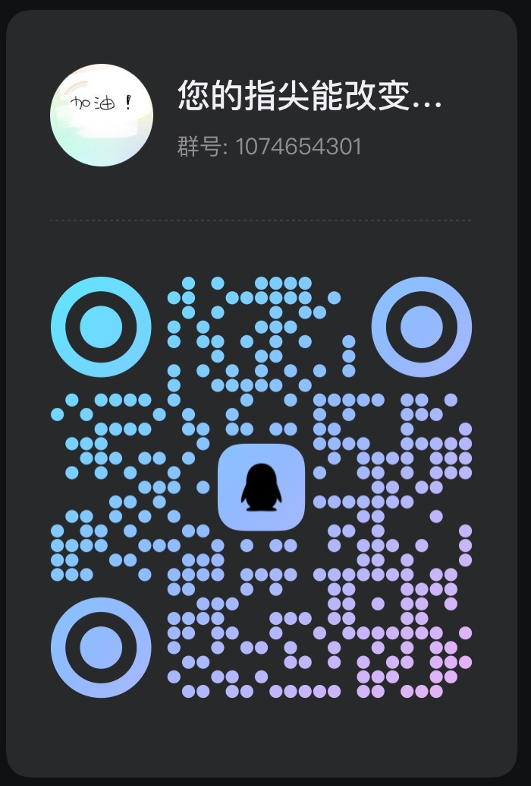

AI-Drive drug Discovery & design
==============

Artificial Intelligence-assisted Drug Discovery and Design
----------------------------------------------------------

## 项目文件夹在 list中，如果你直接想要看流程，只选点击选择03_Al Drug Discovery & Design，01是集成，03是药物发发现与设计的流程，后面是扩展的内容

Let me briefly introduce the field I am responsible for - artificial intelligence-assisted drug discovery and design. In order to better help everyone understand this complex cutting-edge technology, I will explain it in Chinese, especially to support those who may have language barriers. Although this content is usually more suitable for presentation in English, I have chosen to provide a more intuitive learning path in Chinese to ensure everyone can better grasp the core concepts and quickly get started.

Artificial intelligence-assisted drug discovery and design is a method that utilizes artificial intelligence (AI) technology to accelerate and optimize the drug development process. Traditional drug research and development cycles are long, costly, and have low success rates, while AI can significantly enhance the efficiency and accuracy of drug design through big data processing, model prediction, and automated analysis.

###  **Advantages of AI in Drug Design**

*   Accelerate the R&D cycle: AI can quickly screen a large number of compounds, reducing the workload of experimental screening.
*   Enhance accuracy: AI can improve the predictive accuracy in drug design through large-scale data training of models.
*   Cost reduction: AI can effectively reduce the cost of drug development due to the reduction in the repetitiveness and failure rate of experiments.
*   Personalized Drug Design: AI can assist in designing personalized drugs, targeting specific patient or disease characteristics to optimize therapeutic effects.

The application of artificial intelligence in drug discovery and design makes the drug development process more intelligent and automated. Through key steps such as compound screening, target prediction, drug generation, and ADMET analysis, AI can effectively accelerate the process of drug research and development while improving the accuracy and efficiency of design.

 Acknowledgments
----------------

*   First, I would like to express my gratitude to Professor Lei at Sun Yat-sen University Medical School for introducing me to this field. I entered the campus with no knowledge, so I didn't know my direction, and was quite confused, so I am especially grateful to my mentor. Moreover, I would like to thank Professor Yu at Huaiyin Institute of Technology for his help in writing this. I would also like to thank Zhang Shengyu for his strong support in completing my studies.
*   Secondly, first of all, thank you to the big shot in computational chemistry at Nanjing University of Technology, "Guo Weitao" student, who has been helping me and explaining the process of pharmaceutical manufacturing.
*   Third, I still have to thank my good friend——the student Zhou Yiping from Nanjing Medical University, for she is a clever, beautiful, and kind girl who has greatly helped me.
*    Secondly, thank you to the big shots in my group for all their guidance.
*   Last but not least, I would like to express my gratitude to the members of the public and my peers for helping me criticize and correct, making this document and this code more complete and perfect, and making our motherland stronger and better. Thank you, motherland, thank you, Party.
*    Thank you to those who helped me complete my studies!

 Welcome to the Artificial Intelligence Drug Discovery and Design Platform
--------------------------------------------------------------------------

Abstract
--------

Abstract: Drug discovery and development affects various aspects of human health and dramatically impacts the pharmaceutical market. However, investments in a new drug often go unrewarded due to the long and complex process of drug research and development (R&D). With the advancement of experimental technology and computer hardware, artificial intelligence (AI) has recently emerged as a leading tool in analyzing abundant and high-dimensional data. Explosive growth in the size of biomedical data provides advantages in applying AI in all stages of drug R&D. Driven by big data in biomedicine, AI has led to a revolution in drug R&D, due to its ability to discover new drugs more efficiently and at lower cost. This review begins with a brief overview of common AI models in the field of drug discovery; then, it summarizes and discusses in depth their specific applications in various stages of drug R&D, such as target discovery, drug discovery and design, preclinical research, automated drug synthesis, and influences in the pharmaceutical market. Finally, the major limitations of AI in drug R&D are fully discussed and possible solutions are proposed.

Keywords: Artificial intelligence; Machine learning; Deep learning; Target identification; Target discovery; Drug design; Drug discovery

*   👉🏻👉🏻👉🏻👉🏻👉🏻 Currently, the table of contents is divided into, the first, second, and third sections respectively: providing for students without a foundation, and students with a foundation

 Table of Contents
------------------

 Section 1: Basic Part
----------------------

1. Application of Artificial Intelligence in Medicine

*    Python Basics
*    Numpy, Pandas
*   Matplotlib
*    Machine Learning and Scikit-Learn
*    Deep Learning
*   CADD
*    Graph Neural Network
2. Python and Basics of Machine Learning

*    Molecular text representation: SMILES
*    Molecular Vector Representation: Descriptors and Fingerprints
*    RDKit Introduction
*   Classical machine learning models: linear regression, random forest, support vector machine
3. Exploration of Publicly Available Small Molecule Datasets

*    Biologically active molecules ChEMBL database
*    ZINC Database
*    PubChem Database
*    Exploratory Data Analysis (EDA)
*   Quantitative Structure-Activity Relationship (QSAR) and Virtual Screening (VS)
4. Graph Neural Network

*    Neural Network Architecture and Training
*    Molecular diagram, atomic characterization
*    Message Passing Neural Network
*    Tiled Convolutional Neural Network
*    Explainability: Grad-CAM
5. Molecular Docking

*    Molecular data formats: SMI, SDF, MOL2, PDB
*    Field
*    Protein folding
*   Using AutoDock Vina, Smina, QuickVina for molecular docking
*    Interchangeable fingerprint
*    Pharmacodynamic group
6. Deep generative model

*    Automatic Encoder
*    Recurrent Neural Network
*   SMILES Generator: ReLeaSE and REINVENT
*    Graph-based Generative Model: JT-VAE
*    Molecular Characteristic Optimization: Reinforcement Learning and Bayesian Optimization
7. Protein Deep Learning

*    Simplified protein representation
*    Voxel grid representation
*    For encoding the grid representation of protein surfaces
*    3D Convolutional Neural Network
8. Uncertainty Prediction

*    Any and cognitive uncertainty
*    Conformal Prediction

Section 2：Chemical Informatics
-------------------------

1. Basic Knowledge

*    Chemical Informatics RDKit Introduction
*    Application of Pandas in Chemical Informatics
*    SMILES Tutorial
*    SMARTS Tutorial
*    Basic Reactions Enumeration
*    List of stereoisomers and diastereomers
2. Utilizing Datamol and Molfeat to streamline chemical informatics workflows

*    Data processing, descriptors, and clustering
3. Cluster

*    K-Means Clustering
*    Taylor-Butina clustering
4. Complex chemical informatics analysis

*    Chembl System Analysis
*    Based on Chembl database drug data analysis
*    Analysis based on patent data from BindingDB
5. SAR Analysis

*    Scaffolding Identification
*    R-group analysis
*    Position simulation scan analysis
*    Free-Wilson analysis
*    Matching molecular pairs
*    Matching molecular set
6. Machine Learning Model

*    Construct and test a QSAR model
*    Model Classification Construction and Comparison
*    Building and Comparing Regression Models
7. Active Learning

*    Active Classification
*    Active Regression
*    Active Shape Search
8. Neural Network Potential

*    Predicting isomers' energy using Auto3D

 Section 3: Practical Part
--------------------------

###  1\. Compound data collection and preliminary processing

*    01\_Compound data collection from ChEMBL
*    02\_ From PubChem Data Acquisition
*    03\_ Data from KLIFS
    *   Complete Project: "Predicting Bioactivity Based on Machine Learning"
*    04\_Query Online API Network Service

###  2\. Molecular Filtration and Pretreatment

*    05\_Molecular Filtration: ADMET and Lead Compound Similarity Criteria
    *   Complete Project: "Molecular ADMET Prediction Based on Machine Learning and Deep Learning"
    *   Complete Project: "Molecular Toxicity Prediction Based on GNN"
*    06\_Molecular Filtration: Unwanted Substructures
    *   06\_1 Complete Project: "Ligand Screening Based on ADMET and RO5 for Molecular Screening and Compound Similarity"

###  3\. Molecular Representation and Similarity Analysis

*    07\_Molecular Representation
*    08\_Ligand-based screening: Compound similarity
*    09\_Composite Clustering
*    10\_Largest Common Substructure

###  4\. Drug Efficacy Cluster and Off-Target Prediction

*    11\_Ligand-Based Pharmacophore
*    12\_Combining site similarity and off-target prediction

###  5\. Protein data acquisition and binding site detection

*    13\_Protein Data Acquisition: Protein Data Bank (PDB)
*    14\_Combination Ligation Site Detection

###  6\. Protein-ligand docking

*    15\_Protein-ligand docking
    *    Predicting the retrosynthetic accessibility of bioactive molecules
*    16\_Protein-ligand interactions
*    17\_NGLview Advanced Usage

###  7\. Molecular Dynamics Simulation

*    18\_Molecular Dynamics Simulation
*    19\_Analysis of Molecular Dynamics Simulation

###  8\. Lead Compound Optimization and Automation Process

*    20\_Lead Compound Optimization Automation Process

###  9\. Machine Learning and Molecular Property Prediction

*    21\_Ligand-based Screening: Machine Learning
*    22\_Ligand-based screening: Neural network
*    23\_Molecular Property Prediction Based on RNN
*    24\_Molecular Property Prediction Based on GNN
*    25\_Molecular Property Predictor Converter
*    26\_ Uncertainty Estimation

###  10\. RNA Aptamer Design and Analysis

####  **1\. Data Collection and Preparation**

*   **27\_1 RNA Aptamer Data Source**
    *   Data source: RNAapt3D (https://rnaapt3d.medals.jp/)
*    **27\_2 Data Cleaning and Preprocessing**

####  **2\. RNA Structure Prediction**

*    **28\_1 Primary Structure Prediction**
    
*    **28\_2 Structural Visualization and Analysis**
    
*    **29\_1 Secondary Structure Prediction**
    
*    **29\_2 Energy minimization and folding stability analysis**
     
    *    ΔG (Free Energy) and Folding Stability Diagram

####  **30\_RNA Aptamer Binding Site Analysis**

*   **30\_1 RNA Aptamer Binding Site Prediction to Target**
*    **30\_2 Calculation and Optimization of Binding Energy**

####  **3\. Drug Design and Optimization**

*   **30\_3 Drug Design Based on RNA Aptamers**
*    **30\_4 Drug Chemistry and Virtual Screening**

####  **5\. Molecular Dynamics Simulation and Experimental Verification**

*    **30\_5 Molecular Dynamics Simulation**
*    **30\_6 Experimental Verification**

###  11\. Kinase Similarity and Analysis

*    31\_Kinase similarity: Sequence
*   32\_Kinase Similarity: Kinase Pocket (KiSSim Fingerprint)
*    33\_Kinase Similarity: Interaction Fingerprint
*    34\_Kinase Similarity: Ligand Profile
*    35\_Kinase Similarity: Comparison of Different Views
*    36\_ Designed kinase inhibitors based on kinase fragment libraries

###  12\. Protein-ligand interactions and prediction

*    37\_Protein-ligand interaction prediction
    *   Complete Project: "Project Practice: Prediction of Chemical Reaction Yields Using Transformer-Based Deep Learning"
    *   Complete Project: "Project Practice: Mapping the Space of Chemical Reactions Using Attention-Based Neural Networks"
    *   Complete Project: "Project Practice: A Graph to Graphs Framework for Retrosynthesis Prediction of Small Molecule Compounds"
    *   Complete Project: "Project Practice: Generative Language Modeling for Antibody Design"

###  13\. Advanced Modeling and Virtual Screening

*   38\_Running 3D Dynamics Based on KLIFS Data
*   Consensus-based Integrated Structure Virtual Screening (Protein Preparation, Docking, Binding Site Selection, Rescore and Sort)

###  14\. Visualization and Coding Tools

*    40\_One-Hot Encoding
*    41\_Using Code to Draw Molecular Graphs

 **Section 4：Researching Genes to Immune Infiltration**
-------------------------------------------------

#### **1\. Introduction**

*    Research objective: Explore the relationship between genes and immune infiltration
*   Background Introduction: The Importance of Immune Infiltration and Its Impact on Gene Expression

####  **2\. Software Environment Configuration**

*   Software tools required for installation and configuration (such as R, Python, Bioconductor)

####  **3\. Data Download and Preprocessing**

*    Download gene expression data from GEO, TCGA, and other databases
*    Data standardization and cleaning

####  4\. Data Annotation (ANN)

*   Annotate gene expression data using annotation files (such as GTF or GFF files)
*    Tools: `biomaRt` `org.Hs.eg.db`

#### **5\. SVA (Surrogate Variable Analysis)**

*    Apply SVA to correct batch effects
*   Code Implementation: Method `ComBat` or `svaseq` in the `sva` package

#### 6\. Differential Gene Expression (Diff)

*   Using tools such as `limma` and `DESeq2` for differential gene analysis
*    List of differentially expressed genes (DEGs)

####  7\. Volcano Plot Drawing

*    Plot volcano plots using the results of the differential analysis
*   Code Implementation: `ggplot2` , `EnhancedVolcano` Package

####  **8\. Enrichment analysis**

*   **08\. Metascape**
    
    *   Conduct pathway and functional enrichment analysis on the Metascape website
*   **09\. Gene Ontology (GO)**
    
    *    Using GO for gene function annotation and enrichment analysis
    *    Tools: `clusterProfiler` `topGO`
*    **10\. KEGG Enrichment Analysis**
     
    *    Using KEGG database for signaling pathway enrichment analysis
    *    Tools: `clusterProfiler` `KEGGREST`

####  **11\. Protein Interaction Network**

*   **11\. Protein-Protein Interaction (PPI)**
    *    Constructing protein-protein interaction networks
    *    Tools: `STRING` Database, `Cytoscape`

####  **12\. Random Forest Model Random Forest**

*    Constructing a random forest model, filtering important genes

####  **13\. Heatmap Drawing**

*    Draw the expression heat map of different genes

####  14\. Gene Score Calculation

*    According to differential gene calculation of gene score
*    Code Implementation: Comprehensive Scoring Method Based on Gene Expression Values

####  **15\. Neural Network Model**

*    Predicting gene expression using neural network models
*    Tool: `neuralnet` Package

#### **16\. ROC Curve AnalysisReceiver Operating Characteristic (ROC)**

*    Plot ROC curve, evaluate model accuracy
*    Tool: `pROC` Package

#### **17\. Gene Score Test**

*    Evaluate the accuracy and feasibility of the gene scoring model

#### **18\. Neural Network Prediction Test**

*    Evaluate the predictive ability of neural network models

####  **19\. ROC test Test ROC**

*    Validate ROC Curve Using Test Dataset

####  **20\. CIBERSORT analysis**

*   Using CIBERSORT analysis to estimate the proportion of immune cells from gene expression data

####  21\. Barplot drawing

*    Create a histogram of immune cell proportions
*    Tool: `ggplot2`

####  **22\. Violin Plot**

*    Create a diagram showing the relationship between gene expression and immune cell infiltration

 Project Structure
------------------

    |-- Al-drug-design-reference.Data   <- 参考文献文件夹
    |-- README.md                       <- 详细简介
    |-- img                             <- md的图片
    |-- docs                            <- 文档
    |-- Al-drug-design-reference.enl    <- 参考文献文件
    |-- list                            <- 项目结构目录
    |-- Al-drug-design.yml                             <- 环境配置
    |   |-- 00_ai in_medicine                          <- Python基础知识（❤️如果你有Python基础，或者你有Python与药物设计基础，你可以跳过这一章节，直接从01开始看）
    |   |-- 03_03_Al Drug Discovery & Design              <- 化合物采集

 Configure code environment
---------------------------

⚠️ If you are a big shot, just skip to the next step below------------------------

Install Anaconda and Git. Please refer to the Anaconda website and the Git website for download.

### first

❤️ u must need read paper ⚠️:

Where is AIDrugDesign.yml ?

u first git clone my link!!!, it is have AIDrugDesign.yml.

    conda env create -f AIDrugDesign.yml

If you are abroad or have🪜, please open AIDrugDesign.yml

 Delete:

      - pytorch
      - https://mirrors.tuna.tsinghua.edu.cn/anaconda/pkgs/main
      - https://mirrors.tuna.tsinghua.edu.cn/anaconda/pkgs/free

### second

    conda env list

Check to see if the _**AI-drug-design**_

### Then

    conda activate AIDrugDesign

⚠️ If you are a big shot, just skip to the next step below end------------------------

### If you are a beginner, please humbly look at the following steps:

### One, install and configure Git on Windows and macOS systems, and pull my code to the local machine.

If you want to learn more about Git, please go to \[if\_operation\_git\_process.md\]

你的翻译请求没有提供具体的源文本，因此我无法进行翻译。请提供需要翻译的文本，我将按照您的要求进行翻译。

###  Windows system

####  1\. Download and install Git

*    Go to the official Git download page.
*   Select the Windows version for download and follow the prompts to complete the installation.
    *   At installation, the default options can be used. If customization is desired, different configurations can be selected as needed, such as the editor, environment variables, etc.

####  2\. Configure Git

After installation, open the terminal (or Git Bash) and configure your Git user information:

    git config --global user.name "Your Name"
    git config --global user.email "youremail@example.com"

Thus, Git will use this information to identify your identity each time you commit code.

#### 3\. Generate SSH Key

On Windows, open Git Bash, enter the following command to generate an SSH key:

    ssh-keygen -t rsa -b 4096 -C "youremail@example.com"

*   After pressing Enter, you will see a prompt to select the location for the storage key, default Enter is fine.
*    Then you need to set a password, which can be empty, but it is recommended to do so.

#### 4\. Add SSH Key to GitHub

*    Use the following command to display the public key you generated:

    cat ~/.ssh/id_rsa.pub
    
*    Copy the public key and log in to GitHub.
*   Go to the SSH and GPG key page on GitHub, click New SSH key.
*    Paste the public key you just copied into the text box, save after adding.

#### 5\. Clone GitHub repository

After completing the SSH key configuration, you can use the following command to clone the code repository:

    git clone git@github.com:itWangCode/AI-drug-design.git

####  6\. Successfully pulled code

After executing the command, Git will pull the code into the local folder. If successful, you will see information similar to the following:

    Cloning into 'AI-drug-design'...

 At this point, the code has been successfully pulled.

* * *

###  macOS system

####  1\. Install Git

macOS usually comes with Git pre-installed; if not, Git can be installed via Homebrew:

*   Open the terminal and enter the following command to install Homebrew (if not already installed):

    /bin/bash -c "$(curl -fsSL https://raw.githubusercontent.com/Homebrew/install/HEAD/install.sh)"
    
*    After installation, enter the following command to install Git:

    brew install git
    

####  2\. Configure Git

*    Open the terminal and enter the following command to configure Git:

    git config --global user.name "Your Name"
    git config --global user.email "youremail@example.com"
    

#### 3\. Generate SSH Key

*    Enter the following command in the terminal to generate an SSH key:

    ssh-keygen -t rsa -b 4096 -C "youremail@example.com"
    
*   As with Windows, press Enter to store the key at the default path, set a password (optional).

#### 4\. Add SSH Key to GitHub

*    At the terminal, use the following command to view the public key:

    cat ~/.ssh/id_rsa.pub
    
*   Copy the output public key, log in to GitHub, and add the public key to the GitHub SSH Keys page.

#### 5\. Clone GitHub repository

 Use the following command to clone your repository to your local machine:

    git clone git@github.com:itWangCode/AI-drug-design.git

####  6\. Successfully pulled code

Git will download the code to the current directory, indicating a successful code pull.

Thus, you have successfully configured Git and cloned the code repository.

### How to download and install Anaconda-Navigator on Windows and macOS systems and configure your environment

#### 1\. Download Anaconda-Navigator

#####  Windows:

*    Go to the Anaconda official website.
*   Click the download button, select the version suitable for the Windows system (usually 64-bit).
*    Download completed, run the installation program and follow the prompts to complete the installation.

#####  macOS:

*    Similarly, go to the Anaconda official website.
*    Select the version of macOS system to download and install.

During the installation process, it is recommended to check the option "Add Anaconda to my PATH environment variable" so that the `conda` command can be used directly in the terminal.

#### 2\. Open Anaconda-Navigator

 After installation:

*   On Windows, Anaconda-Navigator can be found in the Start menu and run.
*   On macOS, you can find Anaconda-Navigator in the "Applications" folder, and click to launch it.

#### 3\. Clone your repository

Before configuring in the Anaconda environment, you first need to clone your GitHub repository to your local machine.

1. Open terminal (macOS) or Git Bash (Windows).
2. Run the following command to clone your repository:

    git clone git@github.com:itWangCode/AI-drug-design.git
    

 This will download the repository containing the `AIDrugDesign.yml` file to the local machine.

#### 4\. Create Conda Environment

Navigate to the clone project folder and create a new Conda environment through the `.yml` file:

1. In the terminal or Git Bash, switch to the directory of the cloned repository:

    cd AI-drug-design
    
1. Run the following command to create a Conda environment based on the `AIDrugDesign.yml` file:

    conda env create -f AIDrugDesign.yml
    

❤️ Please wait for more than 15 minutes, please connect to Wi-Fi !!!!!!!

1. Conda will automatically install the required dependency packages based on the `.yml` file and create the environment.

#### 5\. List Conda environments

After installation, use the following command to view all environments and check if the `AI-drug-design` environment has been created:

    conda env list

 You should see an output similar to the following, which includes `AI-drug-design` :

    # conda environments:
    #
    base                  *  /path/to/anaconda3
    AI-drug-design           /path/to/anaconda3/envs/AI-drug-design

####  6\. Activation Environment

 Finally, use the following command to activate the `AI-drug-design` environment:

    conda activate AI-drug-design

You have now successfully configured and activated the `AI-drug-design` environment, and you can start developing using this environment.

 Install all configurations
---------------------------

###  Operation

###  Three, software

*   [https://www.jetbrains.com/pycharm/](https://www.jetbrains.com/pycharm/)

 I sometimes get particularly scared of Mac OS system classmates

More operations: Please refer to: \[https://www.exception.site/article/1762\]

 QS Question Area
-----------------

###  1\. For example, will you encounter such a situation?

*   Then how do we solve it, so go to the win advanced environment variables to configure?
    
    
    

 Join the group discussion
--------------------------

### Link: t.me/AIDD\_itwangyang

Can you support me in having a cup of coffee☕️☕️☕️☕️☕️, thank you!! Let me have more motivation, writing💪🏻!!!
---------------------------------------------------------------------------------------------------------------

